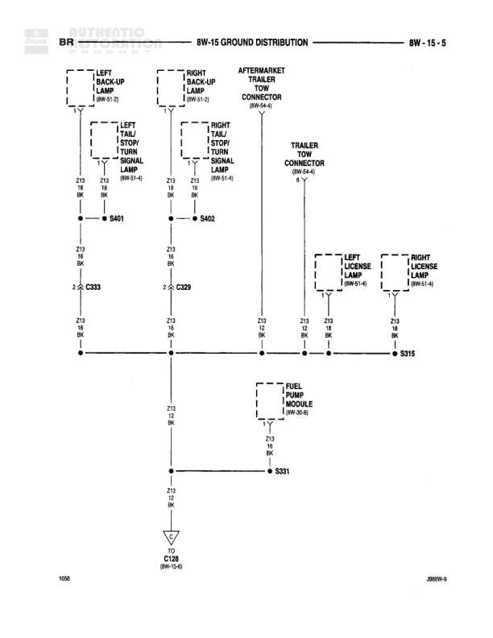

# Ground Distribution - Gas

**Notes:** This diagram shows ground distribution for gas engine components including oxygen sensors, starter relay, A/C compressor clutch, data link connector, and powertrain control module. Two primary ground circuits shown: Z11 (BK/WT) and Z12 (BK/TN).

## Components

| Component | Ref | Connectors | Notes |
|-----------|-----|------------|-------|
| Left Upstream Heated Oxygen Sensor | 8W-30-17 | C130 | None |
| Right Upstream Heated Oxygen Sensor | 8W-30-19 | C130 | None |
| Pre-Catalyst Heated Oxygen Sensor | 8W-30-18 | C134 | None |
| Post-Catalyst Heated Oxygen Sensor | 8W-30-18 | C134 | None |
| Engine Starter Motor Relay (IN PDC) | 8W-8-0 |  | None |
| A/C Compressor Clutch | 8W-42-3 |  | None |
| Data Link Connector | 8W-3-4 |  | None |
| Powertrain Control Module | 8W-36-3 | C1, C1 | None |

## Wires

| From | To | Wire Code | Gauge | Color | Notes |
|------|-----|-----------|-------|-------|-------|
| Left Upstream Heated Oxygen Sensor/8W-30-17 | Z11 BK/WT | Z11 | None | BK/WT | None |
| Right Upstream Heated Oxygen Sensor/8W-30-19 | Z11 BK/WT | Z11 | None | BK/WT | None |
| Pre-Catalyst Heated Oxygen Sensor/8W-30-18 | Z11 BK/WT | Z11 | None | BK/WT | None |
| Post-Catalyst Heated Oxygen Sensor/8W-30-18 | Z11 BK/WT | Z11 | None | BK/WT | None |
| Engine Starter Motor Relay (8W-8-0) | Z11 BK/WT | Z11 | None | BK/WT | None |
| A/C Compressor Clutch (8W-42-3) | Z11 BK/WT | Z11 | None | BK/WT | None |
| S122 | Z11 BK/WT | Z11 | None | BK/WT | None |
| Data Link Connector pin 4 | Z12 BK/TN | Z12 | 18 | BK/TN | None |
| Data Link Connector pin 5 | Z12 BK/TN | Z12 | 18 | BK/TN | None |
| Z12 BK/TN | C134 pin 9 | Z12 | 18 | BK/TN | None |
| Z12 BK/TN | C134 pin 8 | Z12 | 18 | BK/TN | None |
| C134 pin 25 | C130 pin 30 | Z12 | 18 | BK/TN | None |
| C134 pin 8 | C130 pin 30 | Z12 | 18 | BK/TN | None |
| C130 pin 30 | Powertrain Control Module C1 | Z12 | 18 | BK/TN | None |
| C130 pin 30 | Powertrain Control Module C1 | Z12 | 18 | BK/TN | None |
| C134 pin 9 | S126 | Z12 | 18 | BK/TN | None |
| Powertrain Control Module | Z12 BK/TN | Z12 | 18 | BK/TN | None |
| S126 | G106 | Z12 | 18 | BK/TN | None |

## Splices & Grounds

| ID | Type | Location | Wires Connected | Notes |
|----|------|----------|-----------------|-------|
| S122 | splice | Upper portion of diagram | Z11 | Connects all Z11 ground wires from oxygen sensors and components |
| C134 | connector | Middle portion of diagram | Z12 | Pins 9, 8, 25 shown |
| C130 | connector | Middle portion of diagram | Z12 | Pin 30 shown |
| S126 | splice | Lower middle portion of diagram | Z12 | Connects Z12 ground wires from data link connector and PCM |
| G106 | ground | Bottom of diagram |  | Final ground point for Z12 circuit |

## Cross-References

- 8W-30-17
- 8W-30-19
- 8W-30-18
- 8W-8-0
- 8W-42-3
- 8W-3-4
- 8W-36-3
- 8W-15-7
