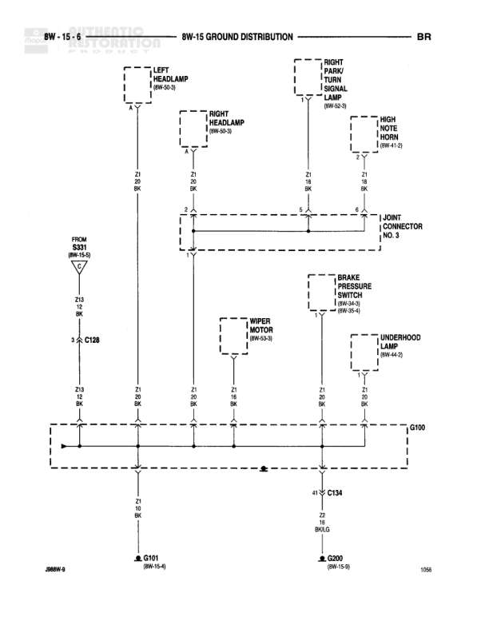

# GROUND DISTRIBUTION

**Notes:** Ground distribution diagram showing Z1 and Z2 circuit grounds (BK/LG and BK/OR wires) connecting various components through G200 main ground point to G100 and G201 grounds

## Components

| Component | Ref | Connectors | Notes |
|-----------|-----|------------|-------|
| STOP LAMP SWITCH | 8W-37-0 | C1 | None |
| INSTRUMENT CLUSTER | 8W-40-0 | C1 | None |
| OVERDRIVE SWITCH | 8W-31-4 | C1 | None |
| INTEGRATED ELECTRONIC MODULE | 8W-62-8 | C1 | None |
| OVERHEAD CONSOLE | 8W-40-3 | C7 | None |
| JUNCTION BLOCK | 8W-40-1 | C7 | None |

## Wires

| From | To | Wire Code | Gauge | Color | Notes |
|------|-----|-----------|-------|-------|-------|
| STOP LAMP SWITCH C1 | Z2 BK/LG splice | Z2 | 22 | BK/LG | None |
| INSTRUMENT CLUSTER C1 | Z1 BK/LG splice | Z1 | 20 | BK/LG | None |
| OVERDRIVE SWITCH C1 | Z1 BK/LG splice | Z1 | 22 | BK/LG | None |
| INTEGRATED ELECTRONIC MODULE C1 | Z2 BK/LG splice | Z2 | 22 | BK/LG | None |
| OVERHEAD CONSOLE C7 | Z2 BK/LG splice | Z2 | 22 | BK/LG | None |
| JUNCTION BLOCK C7 | Z1 BK/LG splice | Z1 | 22 | BK/LG | None |
| G200 | Z1 16 BK/LG | Z1 | 16 | BK/LG | None |
| G200 | Z1 BK/OR | Z1 | None | BK/OR | None |
| Z1 BK/LG | C134 | Z1 | None | BK/LG | None |
| C134 | G100 (8W-15-0) | Z2 | 16 | BK/LG | None |
| G200 | G201 (8W-15-10) | Z1 | None | BK/OR | None |

## Splices & Grounds

| ID | Type | Location | Wires Connected | Notes |
|----|------|----------|-----------------|-------|
| G200 | ground | main ground distribution point |  | Central ground point connecting to multiple circuits |
| G100 | ground | referenced on 8W-15-0 |  | None |
| G201 | ground | referenced on 8W-15-10 |  | None |
| C134 | connector | in-line connector between G200 and G100 | Z1, Z2 | None |

## Cross-References

- 8W-37-0
- 8W-40-0
- 8W-31-4
- 8W-62-8
- 8W-40-3
- 8W-40-1
- 8W-15-0
- 8W-15-10
