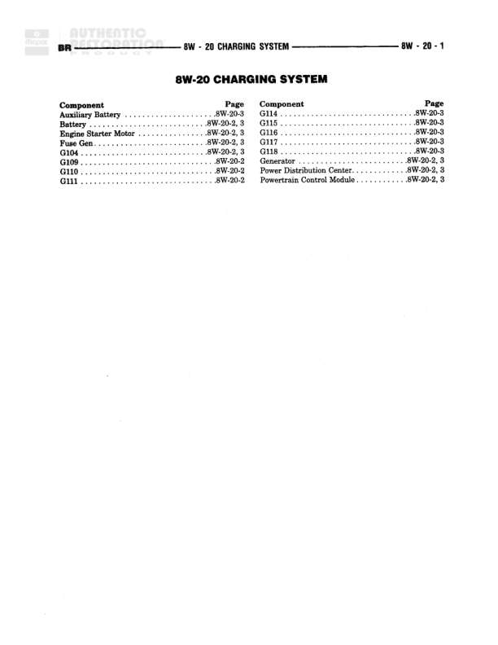

# CHARGING SYSTEM

**Notes:** This is an index page for the Charging System diagrams. It lists components and their corresponding page references within the 8W-20 section. No actual wiring connections are shown on this page.

## Components

| Component | Ref | Connectors | Notes |
|-----------|-----|------------|-------|
| Auxiliary Battery | 8W-20-3 |  | Index listing page |
| Battery | 8W-20-2, 3 |  | Index listing page |
| Battery Starter Motor | 8W-20-2, 3 |  | Index listing page |
| Fuse Gen | 8W-20-2, 3 |  | Index listing page |
| G104 | 8W-20-2, 3 |  | Ground point - Index listing page |
| G109 | 8W-20-2 |  | Ground point - Index listing page |
| G110 | 8W-20-2 |  | Ground point - Index listing page |
| G111 | 8W-20-2 |  | Ground point - Index listing page |
| G115 | 8W-20-3 |  | Ground point - Index listing page |
| G116 | 8W-20-3 |  | Ground point - Index listing page |
| G117 | 8W-20-3 |  | Ground point - Index listing page |
| G118 | 8W-20-3 |  | Ground point - Index listing page |
| Generator | 8W-20-2, 3 |  | Index listing page |
| Power Distribution Center | 8W-20-2, 3 |  | Index listing page |
| Powertrain Control Module | 8W-20-2, 3 |  | Index listing page |

## Cross-References

- 8W-20-2
- 8W-20-3
