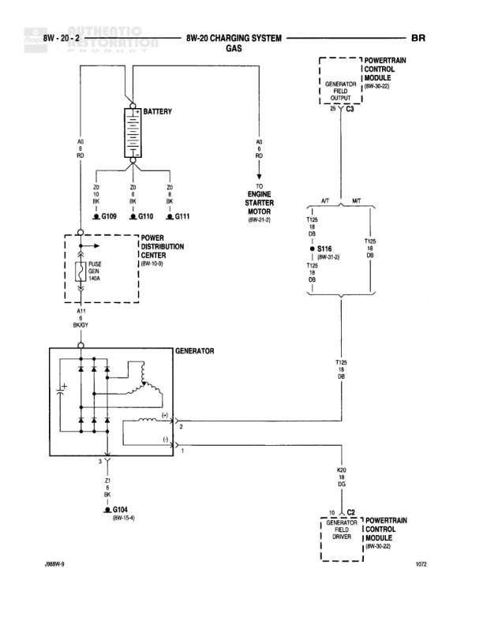

# CHARGING SYSTEM - GAS

**Notes:** Charging system diagram for gas engine vehicles. Shows generator (alternator) with internal voltage regulator control via PCM field driver. Generator output goes through Power Distribution Center before connecting to battery. PCM monitors generator field duty cycle and alternator output.

## Components

| Component | Ref | Connectors | Notes |
|-----------|-----|------------|-------|
| BATTERY | top center |  | Main vehicle battery |
| POWER DISTRIBUTION CENTER | 8W-12-0 |  | Contains fuse/relay box |
| GENERATOR | lower left |  | Shows internal diode bridge and field coil |
| ENGINE STARTER MOTOR | 8W-21-0 | S116 (8W-31-0) | Connected via S116 |
| POWERTRAIN CONTROL MODULE | 8W-10-20 |  | Controls generator field output and monitors alternator field duty cycle |
| GENERATOR FIELD DRIVER | 8W-10-22 |  | Located in Powertrain Control Module |
| IGN GEN 10GA | in PDC |  | 10 gauge ignition to generator circuit |

## Wires

| From | To | Wire Code | Gauge | Color | Notes |
|------|-----|-----------|-------|-------|-------|
| BATTERY positive | G109 | A0 | 6 | RD | Battery positive feed |
| BATTERY positive | G110 | A0 | 6 | RD | Battery positive feed |
| BATTERY positive | G111 | A0 | 6 | RD | Battery positive feed |
| BATTERY positive | ENGINE STARTER MOTOR | A0 | 6 | RD | Feed to starter motor |
| POWER DISTRIBUTION CENTER | GENERATOR output (2) | A11 | 10 | BK/WT | From IGN GEN 10GA through PDC |
| GENERATOR field (1) | G104 | Z1 | 16 | BK | Generator field ground at 8W-11-4 |
| S116 (ENGINE STARTER MOTOR) | POWERTRAIN CONTROL MODULE | T125 | 18 | DB | Starter signal to PCM |
| GENERATOR output (2) | POWERTRAIN CONTROL MODULE | K20 | 18 | DG | Generator sense line to PCM |
| POWERTRAIN CONTROL MODULE | GENERATOR FIELD DRIVER | K7 | None | WT | Field control from PCM to driver |
| GENERATOR FIELD DRIVER | S116 | T125 | 18 | DB | Field driver connection |

## Splices & Grounds

| ID | Type | Location | Wires Connected | Notes |
|----|------|----------|-----------------|-------|
| G109 | ground | Battery area |  | Battery positive distribution point |
| G110 | ground | Battery area |  | Battery positive distribution point |
| G111 | ground | Battery area |  | Battery positive distribution point |
| G104 | ground | 8W-11-4 |  | Generator field ground |
| S116 | splice | 8W-31-0 | T125 | Starter motor splice point |

## Cross-References

- 8W-12-0
- 8W-21-0
- 8W-31-0
- 8W-11-4
- 8W-10-20
- 8W-10-22
