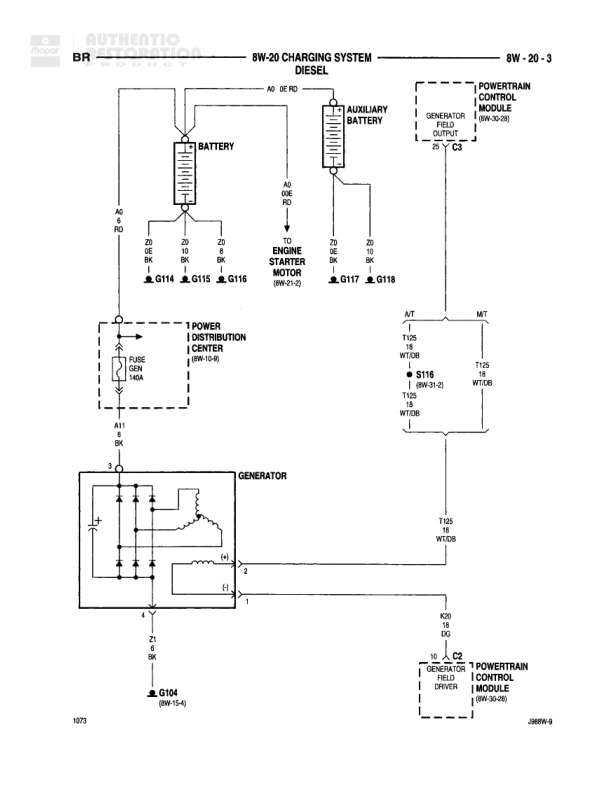

# CHARGING SYSTEM - DIESEL

**Notes:** Diesel charging system diagram showing dual battery configuration with auxiliary battery for starter motor. Generator field is controlled by PCM through generator field driver circuit. Document reference: 28WFW-B at bottom of page.

## Components

| Component | Ref | Connectors | Notes |
|-----------|-----|------------|-------|
| Battery | 8W-20-3 |  | Main battery |
| Auxiliary Battery | 8W-20-3 |  | Secondary battery |
| Engine Starter Motor | 8W-21-2 | C114, C115, C116 | Diesel engine starter |
| Powertrain Control Module | 8W-30-8 | C2 | Generator field driver output, referenced twice in diagram |
| Generator | 8W-20-3 |  | Main charging system generator with internal diode bridge and field coil |
| Power Distribution Center | 8W-11-1 |  | Contains fuses, includes IGN and 10A components |
| Generator Field Driver | Referenced from PCM C2 |  | Part of Powertrain Control Module |

## Wires

| From | To | Wire Code | Gauge | Color | Notes |
|------|-----|-----------|-------|-------|-------|
| Battery positive | G114 | Z2 | 2 | BK | Battery negative to ground |
| Battery positive | G115 | Z2 | 2 | BK | Battery negative to ground |
| Battery positive | G116 | Z2 | 2 | BK | Battery negative to ground |
| Auxiliary Battery | Engine Starter Motor | A2 | 2 | RD | Positive feed to starter |
| Auxiliary Battery negative | G117 | Z2 | 2 | BK | Auxiliary battery negative to ground |
| Auxiliary Battery negative | G118 | Z2 | 2 | BK | Auxiliary battery negative to ground |
| Power Distribution Center | Generator Field | A11 | 18 | BK | From IGN fuse through 10A fuse |
| Powertrain Control Module C2 | Generator Field Driver | K28 | 20 | DG | Generator field driver control |
| Generator | G104 | Z1 | 12 | BK | Generator case ground |
| Generator output | Battery | A1 | None | RD | Main charging output from generator rectifier to battery positive |
| Generator | S116 | T105 | 16 | WT/OR | Generator sense circuit |
| S116 | Powertrain Control Module | T105 | 16 | WT/OR | Sense signal to PCM |
| Generator internal | Generator field coil | None | None | None | Internal generator connections showing diode bridge and field coil |

## Splices & Grounds

| ID | Type | Location | Wires Connected | Notes |
|----|------|----------|-----------------|-------|
| G114 | ground | Engine Starter Motor connection |  | Battery negative ground point |
| G115 | ground | Engine Starter Motor connection |  | Battery negative ground point |
| G116 | ground | Engine Starter Motor connection |  | Battery negative ground point |
| G117 | ground | Auxiliary battery connection |  | Auxiliary battery negative ground point |
| G118 | ground | Auxiliary battery connection |  | Auxiliary battery negative ground point |
| G104 | ground | Generator case |  | Generator case ground, reference 8W-15-4 |
| S116 | splice | Between generator and PCM | T105 | Generator sense circuit splice, reference 8W-31-2 |

## Cross-References

- 8W-30-8
- 8W-21-2
- 8W-11-1
- 8W-31-2
- 8W-15-4
