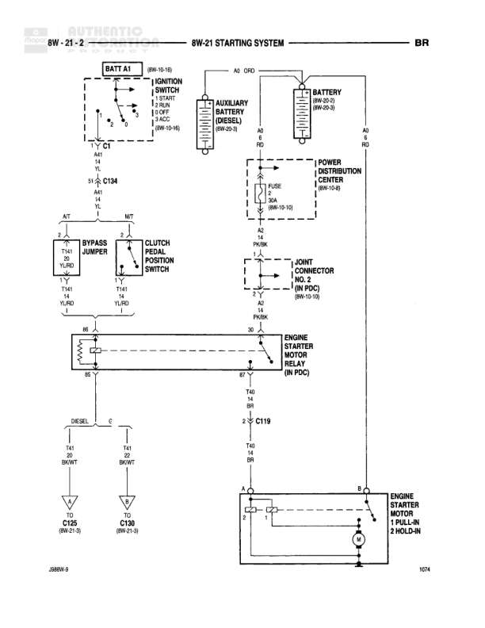

# STARTING SYSTEM

**Notes:** This diagram shows the starting system with separate paths for automatic transmission (AT) with bypass jumper and manual transmission (MT) with clutch pedal position switch. Diesel models have an auxiliary battery. The engine starter motor has two coils: pull-in and hold-in. Document reference: J2BRW-9 and 1074

## Components

| Component | Ref | Connectors | Notes |
|-----------|-----|------------|-------|
| Battery A1 | 8W-10-16 |  | Main battery |
| Ignition Switch | 8W-10-16 | C134 | Positions: 1 START, 2 RUN, 3 OFF, 4 ACCY |
| Auxiliary Battery (Diesel) | 8W-50-3 |  | For diesel models |
| Battery | 8W-50-3 |  | Secondary battery reference |
| Power Distribution Center | 8W-10-10 |  | Contains FUSE 12 |
| Bypass Jumper |  | TA1, TA2 | AT only, located at (8W-10-6) |
| Clutch Pedal Position Switch |  | TA1 | MT only, located at (8W-10-5) |
| Joint Connector No. 2 | 8W-10-10 |  | In PDC |
| Engine Starter Motor Relay |  | TA2 | In PDC, at (8W-10-2) |
| Engine Starter Motor |  |  | 1 PULL-IN, 2 HOLD-IN |

## Wires

| From | To | Wire Code | Gauge | Color | Notes |
|------|-----|-----------|-------|-------|-------|
| Battery A1 | Ignition Switch C134 pin 4 | A2 | 14 | RD |  |
| Ignition Switch C134 pin 1 | Bypass Jumper TA1 | TA1 | 14 | YL/RD | AT only |
| Ignition Switch C134 pin 1 | Clutch Pedal Position Switch TA1 | TA1 | 14 | YL/RD | MT only |
| Bypass Jumper TA2 | Engine Starter Motor Relay TA2 | TA2 | 14 | BR/WT | AT only |
| Clutch Pedal Position Switch | Engine Starter Motor Relay TA2 | TA2 | 14 | BR/WT | MT only |
| Auxiliary Battery (Diesel) | A2 ORD | A2 | None |  | Diesel only |
| Power Distribution Center FUSE 12 | Joint Connector No. 2 | A2 | 12 | PK/BK |  |
| Joint Connector No. 2 | Engine Starter Motor Relay | A2 | 12 | PK/BK |  |
| Engine Starter Motor Relay | C119 | TA6 | 10 | BR |  |
| C119 | Engine Starter Motor | TA6 | 10 | BR |  |
| Battery | Engine Starter Motor | A2 | 4 | RD | Direct battery feed to starter |
| Engine Starter Motor | C125 | TA1 | 14 | BR/WT | Diesel, to ground |
| Engine Starter Motor | C130 | TA1 | 14 | BR/WT | To ground |

## Splices & Grounds

| ID | Type | Location | Wires Connected | Notes |
|----|------|----------|-----------------|-------|
| C125 | ground | 8W-21-8 | TA1 | Diesel only |
| C130 | ground | 8W-21-8 | TA1 |  |
| C119 | splice | In line between relay and starter | TA6 |  |

## Cross-References

- 8W-10-16
- 8W-10-10
- 8W-10-6
- 8W-10-5
- 8W-10-2
- 8W-50-3
- 8W-21-8
