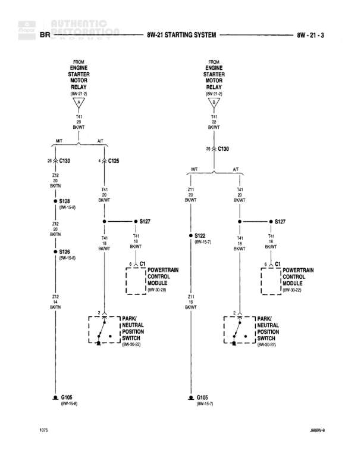

# Starting System

**Notes:** Diagram shows parallel circuits for Manual Transmission (M/T) and Automatic Transmission (A/T) configurations. Left side shows M/T circuit, right side shows A/T circuit. Both connect to Powertrain Control Module and Park/Neutral Position Switch.

## Components

| Component | Ref | Connectors | Notes |
|-----------|-----|------------|-------|
| Engine Starter Motor Relay | 8W-21-2 | C130, C125 | Manual Transmission (M/T) |
| Engine Starter Motor Relay | 8W-21-2 | C130 | Automatic Transmission (A/T) |
| Powertrain Control Module | 8W-30-26 | C1 | Left side diagram |
| Powertrain Control Module | 8W-30-22 | C1 | Right side diagram |
| Park/Neutral Position Switch | 8W-30-25 |  | Left side diagram |
| Park/Neutral Position Switch | 8W-30-25 |  | Right side diagram |

## Wires

| From | To | Wire Code | Gauge | Color | Notes |
|------|-----|-----------|-------|-------|-------|
| Engine Starter Motor Relay (8W-21-2) | C130 Pin 26 | D1 | 20 | BK/WT | M/T |
| C130 Pin 26 | S128 | Z12 | 20 | BK/TN | M/T, (8W-15-8) |
| S128 | S125 | Z12 | 20 | BK/TN | M/T, (8W-15-8) |
| C125 Pin 4 | S127 | T41 | 20 | BK/WT | M/T |
| S127 | Powertrain Control Module C1 Pin 6 | T41 | 20 | BK/WT | M/T |
| S125 | Powertrain Control Module C1 | Z12 | 20 | BK/TN | M/T |
| Powertrain Control Module C1 Pin 2 | Park/Neutral Position Switch | None | None | None | M/T |
| Park/Neutral Position Switch | G105 | None | None | None | M/T, (8W-14-6) |
| Engine Starter Motor Relay (8W-21-2) | C130 Pin 26 | D1 | 20 | BK/WT | A/T |
| C130 Pin 26 | S122 | Z11 | 20 | BK/WT | A/T, (8W-15-7) |
| S122 | Powertrain Control Module C1 | Z11 | 20 | BK/WT | A/T |
| S127 | Powertrain Control Module C1 Pin 6 | T41 | 20 | BK/WT | A/T |
| Powertrain Control Module C1 Pin 2 | Park/Neutral Position Switch | None | None | None | A/T |
| Park/Neutral Position Switch | G105 | None | None | None | A/T, (8W-15-7) |

## Splices & Grounds

| ID | Type | Location | Wires Connected | Notes |
|----|------|----------|-----------------|-------|
| S128 | splice | None | Z12 | 8W-15-8, M/T only |
| S125 | splice | None | Z12 | 8W-15-8, M/T only |
| S127 | splice | None | T41 | Both M/T and A/T |
| S122 | splice | None | Z11 | 8W-15-7, A/T only |
| G105 | ground | None |  | 8W-14-6 (M/T), 8W-15-7 (A/T) |

## Cross-References

- 8W-21-2
- 8W-30-26
- 8W-30-25
- 8W-15-8
- 8W-14-6
- 8W-15-7
- 8W-30-22
