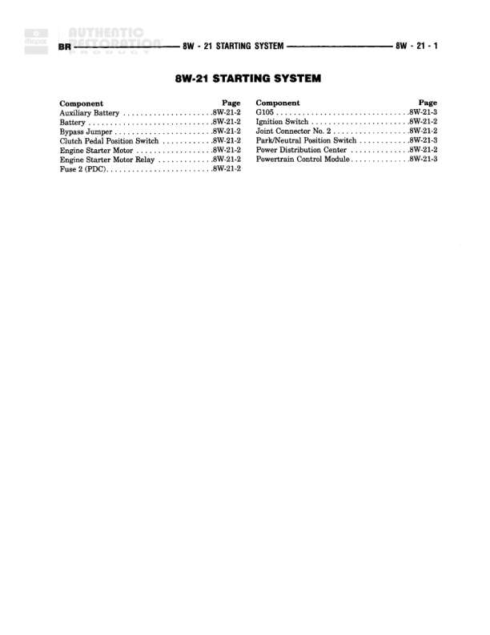

# STARTING SYSTEM

**Notes:** This is an index/reference page for the Starting System section, listing all components and their corresponding diagram page references. Actual wiring diagrams are on pages 8W-21-2 and 8W-21-3.

## Components

| Component | Ref | Connectors | Notes |
|-----------|-----|------------|-------|
| Auxiliary Battery | 8W-21-2 |  |  |
| Battery | 8W-21-2 |  |  |
| Battery Cable | 8W-21-2 |  |  |
| Clutch Pedal Position Switch | 8W-21-2 |  |  |
| Engine Starter Motor | 8W-21-2 |  |  |
| Engine Starter Motor Relay | 8W-21-2 |  |  |
| Fuse 2 (PDC) | 8W-21-2 |  |  |
| Gateway | 8W-21-3 |  |  |
| Ignition Switch | 8W-21-2 |  |  |
| Joint Connector No. 2 | 8W-21-2 |  |  |
| Park/Neutral Position Switch | 8W-21-3 |  |  |
| Power Distribution Center | 8W-21-2 |  |  |
| Powertrain Control Module | 8W-21-3 |  |  |

## Cross-References

- 8W-21-2
- 8W-21-3
