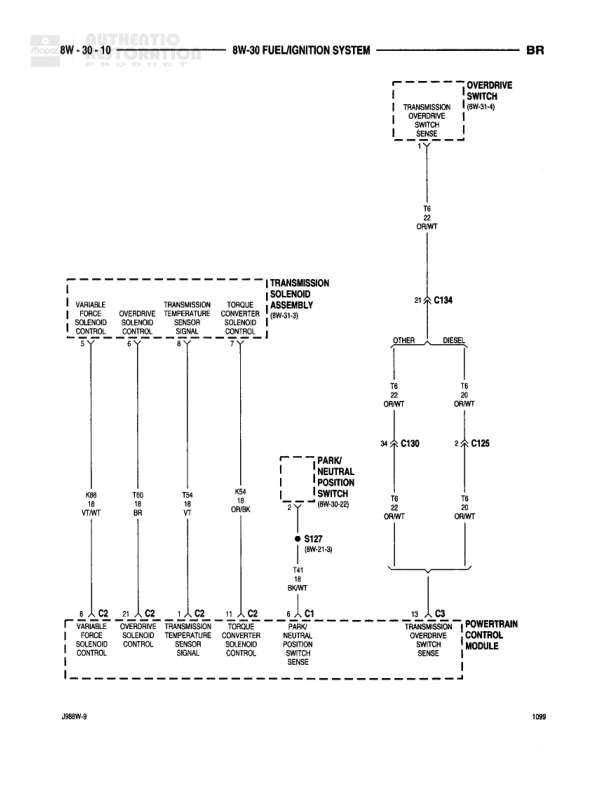

# FUEL/IGNITION SYSTEM

**Notes:** Diagram shows transmission control system including overdrive switch, park/neutral position switch, and various transmission solenoids connected to the Powertrain Control Module. Includes both OTHER and DIESEL variants with different wire routing through C184.

## Components

| Component | Ref | Connectors | Notes |
|-----------|-----|------------|-------|
| OVERDRIVE SWITCH | SHIFTER |  | Part of Transmission Overdrive Switch |
| VARIABLE FORCE SOLENOID CONTROL | 8W-30-10 | C2 |  |
| OVERDRIVE SOLENOID CONTROL | 8W-30-10 | C2 |  |
| TRANSMISSION TEMPERATURE SENSOR SIGNAL | 8W-30-10 | C2 |  |
| TORQUE CONVERTER SOLENOID CONTROL | 8W-30-10 | C2 |  |
| TRANSMISSION SOLENOID POWER | 8W-30-9 | C184 |  |
| PARK/NEUTRAL POSITION SWITCH | 8W-30-42 | C190, C125 |  |
| TRANSMISSION OVERDRIVE SWITCH SENSE | 8W-30-10 | C3 |  |
| PARK/NEUTRAL SWITCH SENSE | C1 |  |  |
| POWERTRAIN CONTROL MODULE | 8W-30-10 | C2, C1, C3 |  |

## Wires

| From | To | Wire Code | Gauge | Color | Notes |
|------|-----|-----------|-------|-------|-------|
| OVERDRIVE SWITCH | T4 OR/WT | T4 | 22 | OR/WT |  |
| TRANSMISSION SOLENOID POWER (8W-30-9) | C184 | T5 | 21 | OR/WT | OTHER |
| C184 | T5 OR/WT | T5 | None | OR/WT |  |
| C184 | T6 OR/WT | T6 | None | OR/WT | DIESEL |
| T5 OR/WT | C190 | T5 | 34 | OR/WT |  |
| C190 | PARK/NEUTRAL POSITION SWITCH | T5 | None | OR/WT |  |
| T6 OR/WT | C125 | T6 | 2 | OR/WT |  |
| C125 | PARK/NEUTRAL POSITION SWITCH | T6 | None | OR/WT |  |
| PARK/NEUTRAL POSITION SWITCH | S127 (8W-21-3) | Z1 | 2 | BK/WT |  |
| S127 | T41 BK/WT | T41 | None | BK/WT |  |
| VARIABLE FORCE SOLENOID CONTROL | PCM C2 | C2 | 8 | VT/WT |  |
| OVERDRIVE SOLENOID CONTROL | PCM C2 | C2 | 21 | BR |  |
| TRANSMISSION TEMPERATURE SENSOR SIGNAL | PCM C2 | C2 | 1 | VT |  |
| TORQUE CONVERTER SOLENOID CONTROL | PCM C2 | C2 | 11 | OR/BK |  |
| PARK/NEUTRAL SWITCH SENSE | PCM C1 | C1 | 11 | VT/WT |  |
| TRANSMISSION OVERDRIVE SWITCH SENSE | PCM C3 | C3 | 13 | LG/OR |  |
| VARIABLE FORCE SOLENOID CONTROL | K98 | K98 | 8 | VT/WT |  |
| OVERDRIVE SOLENOID CONTROL | T90 | T90 | 21 | BR |  |
| TRANSMISSION TEMPERATURE SENSOR SIGNAL | T54 | T54 | 1 | VT |  |
| TORQUE CONVERTER SOLENOID CONTROL | K54 | K54 | 11 | OR/BK |  |

## Splices & Grounds

| ID | Type | Location | Wires Connected | Notes |
|----|------|----------|-----------------|-------|
| S127 | splice | 8W-21-3 | Z1, T41 |  |

## Cross-References

- 8W-30-9
- 8W-30-42
- 8W-21-3
