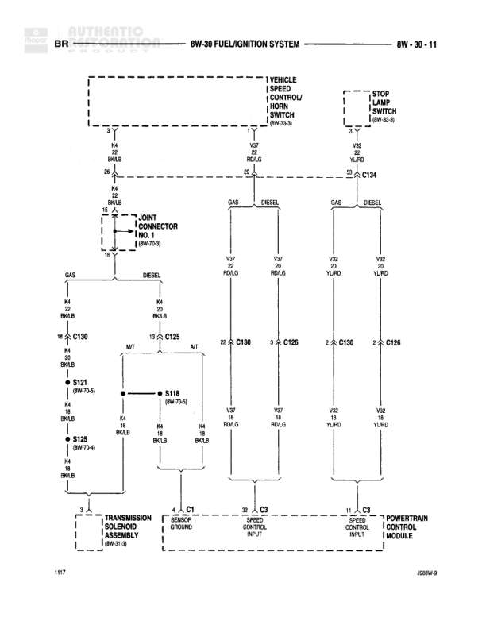

# FUEL/IGNITION SYSTEM

**Notes:** Diagram shows fuel/ignition system connections including vehicle speed control/horn switch, stop lamp switch inputs to powertrain control module. Includes separate GAS and DIESEL wire routing paths. 3-JOINT CONNECTOR NO. 1 (8W-70-9) serves as distribution point for K4 circuit. Connectors C125 (DIESEL), C126, C130 (GAS), and C134 interface with Powertrain Control Module for sensor grounds and speed control inputs.

## Components

| Component | Ref | Connectors | Notes |
|-----------|-----|------------|-------|
| VEHICLE SPEED CONTROL/HORN SWITCH | 8W-30-8 |  | Referenced component |
| STOP LAMP SWITCH | 8W-30-6 |  | Referenced component |
| TRANSMISSION SOLENOID ASSEMBLY | 8W-31-9 | C1 | Connection point for sensor ground |
| POWERTRAIN CONTROL MODULE |  | C1, C2, C3 | Main engine control module with three connectors for sensor grounds and speed control inputs |

## Wires

| From | To | Wire Code | Gauge | Color | Notes |
|------|-----|-----------|-------|-------|-------|
| VEHICLE SPEED CONTROL/HORN SWITCH (8W-30-8) | K4 BK/LB via 3-JOINT CONNECTOR NO. 1 | K4 | 20 | BK/LB |  |
| K4 BK/LB 3-JOINT CONNECTOR | S121 (8W-70-5) | K4 | 18 | BK/LB |  |
| S121 | S125 (8W-70-4) | K4 | 18 | BK/LB |  |
| S125 | C1 TRANSMISSION SOLENOID ASSEMBLY | K4 | 18 | BK/LB |  |
| 3-JOINT CONNECTOR NO. 1 | C130 Pin 18 | K4 | 18 | BK/LB | GAS |
| 3-JOINT CONNECTOR NO. 1 | C125 Pin 13 | K4 | 20 | BK/LB | DIESEL |
| V37 RD/LG | C125 Pin WT | V37 | None | RD/LG |  |
| V37 RD/LG | C130 Pin 27 | V37 | None | RD/LG | GAS |
| V37 RD/LG | C126 Pin 3 | V37 | None | RD/LG |  |
| V35 YL/RD | C130 Pin 2 | V35 | None | YL/RD | GAS |
| V35 YL/RD | C126 Pin 2 | V35 | None | YL/RD |  |
| STOP LAMP SWITCH (8W-30-6) | V32 YL/RD | V32 | 20 | YL/RD |  |
| V32 YL/RD | C134 | V32 | 20 | YL/RD | GAS and DIESEL split |
| C125 | S118 (8W-70-5) | K4 | 18 | BK/LB |  |
| C125 Pin AT | C1 SENSOR GROUND POWERTRAIN CONTROL MODULE |  | None |  | DIESEL |
| C130 Pin WT | C1 SENSOR GROUND POWERTRAIN CONTROL MODULE |  | None |  | GAS |
| C126 | C2 SPEED CONTROL INPUT POWERTRAIN CONTROL MODULE |  | None |  |  |
| C130 | C3 SPEED CONTROL INPUT POWERTRAIN CONTROL MODULE |  | None |  | GAS |

## Splices & Grounds

| ID | Type | Location | Wires Connected | Notes |
|----|------|----------|-----------------|-------|
| S121 | splice | 8W-70-5 | K4 |  |
| S118 | splice | 8W-70-5 | K4 |  |
| S125 | splice | 8W-70-4 | K4 |  |

## Cross-References

- 8W-30-8
- 8W-30-6
- 8W-31-9
- 8W-70-5
- 8W-70-4
