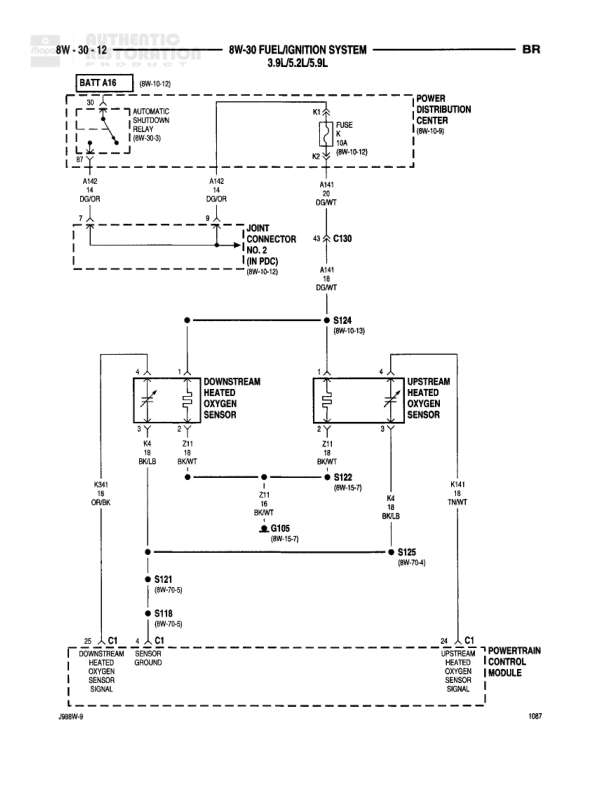

# FUEL/IGNITION SYSTEM 3.9L/5.2L/5.9L

**Notes:** This diagram shows the fuel/ignition system for 3.9L/5.2L/5.9L engines, focusing on the heated oxygen sensor circuits. Power is distributed from the battery through a shutdown relay and power distribution center to both upstream and downstream oxygen sensors. The sensors provide feedback signals to the Powertrain Control Module.

## Components

| Component | Ref | Connectors | Notes |
|-----------|-----|------------|-------|
| BATT A16 | 8W-10-13 |  | Battery feed with shutdown relay |
| POWER DISTRIBUTION CENTER | 8W-10-13 |  | Contains FUSE and fuses K2, K3 |
| JOINT CONNECTOR (IN PDC) | 8W-30-12 | C130 | Located in Power Distribution Center |
| DOWNSTREAM HEATED OXYGEN SENSOR | diagram lower left | C1 | Sensor ground at pin 4 |
| UPSTREAM HEATED OXYGEN SENSOR | diagram lower right | C1 | Sensor ground at pin 4 |
| POWERTRAIN CONTROL MODULE | diagram lower right | C1 | Receives signals from both oxygen sensors |

## Wires

| From | To | Wire Code | Gauge | Color | Notes |
|------|-----|-----------|-------|-------|-------|
| BATT A16 | SHUTDOWN RELAY | A142 | 12 | DG/OR | From battery feed |
| SHUTDOWN RELAY | POWER DISTRIBUTION CENTER K2 | K2 | None | None | FUSE 5 (JB) |
| POWER DISTRIBUTION CENTER K3 | C130 | K3 | None | None | 8W-10-13 |
| BATT A16 | G102 DOOR | A142 | 12 | DG/OR | Ground connection |
| SHUTDOWN RELAY | G102 DOOR | A142 | 12 | DG/OR | Ground connection |
| POWER DISTRIBUTION CENTER | G301 DOWT | A141 | 12 | DG/WT | Ground connection |
| C130 | G301 DOWT | A141 | 12 | DG/WT | Continues from joint connector |
| C130 | S124 | None | None | None | 8W-30-13, continues to splice |
| S124 | DOWNSTREAM HEATED OXYGEN SENSOR Pin 1 | K4 | 18 | BK/LB | 8W-30-13 |
| S124 | UPSTREAM HEATED OXYGEN SENSOR Pin 1 | K4 | 18 | BK/LB | Power feed to sensor |
| DOWNSTREAM HEATED OXYGEN SENSOR Pin 2 | S122 | Z11 | 18 | BK/WT | Ground return |
| UPSTREAM HEATED OXYGEN SENSOR Pin 2 | S122 | Z11 | 18 | BK/WT | Ground return |
| S122 | G105 | Z11 | 18 | BK/WT | 8W-15-7, Ground connection |
| S124 | S125 | None | None | None | 8W-70-4 |
| S125 | S121 | None | None | None | 8W-70-3 |
| S121 | S118 | None | None | None | 8W-70-6 |
| DOWNSTREAM HEATED OXYGEN SENSOR Pin 3 | K341 ORDIN | K341 | 20 | OR/DN | Sensor signal |
| UPSTREAM HEATED OXYGEN SENSOR Pin 3 | K41 TNWT | K41 | 20 | TN/WT | Sensor signal |
| DOWNSTREAM HEATED OXYGEN SENSOR Pin 4 C1 | POWERTRAIN CONTROL MODULE C1 | None | None | None | Sensor ground connection |
| UPSTREAM HEATED OXYGEN SENSOR Pin 4 C1 | POWERTRAIN CONTROL MODULE C1 | None | None | None | Sensor ground connection |

## Splices & Grounds

| ID | Type | Location | Wires Connected | Notes |
|----|------|----------|-----------------|-------|
| G102 | ground | DOOR |  | Ground for battery circuit |
| G301 | ground | DOWT |  | Ground for power distribution |
| G105 | ground | Near oxygen sensors | Z11 | 8W-15-7, Ground for oxygen sensor heater returns |
| S124 | splice | Between C130 and oxygen sensors | K4 | 8W-30-13, Distributes power to both oxygen sensors |
| S122 | splice | Between oxygen sensors and ground | Z11 | 8W-15-7, Combines ground returns from both sensors |
| S125 | splice | Downstream from S124 |  | 8W-70-4 |
| S121 | splice | Downstream from S125 |  | 8W-70-3 |
| S118 | splice | Downstream from S121 |  | 8W-70-6 |

## Cross-References

- 8W-10-13
- 8W-30-13
- 8W-15-7
- 8W-70-4
- 8W-70-3
- 8W-70-6
