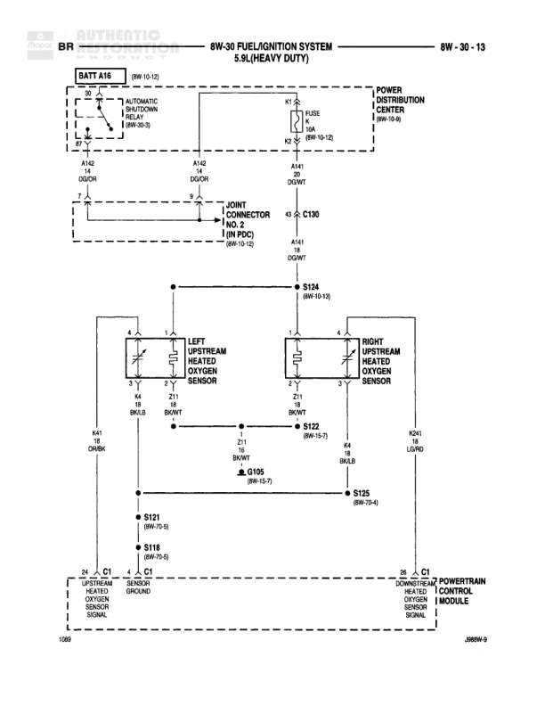

# FUEL/IGNITION SYSTEM 5.9L (HEAVY DUTY)

**Notes:** Diagram shows the upstream heated oxygen sensor circuit for 5.9L Heavy Duty engine. Power is distributed from the Automatic Shutdown Relay through the Power Distribution Center to both left and right upstream O2 sensors. Sensors are grounded through splice S122 and provide signal feedback to the Powertrain Control Module. Document reference: J08M-9

## Components

| Component | Ref | Connectors | Notes |
|-----------|-----|------------|-------|
| BATT A16 | 8W-10-12 |  | Battery source |
| AUTOMATIC SHUTDOWN RELAY | 8W-30-9 |  | Located in Power Distribution Center |
| POWER DISTRIBUTION CENTER | 8W-10-1 |  | Contains FUSE 1 (30A) |
| LEFT UPSTREAM HEATED O2 SENSOR | diagram | C1 | 4-pin connector |
| RIGHT UPSTREAM HEATED O2 SENSOR | diagram | C1 | 4-pin connector |
| POWERTRAIN CONTROL MODULE | 8W-11-53 | C1 | Receives sensor signals |

## Wires

| From | To | Wire Code | Gauge | Color | Notes |
|------|-----|-----------|-------|-------|-------|
| BATT A16 | AUTOMATIC SHUTDOWN RELAY | A142 | 12 | DG/OR |  |
| AUTOMATIC SHUTDOWN RELAY | FUSE 1 (30A) | A142 | 12 | DG/OR |  |
| FUSE 1 | JOINT CONNECTOR | A142 | 12 | DG/OR | 8W-10-12 |
| JOINT CONNECTOR | C130 (pin 4) | A141 | None | DG/WT | 8W-10-12, IN PDC |
| C130 | S124 | A141 | None | DG/WT | 8W-10-13 |
| S124 | LEFT UPSTREAM HEATED O2 SENSOR (pin 4) | A141 | 18 | DG/WT |  |
| S124 | RIGHT UPSTREAM HEATED O2 SENSOR (pin 4) | A141 | 18 | DG/WT |  |
| LEFT UPSTREAM HEATED O2 SENSOR (pin 3) | S122 | Z1 | 18 | BK/WT | 8W-15-7 |
| RIGHT UPSTREAM HEATED O2 SENSOR (pin 3) | S122 | Z1 | 18 | BK/LB |  |
| S122 | C1 FUSE (8W-15-7) | Z1 | None | BK/WT |  |
| S122 | S125 | None | None | None | 8W-70-4 |
| LEFT UPSTREAM HEATED O2 SENSOR (pin 2) | S121 | K41 | 18 | GY/BK | 9W-70-8 |
| RIGHT UPSTREAM HEATED O2 SENSOR (pin 2) | S121 | K241 | 18 | LG/RD |  |
| LEFT UPSTREAM HEATED O2 SENSOR (pin 1) | POWERTRAIN CONTROL MODULE C1 | None | None | None | UPSTREAM HEATED O2 SENSOR SIGNAL |
| RIGHT UPSTREAM HEATED O2 SENSOR (pin 1) | POWERTRAIN CONTROL MODULE C1 | None | None | None | UPSTREAM HEATED O2 SENSOR SIGNAL |
| S121 | POWERTRAIN CONTROL MODULE C1 | None | None | None | SENSOR GROUND |

## Splices & Grounds

| ID | Type | Location | Wires Connected | Notes |
|----|------|----------|-----------------|-------|
| S124 | splice | Upper center of diagram | A141 | 8W-10-13, distributes power to both O2 sensors |
| S122 | splice | Center of diagram | Z1 | 8W-15-7, ground connection for O2 sensors |
| S125 | splice | Lower center of diagram |  | 8W-70-4 |
| S121 | splice | Lower left of diagram | K41, K241 | 9W-70-8, sensor signal splice |
| S118 | splice | Lower left of diagram |  | 9W-70-8 |

## Cross-References

- 8W-10-12
- 8W-30-9
- 8W-10-1
- 8W-10-13
- 8W-15-7
- 8W-70-4
- 8W-11-53
- 9W-70-8
