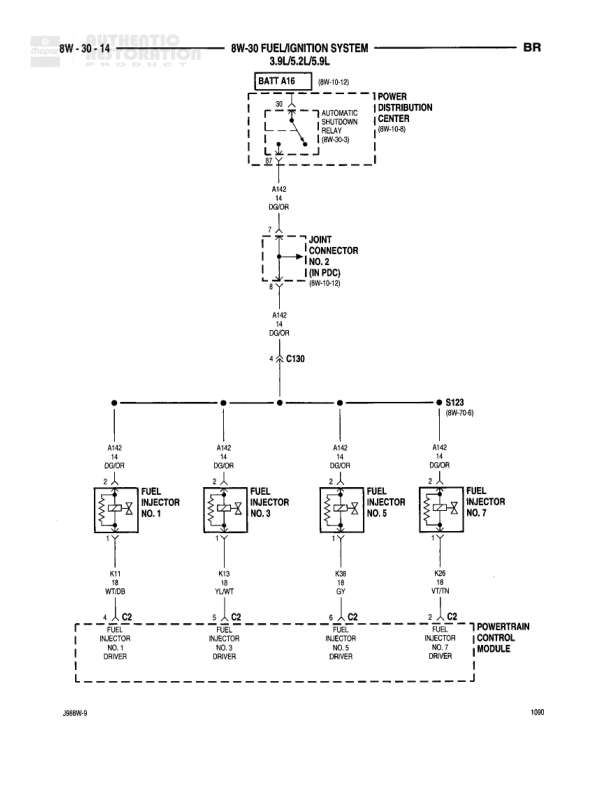

# FUEL/IGNITION SYSTEM 3.9L/5.2L/5.9L

**Notes:** This diagram shows the fuel injector circuit for cylinders 1, 3, 5, and 7 on 3.9L/5.2L/5.9L engines. Power flows from battery through automatic shutdown relay in PDC to all injectors. Each injector is individually controlled by the PCM through separate driver circuits.

## Components

| Component | Ref | Connectors | Notes |
|-----------|-----|------------|-------|
| BATT A16 | 8W-10-10 |  | Battery feed, continues from POWER DISTRIBUTION CENTER |
| POWER DISTRIBUTION CENTER | 8W-10-8 |  | AUTOMATIC SHUTDOWN RELAY (8W-30-6) |
| JOINT CONNECTOR NO. 2 (IN PDC) | 8W-10-10 |  | Located in Power Distribution Center |
| FUEL INJECTOR NO. 1 |  | C2 |  |
| FUEL INJECTOR NO. 3 |  | C2 |  |
| FUEL INJECTOR NO. 5 |  | C2 |  |
| FUEL INJECTOR NO. 7 |  | C2 |  |
| POWERTRAIN CONTROL MODULE |  | C2 | Injector drivers NO. 1, 3, 5, 7 |

## Wires

| From | To | Wire Code | Gauge | Color | Notes |
|------|-----|-----------|-------|-------|-------|
| BATT A16 | JOINT CONNECTOR NO. 2 (IN PDC) | A142 | 14 | DG/OR |  |
| JOINT CONNECTOR NO. 2 (IN PDC) | C130 | A142 | 14 | DG/OR |  |
| C130 | S123 | A142 | 14 | DG/OR |  |
| S123 | FUEL INJECTOR NO. 1 | A142 | 14 | DG/OR |  |
| S123 | FUEL INJECTOR NO. 3 | A142 | 14 | DG/OR |  |
| S123 | FUEL INJECTOR NO. 5 | A142 | 14 | DG/OR |  |
| S123 | FUEL INJECTOR NO. 7 | A142 | 14 | DG/OR |  |
| FUEL INJECTOR NO. 1 | POWERTRAIN CONTROL MODULE INJECTOR NO. 1 DRIVER | K11 | 18 | WT/DB |  |
| FUEL INJECTOR NO. 3 | POWERTRAIN CONTROL MODULE INJECTOR NO. 3 DRIVER | K13 | 18 | YL/WT |  |
| FUEL INJECTOR NO. 5 | POWERTRAIN CONTROL MODULE INJECTOR NO. 5 DRIVER | K36 | 18 | GY |  |
| FUEL INJECTOR NO. 7 | POWERTRAIN CONTROL MODULE INJECTOR NO. 7 DRIVER | K38 | 18 | VT/TN |  |

## Splices & Grounds

| ID | Type | Location | Wires Connected | Notes |
|----|------|----------|-----------------|-------|
| S123 | splice | 8W-70-6 | A142 | Distributes power to all four fuel injectors |
| C130 | connector | inline on A142 | A142 | In-line connector |

## Cross-References

- 8W-10-10
- 8W-10-8
- 8W-30-6
- 8W-70-6
