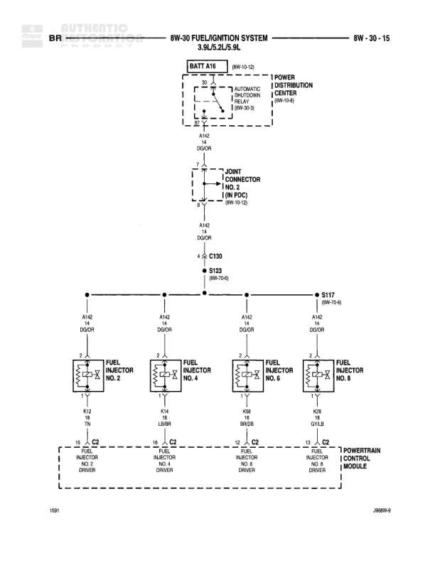

# AUTOMATIC 6W-30 FUEL/IGNITION SYSTEM 3.9L/5.2L/5.9L

**Notes:** Diagram shows fuel injector circuit for cylinders 2, 4, 6, and 8 on automatic transmission equipped 3.9L/5.2L/5.9L engines. Power is fed from the Automatic Shutdown Relay through the Power Distribution Center to all injectors in parallel, with individual return circuits to the PCM for each injector driver.

## Components

| Component | Ref | Connectors | Notes |
|-----------|-----|------------|-------|
| Automatic Shutdown Relay | 8W-30-3 |  | Located in Power Distribution Center |
| Joint Connector | 8W-10-12 |  | NO. 2 (IN PDC) |
| Fuel Injector NO. 2 |  | C2 |  |
| Fuel Injector NO. 4 |  | C2 |  |
| Fuel Injector NO. 6 |  | C2 |  |
| Fuel Injector NO. 8 |  | C2 |  |
| Powertrain Control Module |  |  | Fuel Injector Drivers NO. 2, 4, 6, 8 |
| Power Distribution Center | 8W-10-8 |  |  |

## Wires

| From | To | Wire Code | Gauge | Color | Notes |
|------|-----|-----------|-------|-------|-------|
| BATT A16 | Automatic Shutdown Relay |  | None |  | 8W-10-12 |
| Automatic Shutdown Relay | Power Distribution Center |  | None |  | 8W-10-8 |
| Power Distribution Center | A142 DOOR | A142 | 14 | DG/OR |  |
| Joint Connector NO. 2 (IN PDC) | A142 DOOR | A142 | 14 | DG/OR | 8W-10-12 |
| A142 DOOR | C130 | A142 | 14 | DG/OR |  |
| C130 | S123 |  | None |  | 8W-10-4 |
| S123 | A142 DOOR (left branch) | A142 | 14 | DG/OR |  |
| S123 | A142 DOOR (second branch) | A142 | 14 | DG/OR |  |
| S123 | A142 DOOR (third branch) | A142 | 14 | DG/OR |  |
| S123 | S117 |  | None |  | 8W-70-8 |
| S117 | A142 DOOR (fourth branch) | A142 | 14 | DG/OR |  |
| A142 DOOR (left) | Fuel Injector NO. 2 Pin 2 | A142 | 14 | DG/OR |  |
| A142 DOOR (second) | Fuel Injector NO. 4 Pin 2 | A142 | 14 | DG/OR |  |
| A142 DOOR (third) | Fuel Injector NO. 6 Pin 2 | A142 | 14 | DG/OR |  |
| A142 DOOR (fourth) | Fuel Injector NO. 8 Pin 2 | A142 | 14 | DG/OR |  |
| Fuel Injector NO. 2 Pin 1 | C2 | K12 | 18 | TN |  |
| C2 | Powertrain Control Module (Fuel Injector NO. 2 Driver) | K12 | 18 | DG/GY |  |
| Fuel Injector NO. 4 Pin 1 | C2 | K14 | 18 | LB/BR |  |
| C2 | Powertrain Control Module (Fuel Injector NO. 4 Driver) | K14 | 18 | DB/GY |  |
| Fuel Injector NO. 6 Pin 1 | C2 | K58 | 18 | BR/DB |  |
| C2 | Powertrain Control Module (Fuel Injector NO. 6 Driver) | K58 | 18 | OR/GY |  |
| Fuel Injector NO. 8 Pin 1 | C2 | K48 | 18 | GY/LB |  |
| C2 | Powertrain Control Module (Fuel Injector NO. 8 Driver) | K48 | 18 | BR/YL |  |

## Splices & Grounds

| ID | Type | Location | Wires Connected | Notes |
|----|------|----------|-----------------|-------|
| S123 | splice |  | A142 | 8W-10-4, splits A142 to four fuel injectors |
| C130 | connector |  | A142 |  |
| S117 | splice |  | A142 | 8W-70-8 |

## Cross-References

- 8W-10-12
- 8W-10-8
- 8W-10-4
- 8W-70-8
- 8W-30-3
