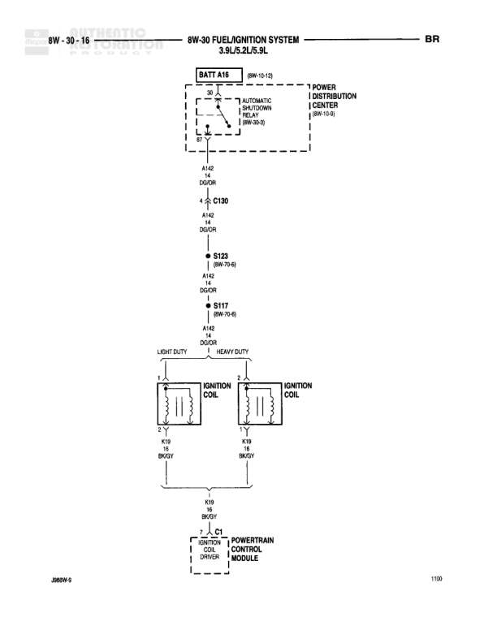

# 8W-30 FUEL/IGNITION SYSTEM 9.0L

**Notes:** This diagram shows the upstream heated oxygen sensor circuits for a 9.0L engine. Both left and right upstream oxygen sensors are heated and receive power through the Automatic Shutdown Relay and a 30A fuse in the Power Distribution Center. The sensors connect to the Powertrain Control Module for signal processing. Ground circuit Z11 connects through multiple splices (S118, S121, S125) while Z1 grounds at G105.

## Components

| Component | Ref | Connectors | Notes |
|-----------|-----|------------|-------|
| AUTOMATIC SHUTDOWN RELAY | 8W-30-8 |  | Located in battery air section |
| POWER DISTRIBUTION CENTER | 8W-10-12 |  | Contains FUSE with 30A rating |
| RIGHT UPSTREAM HEATED OXYGEN SENSOR | 1N03 |  | 4-wire sensor |
| LEFT UPSTREAM HEATED OXYGEN SENSOR | 1N03 |  | 4-wire sensor |
| POWERTRAIN CONTROL MODULE | 8W-30-1 | C1, C2, C3 | Connected to both oxygen sensors and receives power from fuse |

## Wires

| From | To | Wire Code | Gauge | Color | Notes |
|------|-----|-----------|-------|-------|-------|
| BATT AIR 8W-10-12 | AUTOMATIC SHUTDOWN RELAY | None | None | None | None |
| AUTOMATIC SHUTDOWN RELAY | POWER DISTRIBUTION CENTER FUSE 30A | None | None | None | K1 circuit at fuse input, K2 at fuse output |
| POWER DISTRIBUTION CENTER | A142 ODOR | A142 | None | None | 8W-10-12 |
| A142 ODOR | A142 ODOR (second location) | A142 | None | None | None |
| POWER DISTRIBUTION CENTER | A141 DGWT | A141 | None | None | None |
| A142 ODOR (second location) | JOINT CONNECTOR NO. 2 (IN PDC) | A142 | None | None | 8W-10-12 |
| JOINT CONNECTOR NO. 2 | C130 | A141 | None | None | Pin 4 |
| C130 | A141 DGWT | A141 | None | None | None |
| A141 DGWT | S134 | None | None | None | 8W-10-13 |
| S134 | RIGHT UPSTREAM HEATED OXYGEN SENSOR Pin 1 | None | None | None | None |
| S134 | LEFT UPSTREAM HEATED OXYGEN SENSOR Pin 1 | None | None | None | None |
| RIGHT UPSTREAM HEATED OXYGEN SENSOR Pin 4 | K/H1 18 TNWT | K/H1 | 18 | TN/WT | None |
| RIGHT UPSTREAM HEATED OXYGEN SENSOR Pin 3 | 1N 18 BKWT | 1N | 18 | BK/WT | None |
| LEFT UPSTREAM HEATED OXYGEN SENSOR Pin 3 | 1N 18 BKWT | 1N | 18 | BK/WT | None |
| LEFT UPSTREAM HEATED OXYGEN SENSOR Pin 4 | K41 18 BKDG | K41 | 18 | BK/DG | None |
| 1N BKWT (from both sensors) | S122 | 1N | None | BK/WT | 8W-15-7 |
| S122 | Z11 18 BKWT | Z11 | 18 | BK/WT | None |
| S122 | Z1 18 BKLB | Z1 | 18 | BK/LB | None |
| Z1 BKLB | G105 | Z1 | None | BK/LB | 8W-13-6 |
| Z11 BKWT | S125 | Z11 | None | BK/WT | 8W-70-4 |
| Z11 BKWT | S121 | Z11 | None | BK/WT | 8W-70-5 |
| S121 | S118 | Z11 | None | BK/WT | 8W-70-5 |
| S118 | POWERTRAIN CONTROL MODULE C1 | None | None | None | Ground for RIGHT UPSTREAM HEATED OXYGEN SENSOR SIGNAL |
| K/H1 TNWT | POWERTRAIN CONTROL MODULE C2 | K/H1 | None | TN/WT | RIGHT UPSTREAM HEATED OXYGEN SENSOR SIGNAL |
| K41 BKDG | POWERTRAIN CONTROL MODULE C3 | K41 | None | BK/DG | LEFT UPSTREAM HEATED OXYGEN SENSOR SIGNAL |

## Splices & Grounds

| ID | Type | Location | Wires Connected | Notes |
|----|------|----------|-----------------|-------|
| S134 | splice | Power feed to both oxygen sensors | A141 from DGWT, to RIGHT O2 Pin 1, to LEFT O2 Pin 1 | 8W-10-13 |
| S122 | splice | Ground junction for oxygen sensors | 1N BKWT, Z11 BKWT, Z1 BKLB | 8W-15-7 |
| S125 | splice | Ground distribution point | Z11 | 8W-70-4 |
| S121 | splice | Ground distribution point | Z11 | 8W-70-5 |
| S118 | splice | Ground distribution point before PCM | Z11 | 8W-70-5 |
| G105 | ground | Ground point for oxygen sensor circuit |  | 8W-13-6 |

## Cross-References

- 8W-10-12
- 8W-10-13
- 8W-30-8
- 8W-15-7
- 8W-13-6
- 8W-70-4
- 8W-70-5
- 8W-30-1
