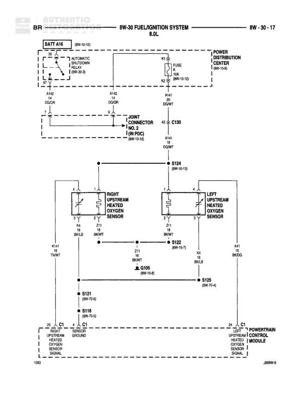

# FUEL/IGNITION SYSTEM 8.0L (CALIFORNIA)

**Notes:** California emissions system with three heated oxygen sensors - two pre-catalyst (heavy duty and light duty options) and one post-catalyst. All sensor heaters powered through common splice S124. System includes ASD relay control for fuel/ignition components. Heavy duty vs light duty pre-catalyst sensor selection based on vehicle configuration.

## Components

| Component | Ref | Connectors | Notes |
|-----------|-----|------------|-------|
| Battery (BATT A16) | 8W-60-10 |  | Battery feed source |
| ASD Relay (Automatic Shutdown Relay) | 8W-30-13 |  | Controls power to fuel/ignition components |
| Power Distribution Center | 8W-10-8 |  | Contains fuses |
| Joint Connector (In PDC) | 8W-10-12 |  | Junction point in Power Distribution Center |
| Pre-Catalyst Heated Oxygen Sensor (Heavy Duty) | diagram |  | Left side sensor |
| Pre-Catalyst Heated Oxygen Sensor (Light Duty) | diagram |  | Left side sensor |
| Post-Catalyst Heated Oxygen Sensor | diagram |  | Right side sensor |
| Powertrain Control Module | diagram | C1 | Engine control computer |

## Wires

| From | To | Wire Code | Gauge | Color | Notes |
|------|-----|-----------|-------|-------|-------|
| BATT A16 | ASD Relay | A142 | None | RD/OR | Battery feed to relay |
| ASD Relay | DOOR connector | A142 | None | RD/OR |  |
| ASD Relay output | Power Distribution Center (FUSE 2) | K2 | 10 | WT/LG | 10A fuse in PDC |
| Power Distribution Center | DOOR connector | A141 | None | RD/WT |  |
| DOOR connector | Joint Connector | A141 | None | RD/WT |  |
| Joint Connector | C130 pin 43 | A141 | None | RD/WT |  |
| C130 | S124 | A141 | None | RD/WT | 8W-10-13 |
| S124 | Pre-Catalyst Heated Oxygen Sensor (Heavy Duty) pin 1 | A141 | None | RD/WT |  |
| S124 | Pre-Catalyst Heated Oxygen Sensor (Light Duty) pin 1 | A141 | None | RD/WT |  |
| S124 | Post-Catalyst Heated Oxygen Sensor pin 1 | A141 | None | RD/WT |  |
| Pre-Catalyst Heated Oxygen Sensor (Heavy Duty) pin 2 | S122 | Z11 | None | BK/WT | 8W-15-7 |
| Pre-Catalyst Heated Oxygen Sensor (Light Duty) pin 2 | S122 | Z11 | None | BK/WT | 8W-15-7 |
| Post-Catalyst Heated Oxygen Sensor pin 2 | S122 | Z11 | None | BK/WT | 8W-15-7 |
| S122 | G105 | Z11 | None | BK/WT | 8W-15-8 |
| G105 | S125 | None | None | None | 8W-70-8 |
| S122 | S121 | None | None | None | 8W-70-5 |
| S121 | S118 | None | None | None | 8W-70-5 |
| Pre-Catalyst Heated Oxygen Sensor (Heavy Duty) pin 3 | Powertrain Control Module C1 pin 30 | K141 | None | TN/WT | Signal wire, Catalyst Ground |
| Pre-Catalyst Heated Oxygen Sensor (Light Duty) pin 3 | Powertrain Control Module C1 pin 30 | K141 | None | TN/WT | Signal wire, Catalyst Ground |
| Post-Catalyst Heated Oxygen Sensor pin 3 | Powertrain Control Module C1 pin 25 | K341 | None | OR/DG | Signal wire, Catalyst Ground |
| Pre-Catalyst Heated Oxygen Sensor (Heavy Duty) pin 4 | Powertrain Control Module | K4 | None | BK/LB | Signal wire |
| Pre-Catalyst Heated Oxygen Sensor (Light Duty) pin 4 | Powertrain Control Module | K4 | None | BK/LB | Signal wire |
| Post-Catalyst Heated Oxygen Sensor pin 4 | Powertrain Control Module | K4 | None | BK/LB | Signal wire |

## Splices & Grounds

| ID | Type | Location | Wires Connected | Notes |
|----|------|----------|-----------------|-------|
| S124 | splice | Near oxygen sensors | A141 | 8W-10-13, distributes power to all three oxygen sensor heaters |
| S122 | splice | Near oxygen sensors | Z11 | 8W-15-7, collects grounds from oxygen sensor heaters |
| S121 | splice | Ground path |  | 8W-70-5 |
| S118 | splice | Ground path |  | 8W-70-5 |
| S125 | splice | Ground path |  | 8W-70-8 |
| G105 | ground | Main ground point |  | 8W-15-8 |

## Cross-References

- 8W-60-10
- 8W-30-13
- 8W-10-8
- 8W-10-12
- 8W-10-13
- 8W-15-7
- 8W-15-8
- 8W-70-5
- 8W-70-8
