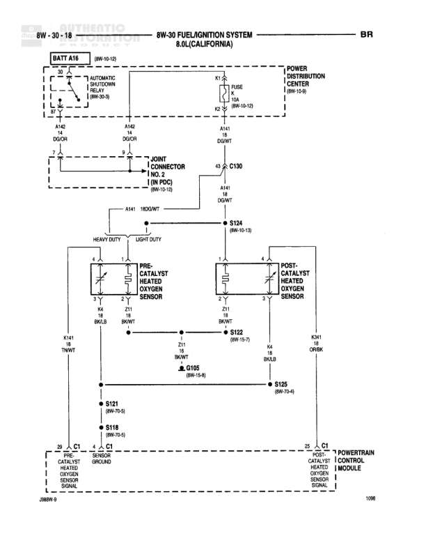

# FUEL/IGNITION SYSTEM 8.0L

**Notes:** This diagram shows the fuel injector power distribution for injectors 1, 3, 5, 7, and 9 (odd numbered injectors) on an 8.0L engine. Power flows from BATT A16 through the Automatic Shutdown Relay, through Joint Connector No. 2, to splice C130 which distributes to all injectors. Each injector is grounded through the PCM driver circuits via connector C2. The diagram shows the first half of the fuel injection system; even numbered injectors (2, 4, 6, 8) likely appear on another diagram page.

## Components

| Component | Ref | Connectors | Notes |
|-----------|-----|------------|-------|
| BATT A16 | 8W-10-12 |  | Battery feed source |
| AUTOMATIC SHUTDOWN RELAY | 8W-30-3 |  | Power distribution component |
| POWER DISTRIBUTION CENTER | 8W-10-6 |  | Main power distribution |
| FUEL INJECTOR NO. 1 |  | K11 | Left bank injector |
| FUEL INJECTOR NO. 3 |  | K13 | Left bank injector |
| FUEL INJECTOR NO. 5 |  | K58 | Center injector |
| FUEL INJECTOR NO. 7 |  | K58 | Right bank injector |
| FUEL INJECTOR NO. 9 |  | K19 | Right bank injector |
| POWERTRAIN CONTROL MODULE |  | C2 | PCM - controls fuel injectors |
| JOINT CONNECTOR NO. 2 (IN PDC) | 8W-10-15 |  | Junction connector in Power Distribution Center |

## Wires

| From | To | Wire Code | Gauge | Color | Notes |
|------|-----|-----------|-------|-------|-------|
| BATT A16 | AUTOMATIC SHUTDOWN RELAY (pin 30) | A16 | 14 | DG/OR |  |
| AUTOMATIC SHUTDOWN RELAY (pin 87) | JOINT CONNECTOR NO. 2 | A142 | 14 | DG/OR |  |
| JOINT CONNECTOR NO. 2 | C130 | A142 | 14 | DG/OR |  |
| C130 | FUEL INJECTOR NO. 1 (pin 1) | A142 | 18 | DG/OR |  |
| C130 | FUEL INJECTOR NO. 3 (pin 1) | A142 | 18 | DG/OR |  |
| C130 | FUEL INJECTOR NO. 5 (pin 1) | A142 | 18 | DG/OR |  |
| C130 | FUEL INJECTOR NO. 7 (pin 1) | A142 | 18 | DG/OR |  |
| C130 | FUEL INJECTOR NO. 9 (pin 1) | A142 | 18 | DG/OR |  |
| C130 | S123 | A142 | 18 | DG/OR |  |
| FUEL INJECTOR NO. 1 (pin 2) | POWERTRAIN CONTROL MODULE C2 (FUEL INJECTOR DRIVER) | K11 | 18 | WT/DB |  |
| FUEL INJECTOR NO. 3 (pin 2) | POWERTRAIN CONTROL MODULE C2 (FUEL INJECTOR DRIVER) | K13 | 18 | BR/LB |  |
| FUEL INJECTOR NO. 5 (pin 2) | POWERTRAIN CONTROL MODULE C2 (FUEL INJECTOR DRIVER) | K58 | 18 | GY |  |
| FUEL INJECTOR NO. 7 (pin 2) | POWERTRAIN CONTROL MODULE C2 (FUEL INJECTOR DRIVER) | K58 | 18 | YL/TN |  |
| FUEL INJECTOR NO. 9 (pin 2) | POWERTRAIN CONTROL MODULE C2 (FUEL INJECTOR DRIVER) | K19 | 18 | TN/BK |  |

## Splices & Grounds

| ID | Type | Location | Wires Connected | Notes |
|----|------|----------|-----------------|-------|
| C130 | splice | Distribution point for injector power feed | A142 | Splits A142 to all 5 fuel injectors and S123 |
| S123 | splice | 8W-10-7 | A142 | Continues to other injectors |

## Cross-References

- 8W-10-12
- 8W-30-3
- 8W-10-6
- 8W-10-15
- 8W-10-7
