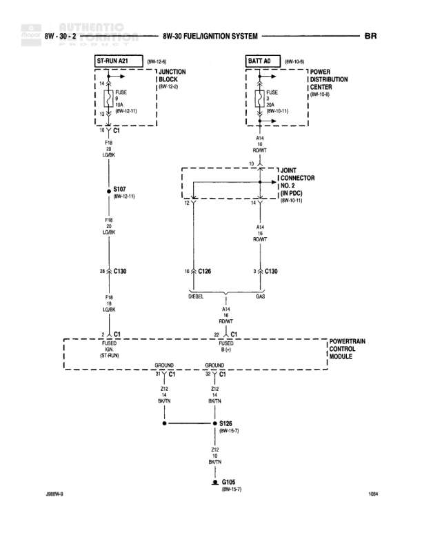

# FUEL/IGNITION SYSTEM

**Notes:** Diagram shows fuel/ignition system wiring with both DIESEL and GAS configurations. Document ID: 288IW-9, Page: 10A

## Components

| Component | Ref | Connectors | Notes |
|-----------|-----|------------|-------|
| ST-RUN A21 | 8W-12-0 |  | Junction Block |
| BATT A0 | 8W-10-0 |  | Power Distribution Center |
| JOINT CONNECTOR NO. 2 (IN PDC) | 8W-10-11 | J JOINT CONNECTOR NO. 2 |  |
| POWERTRAIN CONTROL MODULE |  | C1, C1 | Has Ground and Circ-Ignd connections |

## Wires

| From | To | Wire Code | Gauge | Color | Notes |
|------|-----|-----------|-------|-------|-------|
| ST-RUN A21 FUSE | S107 | F16 | 20 | DG/BK |  |
| S107 | C130 Pin 28 | F16 | 18 | DG/BK |  |
| BATT A0 FUSE | J JOINT CONNECTOR NO. 2 | A14 | 12 | RD/WT |  |
| J JOINT CONNECTOR NO. 2 | C130 Pin 3 | A14 | 12 | RD/WT |  |
| C130 Pin 18 | C106 | A14 | None | RD/WT | DIESEL |
| C130 | C106 | A14 | None | RD/WT | GAS |
| C130 Pin 2 | C1 (ST-RUN) | K30 | None |  |  |
| C106 Pin 22 | C1 FUSED B (+) |  | None |  |  |
| C1 GROUND Pin 5 | S126 | Z12 | 18 | BK/TN |  |
| C1 CIRC-IGND Pin 32 | S126 | Z12 | 18 | BK/TN |  |
| S126 | G106 | Z12 | 18 | BK/TN |  |

## Splices & Grounds

| ID | Type | Location | Wires Connected | Notes |
|----|------|----------|-----------------|-------|
| S107 | splice | 8W-15-11 | F16 |  |
| C130 | connector |  | F16, A14 |  |
| C106 | connector |  | A14 |  |
| S126 | splice | 8W-15-7 | Z12 |  |
| G106 | ground | 8W-15-7 |  |  |

## Cross-References

- 8W-12-0
- 8W-10-0
- 8W-10-11
- 8W-15-11
- 8W-15-7
