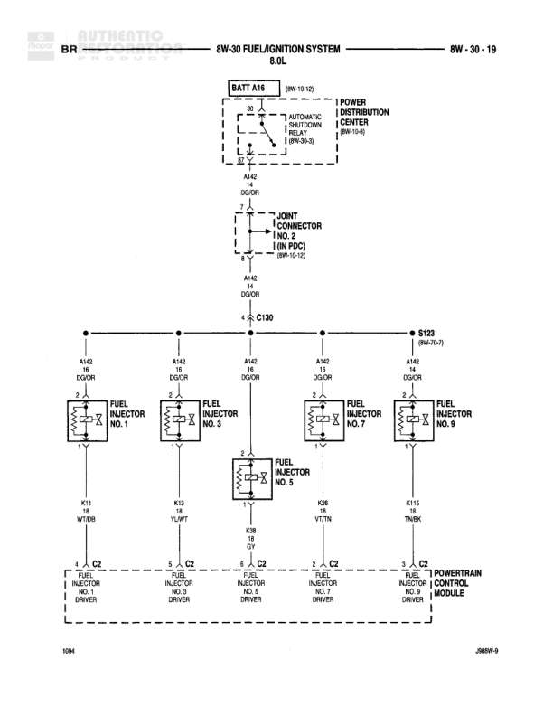

# FUEL/IGNITION SYSTEM 8.0L

**Notes:** This diagram shows the fuel injector circuit for cylinders 2, 4, 6, 8, and 10 of an 8.0L engine. Power is supplied through the Automatic Shutdown Relay and distributed to all injectors via splice S117. Each injector is individually controlled by the Powertrain Control Module through dedicated driver circuits.

## Components

| Component | Ref | Connectors | Notes |
|-----------|-----|------------|-------|
| BATT A16 | 8W-10-1a |  | Battery connection |
| AUTOMATIC SHUTDOWN RELAY | 8W-30-9 | 30, 87, 85, 86 | Located in Power Distribution Center |
| POWER DISTRIBUTION CENTER | 8W-10-6 |  |  |
| DLC CONNECTOR NO. 2 (IN PDC) | 8W-10-12 |  | Data Link Connector |
| FUEL INJECTOR NO. 2 |  | 1, 2 | K12 TN |
| FUEL INJECTOR NO. 4 |  | 1, 2 | K14 LB/BR |
| FUEL INJECTOR NO. 6 |  | 1, 2 | K58 BR/DB |
| FUEL INJECTOR NO. 8 |  | 1, 2 | K38 GY/LB |
| FUEL INJECTOR NO. 10 |  | 1, 2 | K116 WT |
| POWERTRAIN CONTROL MODULE |  | C2 | Pins 11, 10, 12, 13, 14 connected to fuel injector drivers |

## Wires

| From | To | Wire Code | Gauge | Color | Notes |
|------|-----|-----------|-------|-------|-------|
| BATT A16 | AUTOMATIC SHUTDOWN RELAY pin 30 | A142 | None | DG/OR |  |
| AUTOMATIC SHUTDOWN RELAY pin 87 | DLC CONNECTOR NO. 2 | A142 | None | DG/OR |  |
| DLC CONNECTOR NO. 2 | C130 | A142 | None | DG/OR |  |
| C130 | S123 | A142 | None | DG/OR | 8W-70-7 |
| S123 | S117 | A142 | None | DG/OR | 8W-70-7 |
| S117 | S131 | A142 | None | DG/OR | 8W-70-7 |
| S117 | FUEL INJECTOR NO. 2 pin 2 | A142 | None | DG/OR |  |
| S117 | FUEL INJECTOR NO. 4 pin 2 | A142 | None | DG/OR |  |
| S117 | FUEL INJECTOR NO. 6 pin 2 | A142 | None | DG/OR |  |
| S117 | FUEL INJECTOR NO. 8 pin 2 | A142 | None | DG/OR |  |
| S117 | FUEL INJECTOR NO. 10 pin 2 | A142 | None | DG/OR |  |
| FUEL INJECTOR NO. 2 pin 1 | POWERTRAIN CONTROL MODULE C2 pin 11 | K12 | None | TN | NO. 2 DRIVER |
| FUEL INJECTOR NO. 4 pin 1 | POWERTRAIN CONTROL MODULE C2 pin 10 | K14 | None | LB/BR | NO. 4 DRIVER |
| FUEL INJECTOR NO. 6 pin 1 | POWERTRAIN CONTROL MODULE C2 pin 12 | K58 | None | BR/DB | NO. 6 DRIVER |
| FUEL INJECTOR NO. 8 pin 1 | POWERTRAIN CONTROL MODULE C2 pin 13 | K38 | None | GY/LB | NO. 8 DRIVER |
| FUEL INJECTOR NO. 10 pin 1 | POWERTRAIN CONTROL MODULE C2 pin 14 | K116 | None | WT | NO. 10 DRIVER |

## Splices & Grounds

| ID | Type | Location | Wires Connected | Notes |
|----|------|----------|-----------------|-------|
| C130 | connector | In-line connector on A142 circuit | A142 |  |
| S123 | splice | 8W-70-7 | A142 |  |
| S117 | splice | 8W-70-7 | A142 | Distributes power to all fuel injectors shown |
| S131 | splice | 8W-70-7 | A142 |  |

## Cross-References

- 8W-10-1a
- 8W-10-6
- 8W-30-9
- 8W-10-12
- 8W-70-7
