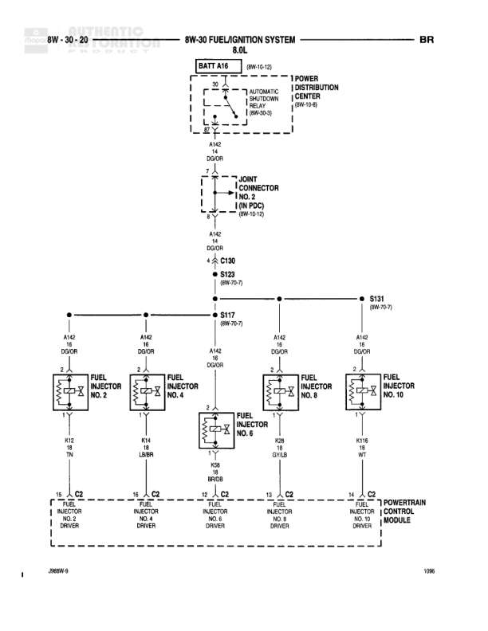

# FUEL/IGNITION SYSTEM 8.0L

**Notes:** Diagram shows fuel/ignition system for 8.0L engine with dual 4-pack ignition coils. Power flows from battery through ASD relay to both coil packs. Each coil driver is independently controlled by PCM. Note: Only 5 of the 8 coil drivers are shown on this diagram page (NO. 1, 2, 3, 4, 5). Remaining drivers (NO. 6, 7, 8) likely on another page.

## Components

| Component | Ref | Connectors | Notes |
|-----------|-----|------------|-------|
| Battery A16 | BATT A16 |  | 8W-10-12 |
| Automatic Shutdown Relay | 8W-30-3 |  | Located in Power Distribution Center |
| Ignition Coil 4-Pack (Left) | Left bank | C1 | Cylinders 1,3,5,7 |
| Ignition Coil 4-Pack (Right) | Right bank | C1 | Cylinders 2,4,6,8 |
| Powertrain Control Module | PCM | C1 | Controls all ignition coils |
| Joint Connector (in PDC) | Power Distribution Center |  | 8W-10-12 |

## Wires

| From | To | Wire Code | Gauge | Color | Notes |
|------|-----|-----------|-------|-------|-------|
| BATT A16 | Automatic Shutdown Relay | A142 | 12 | DG/OR | Battery feed to ASD relay |
| Automatic Shutdown Relay | Joint Connector (in PDC) | A142 | 14 | DG/OR | None |
| Joint Connector | C130 | A142 | 14 | DG/OR | None |
| C130 | S123 | A142 | 14 | DG/OR | 8W-70-7 |
| S123 | S131 | None | None | None | 8W-70-7 |
| S131 | S117 | A142 | 14 | DG/OR | 8W-70-7 |
| S117 | Left Ignition Coil 4-Pack Pin 2 | A142 | 14 | DG/OR | None |
| S117 | Right Ignition Coil 4-Pack Pin 2 | A142 | 14 | DG/OR | None |
| Left Ignition Coil 4-Pack Pin 1 | PCM Ignition Coil NO. 5 Driver | K17 | 20 | DB/WT | None |
| Left Ignition Coil 4-Pack Pin 3 | PCM Ignition Coil NO. 3 Driver | K18 | 20 | RD/BK | None |
| Right Ignition Coil 4-Pack Pin 1 | PCM Ignition Coil NO. 2 Driver | K49 | 20 | BR/WT | None |
| Right Ignition Coil 4-Pack Pin 3 | PCM Ignition Coil NO. 1 Driver | K48 | 18 | YL/WT | None |
| Right Ignition Coil 4-Pack Pin 4 | PCM Ignition Coil NO. 4 Driver | K16 | 20 | DG/WT | None |

## Splices & Grounds

| ID | Type | Location | Wires Connected | Notes |
|----|------|----------|-----------------|-------|
| C130 | connector | In-line connector | A142 | None |
| S123 | splice | External splice point | A142 | 8W-70-7 |
| S131 | splice | External splice point | A142 | 8W-70-7 |
| S117 | splice | External splice point - splits to both coil packs | A142 | 8W-70-7 |

## Cross-References

- 8W-10-12
- 8W-30-3
- 8W-70-7
