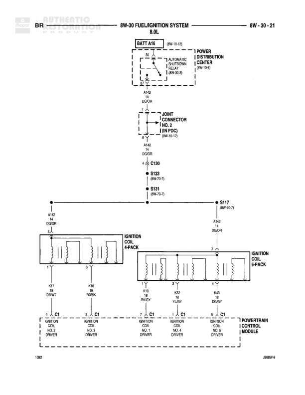

# FUEL/IGNITION SYSTEM - GAS

**Notes:** This diagram shows the gas fuel/ignition system including connections to the Powertrain Control Module, crankshaft position sensor, engine oil pressure sensor, generator, and various control circuits. The diagram includes power feed from ST-RUN ACC through junction block.

## Components

| Component | Ref | Connectors | Notes |
|-----------|-----|------------|-------|
| ST-RUN ACC | 8W-13-6 |  | Junction Block (8W-13-3) |
| CONTROLLER ANTILOCK BRAKE | 8W-36-3 | C1 | None |
| CRANKSHAFT POSITION SENSOR | None |  | Shows 5V supply, sensor signal, and ground connections |
| DUTY CYCLE VAPOR PURGE SOLENOID | None |  | None |
| POWERTRAIN CONTROL MODULE | None | C1, C2 | Main engine control module |
| ENGINE OIL PRESSURE SENSOR | None |  | None |
| PARK/NEUTRAL POSITION SWITCH | None |  | None |
| GENERATOR | 8W-30-3 |  | None |

## Wires

| From | To | Wire Code | Gauge | Color | Notes |
|------|-----|-----------|-------|-------|-------|
| ST-RUN ACC/FUSE 10A (8W-13-15) | C134 | F10 | 18 | DB/WT | None |
| C134 | S106 (8W-12-8) | F10 | 18 | DB/WT | None |
| S106 | C130 | K2 | 18 | WT/VT | None |
| C130 | Powertrain Control Module C1 | K2 | 18 | WT/VT | PARK/NEUTRAL POSITION SWITCH |
| CRANKSHAFT POSITION SENSOR (5V SUPPLY) | S121 (8W-10-5) | K4 | 20 | OR/LB | None |
| S121 | S118 (8W-10-5) | K4 | 20 | OR/LB | None |
| C130 | Controller Antilock Brake C1 | K6 | 18 | WT/VT | VEHICLE SENSOR SIGNAL |
| Controller Antilock Brake C1 (GY OR WT/OR) | Powertrain Control Module C1 | GY | None | GY/OR | 5V SUPPLY |
| Powertrain Control Module C2 | C2 | T18B | 18 | OR | FIELD DRIVER+ |
| Powertrain Control Module C3 | C3 | T18B | 18 | OR | FIELD DRIVER+ |
| Powertrain Control Module C1 | Crankshaft Position Sensor | K7 | 20 | GY/OR | SENSOR GROUND |
| Powertrain Control Module C2 | Engine Oil Pressure Sensor | G10 | 20 | TN | PRESSURE SIGNAL |
| S116 (8W-31-2) | C2 | T18 | 18 | DB | From Generator |
| S121 (8W-10-5) | Engine Oil Pressure Sensor | K4 | 20 | BK/LB | None |
| S116 (8W-10-5) | Generator | K4 | 20 | BK/LB | None |
| S127 (8W-21-3) | Park/Neutral Position Switch | T41 | 18 | BK/YT | None |
| Duty Cycle Vapor Purge Solenoid | G3 | Z1 | 20 | None | None |
| Crankshaft Position Sensor (GROUND) | G1 | Z1 | 20 | BK/LB | None |
| Powertrain Control Module | G1 | Z1 | 20 | None | SENSOR GROUND |
| Generator | G1 | Z1 | 20 | None | None |

## Splices & Grounds

| ID | Type | Location | Wires Connected | Notes |
|----|------|----------|-----------------|-------|
| C134 | connector | None | F10 | In-line connector |
| S106 | splice | 8W-12-8 | F10 | None |
| C130 | connector | None | K2, K6 | In-line connector |
| S121 | splice | 8W-10-5 | K4 | None |
| S118 | splice | 8W-10-5 | K4 | None |
| S116 | splice | 8W-31-2 | T18, K4 | None |
| S127 | splice | 8W-21-3 | T41 | None |
| G3 | ground | None |  | Ground for Duty Cycle Vapor Purge Solenoid and Crankshaft Position Sensor |
| G1 | ground | None |  | Multiple component ground point |
| C1 | connector | None |  | Connector on Controller Antilock Brake and Powertrain Control Module |
| C2 | connector | None | T18B, G10 | Connector on Powertrain Control Module |
| C3 | connector | None | T18B | Connector on Powertrain Control Module |

## Cross-References

- 8W-13-6
- 8W-13-3
- 8W-36-3
- 8W-12-8
- 8W-10-5
- 8W-31-2
- 8W-21-3
- 8W-30-3
