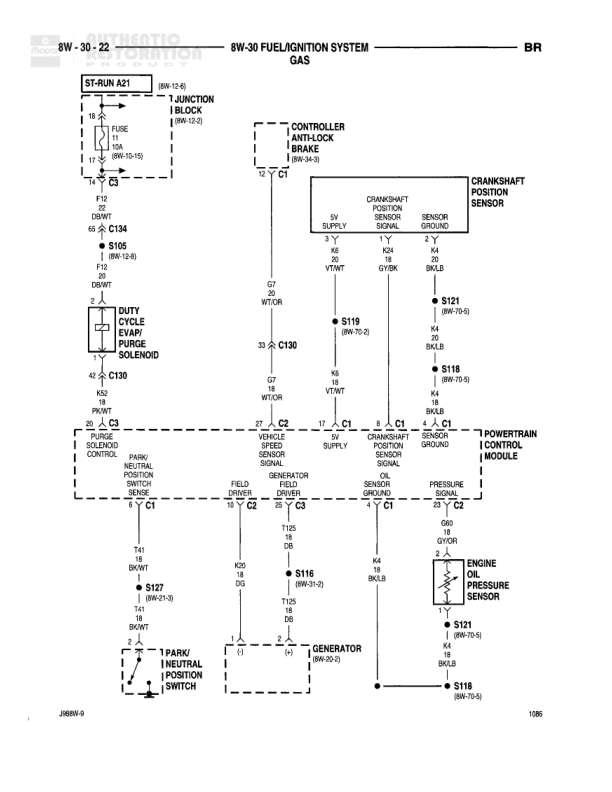

# FUEL/IGNITION SYSTEM - GAS

**Notes:** This diagram shows the fuel pump control system for a gas engine, including the ignition feed (ST-RUN A21), battery feed (BATT A0), fuel pump relay control, and connections to the Powertrain Control Module for fuel level sensing and pump relay control.

## Components

| Component | Ref | Connectors | Notes |
|-----------|-----|------------|-------|
| JUNCTION BLOCK | 8W-12-3 |  | Contains ST-RUN A21 circuit |
| POWER DISTRIBUTION CENTER | 8W-10-11 |  | Contains BATT A0 circuit and FUEL PUMP RELAY |
| FUEL PUMP RELAY | IN PDC |  | Located in Power Distribution Center |
| FUEL PUMP MODULE | 8W-30-10 | C130 |  |
| JOINT CONNECTOR NO. 2 | IN PDC |  | Located in Power Distribution Center, 8W-10-11 |
| POWERTRAIN CONTROL MODULE |  | C1, C3 |  |

## Wires

| From | To | Wire Code | Gauge | Color | Notes |
|------|-----|-----------|-------|-------|-------|
| ST-RUN A21 (8W-13-8) | JUNCTION BLOCK (8W-12-3) | A21 | 14 | VT/WT | FUSE 10A |
| JUNCTION BLOCK | S107 (8W-12-11) | A21 | 14 | VT |  |
| S107 | FUEL PUMP RELAY Pin 86 | A21 | 18 | BR/WT |  |
| BATT A0 (8W-10-6) | POWER DISTRIBUTION CENTER (8W-10-11) | A0 | 10 | RD/WT | FUSE |
| POWER DISTRIBUTION CENTER | JOINT CONNECTOR NO. 2 (8W-10-11) | A0 | 12 | RD/WT |  |
| JOINT CONNECTOR NO. 2 | FUEL PUMP RELAY Pin 30 | A14 | 14 | LG/WT |  |
| FUEL PUMP RELAY Pin 87 | C130 Pin 3 | A14 | 14 | RD/WT |  |
| FUEL PUMP RELAY Pin 85 | C129 | K21 | 20 | DG/BK |  |
| C129 | FUEL PUMP MODULE (8W-30-10) | K21 | 18 | DG/BK |  |
| S107 | C130 Pin 26 | F18 | 18 | LG/BK |  |
| C130 Pin 26 | Powertrain Control Module C1 Pin 2 | F18 | 18 | LG/BK | FUEL LEVEL (RT-MAIN) |
| S107 | C130 Pin 27 | F21 | 18 | BR/WT |  |
| C130 Pin 27 | Powertrain Control Module C3 Pin 49 | F21 | 18 | BR/WT | FUEL PUMP RELAY CONTROL |
| C130 Pin 3 | FUEL PUMP MODULE | A14 | 14 | RD/WT |  |
| Powertrain Control Module C1 Pin 32 |  |  | None |  | Continues to 8W-30-9 |

## Splices & Grounds

| ID | Type | Location | Wires Connected | Notes |
|----|------|----------|-----------------|-------|
| S107 | splice | 8W-12-11 | A21, F18, F21 |  |
| C130 | connector | Fuel Pump Module connections |  | Multiple pin connections shown (Pins 3, 26, 27) |
| C129 | connector | Fuel Pump Relay to Fuel Pump Module |  |  |
| C1 | connector | Powertrain Control Module |  | Pins 2 and 32 shown |
| C3 | connector | Powertrain Control Module |  | Pin 49 shown |

## Cross-References

- 8W-13-8
- 8W-12-3
- 8W-12-11
- 8W-10-6
- 8W-10-11
- 8W-30-10
- 8W-30-9
