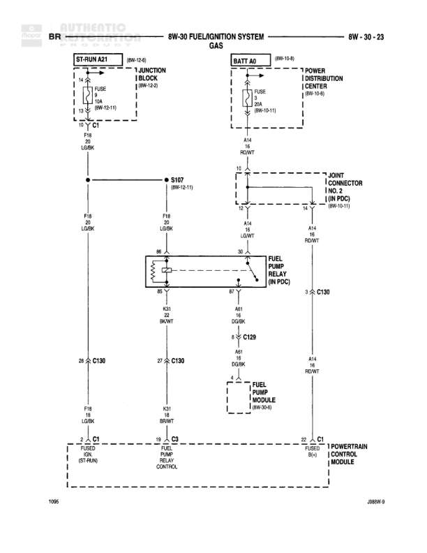

# 8W-30 FUEL/IGNITION SYSTEM - GAS

**Notes:** Diagram shows connections for Intake Air Temperature Sensor and Manifold Absolute Pressure Sensor to Powertrain Control Module. Includes 5V supply (K6 VT/WT), sensor signals (K4 BK/LB and K21 BK/LB), and sensor ground (K1 DG/RD). Document reference J08W-8 shown at bottom. Page 1103 indicated.

## Components

| Component | Ref | Connectors | Notes |
|-----------|-----|------------|-------|
| Powertrain Control Module | Top section | C1 | Shows intake air temperature signal, 5V supply, and sensor ground connections |
| Intake Air Temperature Sensor | Left side |  | Connected to PCM |
| Manifold Absolute Pressure Sensor | Center-right |  | 3-pin sensor with 5V supply, signal, and ground |
| Powertrain Control Module | Bottom section | C1 | Shows sensor ground and MAP sensor signal connections |

## Wires

| From | To | Wire Code | Gauge | Color | Notes |
|------|-----|-----------|-------|-------|-------|
| PCM C1 Pin K21 | Intake Air Temperature Sensor Pin B | K21 | 20 | BK/LB | Intake air temperature signal |
| Intake Air Temperature Sensor Pin A | Junction with 5V supply | None | 20 | BK/LB | OTHERS branch |
| PCM C1 Pin K6 | S119 (8W-70-2) | K6 | 20 | VT/WT | 5V supply |
| S119 (8W-70-2) | Manifold Absolute Pressure Sensor Pin 3 | K6 | 20 | VT/WT | 5V supply to MAP sensor |
| S119 | OTHERS | K6 | 20 | VT/WT | 5V supply branch |
| Manifold Absolute Pressure Sensor Pin 1 | S121 (8W-70-6) | K4 | 20 | BK/LB | MAP sensor signal |
| S121 (8W-70-6) | S118 (8W-70-5) | K4 | 20 | BK/LB | Signal path |
| S118 (8W-70-5) | PCM C1 | K4 | 20 | BK/LB | MAP sensor signal to PCM |
| Intake Air Temperature Sensor | S121 (8W-70-6) | K4 | 20 | BK/LB | IAT signal path |
| Manifold Absolute Pressure Sensor Pin 2 | PCM C1 | K1 | 18 | DG/RD | Sensor ground |
| PCM C1 Sensor Ground | Ground connection | K1 | 18 | DG/RD | To ILL |

## Splices & Grounds

| ID | Type | Location | Wires Connected | Notes |
|----|------|----------|-----------------|-------|
| S119 | splice | 8W-70-2 | K6 | 5V supply distribution |
| S121 | splice | 8W-70-6 | K4 | Sensor signal junction |
| S118 | splice | 8W-70-5 | K4 | Signal path to PCM |

## Cross-References

- 8W-70-2
- 8W-70-5
- 8W-70-6
