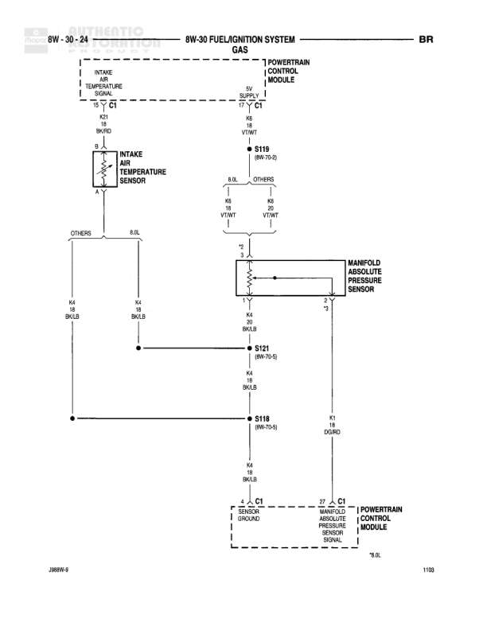

# FUEL/IGNITION SYSTEM GAS

**Notes:** This diagram shows the fuel/ignition system connections for a GAS engine, including idle air control motors 1-4, idle air control valve, and engine coolant temperature sensor connections to the Powertrain Control Module.

## Components

| Component | Ref | Connectors | Notes |
|-----------|-----|------------|-------|
| POWERTRAIN CONTROL MODULE | 8W-30-25 | C1 | Main engine control module |
| IDLE AIR CONTROL MOTOR NO. 1 | 8W-30-25 |  | Driver side motor |
| IDLE AIR CONTROL MOTOR NO. 2 | 8W-30-25 |  | None |
| IDLE AIR CONTROL MOTOR NO. 3 | 8W-30-25 |  | None |
| IDLE AIR CONTROL MOTOR NO. 4 | 8W-30-25 |  | None |
| IDLE AIR CONTROL VALVE | 8W-30-25 |  | None |
| ENGINE COOLANT TEMPERATURE SENSOR | 8W-30-25 | C1 | None |

## Wires

| From | To | Wire Code | Gauge | Color | Notes |
|------|-----|-----------|-------|-------|-------|
| POWERTRAIN CONTROL MODULE C1 Pin 15 | IDLE AIR CONTROL MOTOR NO. 1 Pin 1 | K2 | 18 | GY/RD | IDLE AIR CONTROL NO. 1 DRIVER |
| POWERTRAIN CONTROL MODULE C1 Pin 16 | IDLE AIR CONTROL MOTOR NO. 2 Pin 2 | K2 | 18 | YL/BK | IDLE AIR CONTROL NO. 2 DRIVER |
| POWERTRAIN CONTROL MODULE C1 Pin 17 | IDLE AIR CONTROL MOTOR NO. 3 Pin 3 | K2 | 18 | BR/WT | IDLE AIR CONTROL NO. 3 DRIVER |
| POWERTRAIN CONTROL MODULE C1 Pin 28 | IDLE AIR CONTROL MOTOR NO. 4 Pin 4 | K2 | 18 | VT/BR | IDLE AIR CONTROL NO. 4 DRIVER |
| POWERTRAIN CONTROL MODULE C1 Pin 4 | B11B connection point | K4 | 18 | BK/LB | SENSOR GROUND |
| B11B connection point | ENGINE COOLANT TEMPERATURE SENSOR C1 Pin 1 | K4 | 18 | BK/LB | None |
| ENGINE COOLANT TEMPERATURE SENSOR C1 Pin 2 | POWERTRAIN CONTROL MODULE C1 Pin 18 | K2 | 18 | TN/BK | ENGINE COOLANT TEMPERATURE SENSOR SIGNAL |

## Splices & Grounds

| ID | Type | Location | Wires Connected | Notes |
|----|------|----------|-----------------|-------|
| B11B | splice | Between PCM sensor ground and Engine Coolant Temp Sensor | K4 | (8W-70-5) |

## Cross-References

- 8W-70-5
