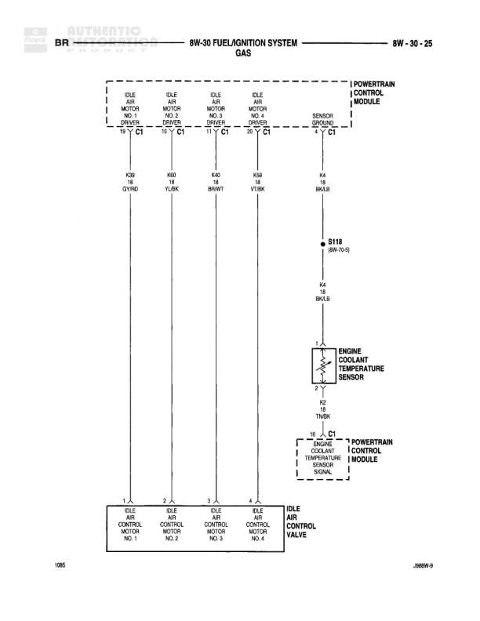

# FUEL/IGNITION SYSTEM DIESEL

**Notes:** Diesel fuel/ignition system diagram showing battery feed, fuses, relays, solenoids, and powertrain control module connections. Includes fuel heater circuit and fuel shut down solenoid control.

## Components

| Component | Ref | Connectors | Notes |
|-----------|-----|------------|-------|
| BATT 40 | 8W-15-0 |  | Battery connection |
| FUSE 60A | 8W-10-14 |  | 60A fuse |
| FUSE 80A | 8W-10-15 |  | 80A fuse in POWER DISTRIBUTION CENTER |
| ST-RUN A21 | 8W-15-6 |  | Start-Run switch |
| JUNCTION BLOCK | 8W-10-5 |  | Contains fuses |
| FUSE 16 30A | 8W-12-10 |  | 30A fuse in Junction Block |
| FUSE 5 10A | 8W-03-11 |  | 10A fuse in Junction Block |
| FUEL HEATER RELAY (IN PDC) | 8W-13-0 |  | Fuel heater relay in Power Distribution Center |
| FUEL HEATER |  |  |  |
| J JOINT CONNECTOR NO. 1 (IN PDC) | 8W-15-2 |  | Joint connector in Power Distribution Center |
| EGR SOLENOID |  |  |  |
| FUEL SHUT DOWN RELAY |  |  |  |
| FUEL SHUT DOWN SOLENOID |  |  |  |
| POWERTRAIN CONTROL MODULE (SOL ENOID CONTROL) |  | C4 | Powertrain Control Module solenoid control |
| ENGINE STARTER MOTOR | 8W-31-2 |  |  |
| J JOINT CONNECTOR NO. 2 | 8W-10-12 |  |  |

## Wires

| From | To | Wire Code | Gauge | Color | Notes |
|------|-----|-----------|-------|-------|-------|
| BATT 40 | FUSE 60A | A12 | 12 | RD/TN |  |
| FUSE 60A (8W-10-14) | POWER DISTRIBUTION CENTER FUSE 80A (8W-10-15) | A12 | 12 | RD/TN |  |
| POWER DISTRIBUTION CENTER | ENGINE STARTER MOTOR | T43 | 8 | BR |  |
| ENGINE STARTER MOTOR | J JOINT CONNECTOR NO. 2 (8W-10-12) | T43 | 8 | BR |  |
| J JOINT CONNECTOR NO. 2 | C130 | T43 | 8 | BR |  |
| ST-RUN A21 | FUSE 16 (8W-12-10) | C4 | 12 | DB/WT |  |
| ST-RUN A21 | FUSE 5 (8W-03-11) | C1 | 18 | LG/BK |  |
| FUSE 16 | C13M | F12 | 12 | DB/WT |  |
| FUSE 5 | S107 (8W-03-11) | F18 | 18 | LG/BK |  |
| S107 | C130 | Z13 | 20 | LG/BK |  |
| C13M | S105 (8W-13-10) | F12 | 12 | DB/WT |  |
| S105 | FUEL HEATER RELAY pin 86 | Y | None | null |  |
| C130 | FUEL HEATER RELAY pin 85 | A16 | None | RD/BK |  |
| FUEL HEATER RELAY pin 30 | C130 | A16 | 18 | RD/BK |  |
| C130 | S130 (8W-13-11) | A16 | 18 | RD/BK |  |
| S130 | FUEL SHUT DOWN RELAY pin 30 | A16 | None | None |  |
| FUEL HEATER RELAY pin 87 | FUEL HEATER | A93 | 18 | RD/VT |  |
| FUEL HEATER | S126 (8W-15-7) | Z12 | 18 | BK/TN |  |
| S130 | J JOINT CONNECTOR NO. 1 | A93 | 18 | RD/VT |  |
| J JOINT CONNECTOR NO. 1 | EGR SOLENOID | F18 | 18 | LG/BK |  |
| EGR SOLENOID | G100 (8W-15-4) | Z12 | 18 | BK/TN |  |
| J JOINT CONNECTOR NO. 1 | POWERTRAIN CONTROL MODULE C4 | Z12 | 18 | BK/TN |  |
| POWERTRAIN CONTROL MODULE | G105 (8W-15-7) | Z12 | 20 | BK/TN |  |
| FUEL SHUT DOWN RELAY pin 87 | FUEL SHUT DOWN SOLENOID | A133 | 18 | RD/VT |  |
| FUEL SHUT DOWN SOLENOID | S126 (8W-15-7) | Z12 | 18 | BK/TN |  |
| FUEL SHUT DOWN RELAY pin 86 | S126 | Z12 | 18 | BK/TN |  |
| FUEL SHUT DOWN RELAY pin 85 | POWERTRAIN CONTROL MODULE | Z12 | 20 | BK/TN |  |
| S126 | G105 (8W-15-7) | Z12 | 18 | BK/TN |  |
| S126 | G106 (8W-16-6) | Z12 | 20 | BK/TN |  |
| C130 | FUEL SHUT DOWN RELAY area | A16 | 18 | RD/BK |  |
| C130 | FUEL SHUT DOWN SOLENOID area | Z12 | 18 | BK/TN |  |

## Splices & Grounds

| ID | Type | Location | Wires Connected | Notes |
|----|------|----------|-----------------|-------|
| S105 | splice | 8W-13-10 | F12 | Connects to fuel heater relay circuit |
| S107 | splice | 8W-03-11 | F18, Z13 | Connects fuse 5 to C130 |
| S130 | splice | 8W-13-11 | A16, A93 | Connects to fuel shut down relay and joint connector |
| S126 | splice | 8W-15-7 | Z12 | Ground splice for multiple components |
| G100 | ground | 8W-15-4 |  | EGR solenoid ground |
| G105 | ground | 8W-15-7 | Z12 | Multiple ground connections |
| G106 | ground | 8W-16-6 |  | Ground connection |

## Cross-References

- 8W-15-0
- 8W-10-14
- 8W-10-15
- 8W-15-6
- 8W-10-5
- 8W-12-10
- 8W-03-11
- 8W-13-0
- 8W-13-10
- 8W-13-11
- 8W-15-2
- 8W-15-4
- 8W-15-7
- 8W-16-6
- 8W-31-2
- 8W-10-12
