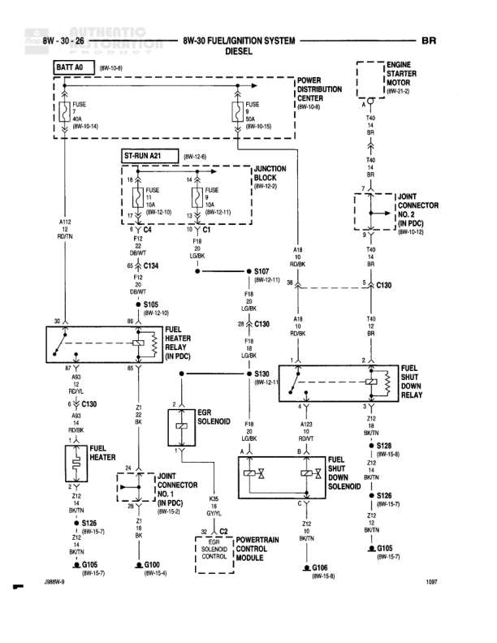

# FUEL/IGNITION SYSTEM - DIESEL

**Notes:** This diagram shows the fuel/ignition system for diesel engines, featuring dual intake air heater relays controlled by the Powertrain Control Module. The system uses fused ignition switch output and direct battery feeds for the heater relays. Document reference: 2888W-9

## Components

| Component | Ref | Connectors | Notes |
|-----------|-----|------------|-------|
| ST-RUN AZT | 8W-12-6 |  | Start-Run connection point |
| JUNCTION BLOCK | 8W-12-6 |  | Contains FUSE and FUSE 10A (8W-12-11) |
| BATTERY | 8W-40-8 |  | Main battery source |
| INTAKE AIR HEATER RELAY NO. 1 |  |  | Controls intake air heater #1 |
| INTAKE AIR HEATER RELAY NO. 2 |  |  | Controls intake air heater #2 |
| INTAKE AIR HEATER |  |  | Heating element for intake air |
| FUSED IGN SWITCH OUTPUT (ST-RUN) | 1108 | C1 | Fused ignition switch output to Powertrain Control Module |
| AIR INTAKE HEATER RELAY NO. 1 CONTROL |  | C1 | From Powertrain Control Module |
| AIR INTAKE HEATER RELAY NO. 2 CONTROL |  | C1 | To Powertrain Control Module |
| POWERTRAIN CONTROL MODULE |  | C1 | Main engine control module |

## Wires

| From | To | Wire Code | Gauge | Color | Notes |
|------|-----|-----------|-------|-------|-------|
| ST-RUN AZT | C1 | P18 | 18 | LG/BK |  |
| C1 | S107 | P18 | 18 | LG/BK |  |
| S107 | C126 | P18 | 18 | LG/BK |  |
| C126 | Splice point | P18 | 18 | LG/BK | Splits to three paths |
| Splice point | Intake Air Heater Relay No. 1 (Pin 30) | P18 | 18 | LG/BK |  |
| Splice point | Intake Air Heater Relay No. 2 (Pin 30) | P18 | 18 | LG/BK |  |
| BATTERY | S403 | A19 | 8 | BK |  |
| S403 | Intake Air Heater Relay No. 1 (Pin 87) | A19 | 8 | BK |  |
| BATTERY | S404 | A8 | 8 | BK |  |
| S404 | Intake Air Heater Relay No. 2 (Pin 87) | A8 | 8 | BK |  |
| S404 | S120 | A8 | 20 | LG/BK |  |
| Intake Air Heater Relay No. 1 (Pin 85) | Ground | SC1 | 18 | YL/BK |  |
| Intake Air Heater Relay No. 2 (Pin 85) | Ground | SC1 | 18 | OR/BK |  |
| Intake Air Heater Relay No. 1 (Pin 86) | Powertrain Control Module C1 | A58 | 18 | BK | Air Intake Heater Relay No. 1 Control |
| Intake Air Heater Relay No. 2 (Pin 86) | Powertrain Control Module C1 | A130 | 18 | BK | Air Intake Heater Relay No. 2 Control |
| Intake Air Heater Relay No. 1 (Pin 87a) | Intake Air Heater |  | None |  | Connection to heater element |
| Intake Air Heater Relay No. 2 (Pin 87a) | Intake Air Heater |  | None |  | Connection to heater element |

## Splices & Grounds

| ID | Type | Location | Wires Connected | Notes |
|----|------|----------|-----------------|-------|
| S107 | splice | Between C1 and C126 | P18 | 8W-12-11 |
| C126 | connector | In-line connector before power split | P18 |  |
| S403 | splice | Battery feed to Intake Air Heater Relay No. 1 | A19 |  |
| S404 | splice | Battery feed to Intake Air Heater Relay No. 2 | A8 |  |
| S120 | splice | From S404 | A8 | 8W-12-11 |

## Cross-References

- 8W-12-6
- 8W-12-11
- 8W-40-8
