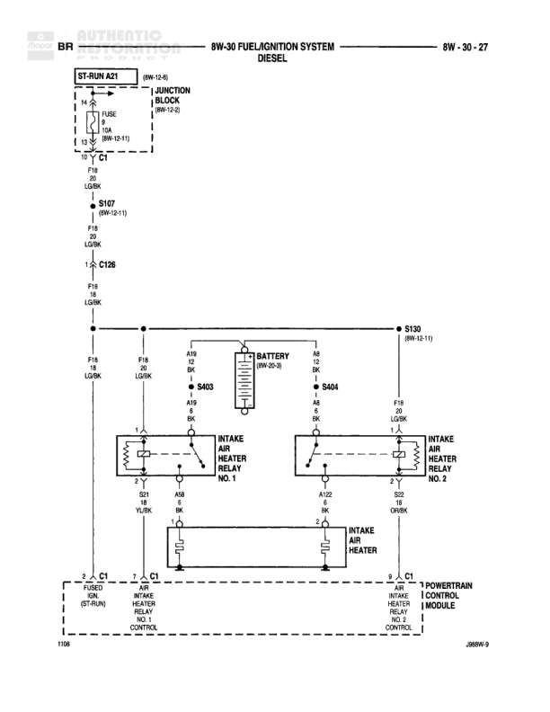

# FUEL/IGNITION SYSTEM - DIESEL

**Notes:** This diagram shows the fuel/ignition system for diesel engines, including temperature sensors, generator connections, and powertrain control module interfaces. Multiple sensor grounds and signal paths are shown connecting to the PCM through various connectors (C1, C2, C3).

## Components

| Component | Ref | Connectors | Notes |
|-----------|-----|------------|-------|
| POWERTRAIN CONTROL MODULE | top of diagram | C1, C2, C3 | Main engine control module |
| ENGINE COOLANT TEMPERATURE SENSOR | 8W-30-5 |  | Located left side of diagram |
| BATTERY TEMPERATURE SENSOR | center of diagram |  | Located near C125 |
| WATER IN FUEL SENSOR | left center |  | Located on left side |
| ENGINE COOLANT TEMPERATURE SENSOR | lower center |  | Second coolant temperature sensor |
| GENERATOR | 8W-30-3 |  | Field generator and generator output connections |
| INSTRUMENT CLUSTER | 8W-67-1 |  | Connected via C1 |
| JOINT CONNECTOR NO. 1 (IN PDC) | center | C125 | Power distribution center connector |

## Wires

| From | To | Wire Code | Gauge | Color | Notes |
|------|-----|-----------|-------|-------|-------|
| POWERTRAIN CONTROL MODULE pin 51 C3 | BATTERY TEMPERATURE SENSOR | K4 | 18 | PK/YL |  |
| BATTERY TEMPERATURE SENSOR | C125 | K4 | 18 | PK/YL |  |
| C125 | WATER IN FUEL SENSOR | K4 | 18 | BK/LB |  |
| WATER IN FUEL SENSOR | ENGINE COOLANT TEMPERATURE SENSOR (left) | K4 | 18 | BK/LB |  |
| ENGINE COOLANT TEMPERATURE SENSOR (left) | POWERTRAIN CONTROL MODULE pin 8 C1 | K4 | 18 | BK/LB |  |
| C125 | JOINT CONNECTOR NO. 1 (IN PDC) pin 18 | K4 | 18 | BK/LB |  |
| JOINT CONNECTOR NO. 1 (IN PDC) pin 13 | C125 | K4 | 18 | BK/LB |  |
| POWERTRAIN CONTROL MODULE | BATTERY TEMPERATURE SENSOR | K4 | 18 | PK/YL |  |
| ENGINE COOLANT TEMPERATURE SENSOR (lower) | S118 | K4 | 18 | BK/LB | 8W-70-9 |
| WATER IN FUEL SENSOR | S118 | K4 | 18 | BK/LB |  |
| ENGINE COOLANT TEMPERATURE SENSOR (lower) | POWERTRAIN CONTROL MODULE pin 20 C1 | K2 | 20 | TN/WT |  |
| ENGINE COOLANT TEMPERATURE SENSOR (left) | POWERTRAIN CONTROL MODULE pin 9 C1 | K1 | 20 | TN/RD |  |
| INSTRUMENT CLUSTER | C1 | T | None | None | Connected via C1 |
| GENERATOR FIELD GENERATOR | POWERTRAIN CONTROL MODULE | K20 | 18 | DG |  |
| GENERATOR OUTPUT | S118 | T125 | 18 | WT/DB | 8W-31-9 |
| S118 | POWERTRAIN CONTROL MODULE | T125 | 18 | WT/DB |  |
| GENERATOR OUTPUT | C130 | T125 | 18 | WT/DB |  |
| C130 | POWERTRAIN CONTROL MODULE pin 25 C3 | K4 | 18 | BK/LB |  |
| G85 | C130 | K4 | 18 | OR/BK |  |
| C130 | ENGINE COOLANT TEMPERATURE SENSOR (lower) | G85 | None | OR/BK |  |
| POWERTRAIN CONTROL MODULE pin 20 C2 | INSTRUMENT CLUSTER via C1 | None | None | None | WAIT TO START LAMP DRIVER |
| POWERTRAIN CONTROL MODULE pin 15 C2 | INSTRUMENT CLUSTER via C1 | None | None | None | GENERATOR OUTPUT |
| POWERTRAIN CONTROL MODULE pin 26 C3 | INSTRUMENT CLUSTER via C1 | None | None | None | GLOW PLUG DRIVER |

## Splices & Grounds

| ID | Type | Location | Wires Connected | Notes |
|----|------|----------|-----------------|-------|
| S118 | splice | center of diagram | K4, T125 | 8W-70-9 and 8W-31-9 references |
| C1 | splice | bottom of diagram at PCM | multiple connections to WATER IN FUEL SENSOR, ENGINE COOLANT SENSOR, SENSOR GROUND | WATER IN FUEL SENSOR SIGNAL, ENGINE COOLANT TEMPERATURE SENSOR SIGNAL, SENSOR GROUND |
| C2 | splice | bottom of diagram at PCM | WAIT TO START LAMP DRIVER, GENERATOR OUTPUT |  |
| C3 | splice | bottom of diagram at PCM | GLOW PLUG DRIVER |  |
| G85 | ground | center lower portion |  | OR/BK wire, connected to C130 |
| C125 | connector | center upper portion | K4 | Part of JOINT CONNECTOR NO. 1 (IN PDC) |
| C130 | connector | lower center | K4, G85 |  |
| C1 | connector | Instrument Cluster connection point |  | References 8W-67-1 |

## Cross-References

- 8W-30-3
- 8W-30-5
- 8W-67-1
- 8W-70-9
- 8W-31-9
