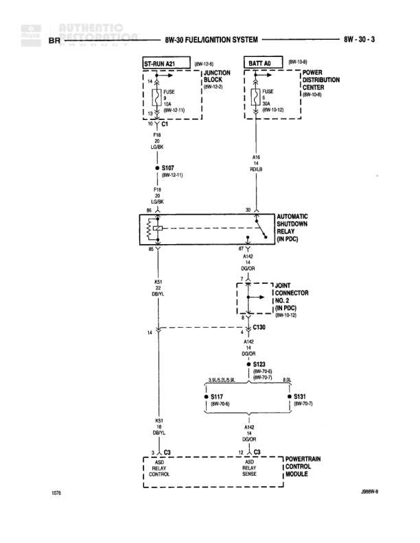

# FUEL/IGNITION SYSTEM

**Notes:** This diagram shows the Automatic Shutdown Relay circuit controlled by the Powertrain Control Module. Power flows from the battery through a 30A fuse and is switched by the relay to supply various fuel and ignition system components through splices S117 and S131. The relay coil is energized from the ST-RUN circuit through a 16A fuse when the PCM grounds the control circuit.

## Components

| Component | Ref | Connectors | Notes |
|-----------|-----|------------|-------|
| ST-RUN A21 | 8W-13-5 |  | Junction Block |
| BATT A0 | 8W-13-6 |  | Power Distribution Center |
| AUTOMATIC SHUTDOWN RELAY (IN PDC) | 8W-30-3 |  | Located in Power Distribution Center |
| JOINT CONNECTOR NO. 2 (IN PDC) | 8W-13-12 | C130 | Located in Power Distribution Center |
| POWERTRAIN CONTROL MODULE | 8W-30-3 | C3, C9 | ASD RELAY CONTROL and ASD RELAY SENSE |

## Wires

| From | To | Wire Code | Gauge | Color | Notes |
|------|-----|-----------|-------|-------|-------|
| ST-RUN A21 pin 14 | FUSE 16A | None | None | None | 8W-13-11 |
| FUSE 16A | ST-RUN A21 pin 15 | None | None | None | None |
| ST-RUN A21 pin 15 | C1 | None | None | None | None |
| C1 | S107 | A18 | 18 | DB/BK | 8W-13-11 |
| S107 | Automatic Shutdown Relay pin 86 | A18 | 18 | DB/BK | None |
| BATT A0 pin 1 | FUSE 30A | None | None | None | 8W-13-12 |
| FUSE 30A | BATT A0 pin 2 | None | None | None | None |
| BATT A0 pin 2 | Automatic Shutdown Relay pin 30 | A16 | 12 | RD/LB | None |
| Automatic Shutdown Relay pin 87 | C130 | A142 | 14 | DG/OR | None |
| C130 | S117 and S131 | A142 | 14 | DG/OR | 8W-70-8 and 8W-70-7 |
| S117 | continue | None | None | None | 8W-70-8 |
| S131 | continue | None | None | None | 8W-70-7 |
| Automatic Shutdown Relay pin 85 | PCM C3 | K51 | 18 | DB/YL | ASD RELAY CONTROL |
| Automatic Shutdown Relay pin 87 | PCM C9 | A142 | 14 | DG/OR | ASD RELAY SENSE |

## Splices & Grounds

| ID | Type | Location | Wires Connected | Notes |
|----|------|----------|-----------------|-------|
| S107 | splice | Near Automatic Shutdown Relay | A18 | 8W-13-11 |
| S117 | splice | After C130 | A142 | 8W-70-8 |
| S131 | splice | After C130 | A142 | 8W-70-7 |
| C1 | connector | Between ST-RUN A21 and S107 |  | None |
| C3 | connector | Powertrain Control Module - Relay Control | K51 | ASD RELAY CONTROL |
| C9 | connector | Powertrain Control Module - Relay Sense | A142 | ASD RELAY SENSE |
| C130 | connector | Joint Connector No. 2 in PDC | A142 | 8W-13-12 |

## Cross-References

- 8W-13-5
- 8W-13-6
- 8W-13-11
- 8W-13-12
- 8W-70-7
- 8W-70-8
