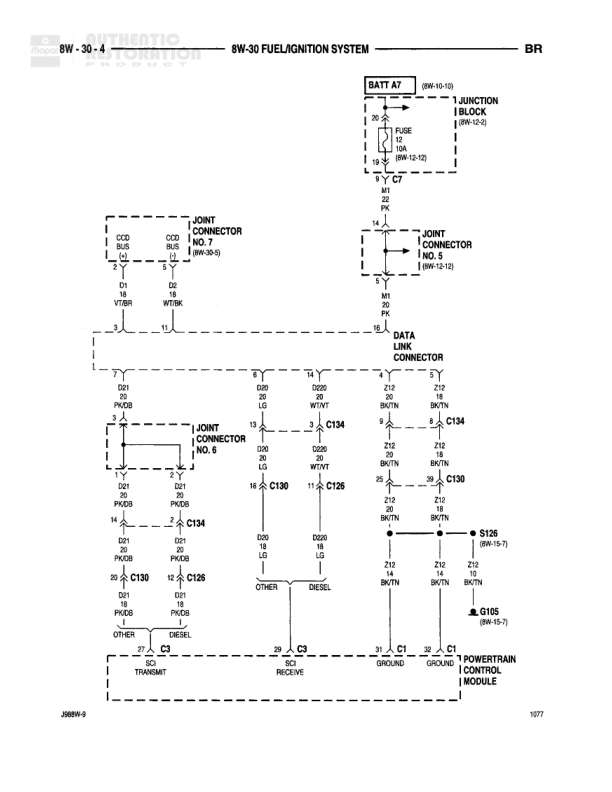

# FUEL/IGNITION SYSTEM

**Notes:** This diagram shows the Fuel/Ignition System connections for the Powertrain Control Module. It includes CCD BUS communication lines (D1, D2), diagnostic data link connections, and both OTHER and DIESEL variants. The system includes multiple connectors (C134, C130, C126) on the PCM and shows ground distribution through S126 and G105.

## Components

| Component | Ref | Connectors | Notes |
|-----------|-----|------------|-------|
| Battery | BATT A7 (8W-10-15) |  | Battery feed source |
| Junction Block | (8W-15-3) |  | Contains FUSE 10A (8W-12-12) |
| Joint Connector No. 7 | (8W-50-8) |  | CCD BUS connection point |
| Joint Connector No. 5 | (8W-12-13) |  | Main distribution point |
| Data Link Connector |  |  | Diagnostic connector |
| Joint Connector No. 6 |  |  | CCD/SCI BUS distribution |
| Powertrain Control Module |  | C134, C130, C126 | Multiple connectors: C134 (8W-15-7), C130, C126 |

## Wires

| From | To | Wire Code | Gauge | Color | Notes |
|------|-----|-----------|-------|-------|-------|
| BATT A7 | FUSE 10A | A2 | 14 | DB | (8W-10-15) |
| FUSE 10A | C7 | A2 | 14 | DB | (8W-12-12) |
| C7 | Joint Connector No. 5 | M1 | 22 | PK |  |
| CCD BUS | Joint Connector No. 7 D1 | D1 | 20 | WT/BR |  |
| CCD BUS | Joint Connector No. 7 D2 | D2 | 20 | WT/BR |  |
| Data Link Connector D40 | C134 | D40 | 20 | LG |  |
| Data Link Connector D20 | C134 | D20 | 20 | WT/VT |  |
| Data Link Connector Z12 | C134 | Z12 | 20 | BK/TN |  |
| Joint Connector No. 6 D21 | C134 | D21 | 20 | PK/DB | OTHER |
| Joint Connector No. 6 D21 | C134 | D21 | 20 | PK/DB | DIESEL |
| C134 | C130 | D00 | 20 | LG |  |
| C134 | C130 | D20 | 20 | WT/VT |  |
| C134 | C126 | D21 | 20 | PK/DB | OTHER |
| C134 | C126 | D21 | 20 | PK/DB | DIESEL |
| C130 | S126 | Z12 | 20 | BK/TN |  |
| C134 | S126 | Z12 | 20 | BK/TN |  |
| S126 | G105 | Z12 | 20 | BK/TN | (8W-15-7) |
| C130 Pin 14 | TRANSMIT C9 | D00 | 20 | LG | OTHER |
| C130 Pin 11 | RECEIVE C9 | D00 | 20 | LG | OTHER |
| C126 Pin 52 | TRANSMIT C9 | D21 | 20 | PK/DB | DIESEL |
| C126 Pin 52 | RECEIVE C9 | D21 | 20 | PK/DB | DIESEL |
| TRANSMIT C9 | GROUND C1 |  | None |  | OTHER |
| RECEIVE C9 | GROUND C1 |  | None |  | DIESEL |
| Data Link Connector Z12 | GROUND C1 | Z12 | 20 | BK/TN |  |

## Splices & Grounds

| ID | Type | Location | Wires Connected | Notes |
|----|------|----------|-----------------|-------|
| C7 | connector | Junction Block area | A2, M1 | Power distribution point |
| S126 | splice | Near PCM connectors | Z12 | (8W-15-7) Ground splice |
| G105 | ground | Main ground point |  | (8W-15-7) |
| C9 | connector | Between PCM and Ground | D00, D21 | TRANSMIT/RECEIVE split for OTHER/DIESEL |
| C1 | ground | Ground point for Powertrain Control Module |  | GROUND |

## Cross-References

- 8W-10-15
- 8W-12-12
- 8W-15-3
- 8W-50-8
- 8W-12-13
- 8W-15-7
