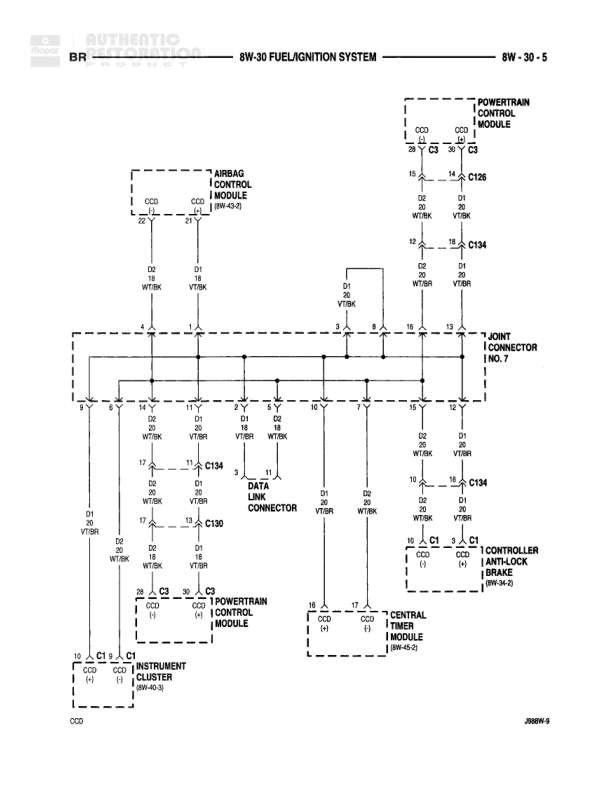

# FUEL/IGNITION SYSTEM

**Notes:** This diagram shows the CCD (Chrysler Collision Detection) bus network connecting various control modules including the Powertrain Control Module, Airbag Control Module, Instrument Cluster, Controller Antilock Brake, and Overhead Timer Module. The Data Link Connector provides diagnostic access to the CCD bus system. All connections route through a 7-joint connector which acts as the central hub for the CCD bus communication.

## Components

| Component | Ref | Connectors | Notes |
|-----------|-----|------------|-------|
| Powertrain Control Module | top right | C126, C134 | Main engine control module |
| Airbag Control Module | 8W-60-9 | CCD | Connected to CCD bus |
| Data Link Connector | center | C134 | 3-pin diagnostic connector |
| Controller Antilock Brake | 8W-57-5 | C1 | Connected to CCD bus |
| Instrument Cluster | 8W-40-1 | C1 | Connected to CCD bus |
| Overhead Timer Module | 8W-40-5 |  | Connected to CCD bus |

## Wires

| From | To | Wire Code | Gauge | Color | Notes |
|------|-----|-----------|-------|-------|-------|
| Powertrain Control Module C126 Pin 15 | 7-Joint Connector Pin 7 | D2 | 20 | WT/BK |  |
| Powertrain Control Module C126 Pin 14 | 7-Joint Connector Pin 8 | D1 | 20 | VT/BK |  |
| Powertrain Control Module C134 Pin 12 | 7-Joint Connector Pin 12 | D2 | 20 | WT/BK |  |
| Powertrain Control Module C134 Pin 13 | 7-Joint Connector Pin 13 | D1 | 20 | VT/BK |  |
| Airbag Control Module CCD Pin 26 | 7-Joint Connector Pin 7 | D2 | 20 | WT/BK |  |
| Airbag Control Module CCD Pin 27 | 7-Joint Connector Pin 8 | D1 | 20 | VT/BK |  |
| 7-Joint Connector Pin 17 | Data Link Connector C134 Pin 17 | D2 | 20 | WT/BK |  |
| 7-Joint Connector Pin 11 | Data Link Connector C134 Pin 11 | D1 | 20 | VT/BK |  |
| Data Link Connector C134 Pin 17 | C130 Pin 17 | D2 | 20 | WT/BK |  |
| Data Link Connector C134 Pin 11 | C130 Pin 13 | D1 | 20 | VT/BK |  |
| C130 Pin 17 | Powertrain Control Module C1 Pin 23 | D2 | 20 | WT/BK |  |
| C130 Pin 13 | Powertrain Control Module C1 Pin 24 | D1 | 20 | VT/BK |  |
| 7-Joint Connector Pin 10 | Data Link Connector C134 Pin 10 | D1 | 20 | VT/BK |  |
| Data Link Connector C134 Pin 10 | Controller Antilock Brake C1 Pin 10 | D1 | 20 | VT/BK |  |
| 7-Joint Connector Pin 12 | Data Link Connector C134 Pin 12 | D2 | 20 | WT/BK |  |
| Data Link Connector C134 Pin 12 | Controller Antilock Brake C1 Pin 9 | D2 | 20 | WT/BK |  |
| 7-Joint Connector Pin 15 | Instrument Cluster C1 Pin 15 | CCD | None |  |  |
| 7-Joint Connector Pin 16 | Overhead Timer Module | CCD | None |  |  |

## Cross-References

- 8W-60-9
- 8W-57-5
- 8W-40-1
- 8W-40-5
