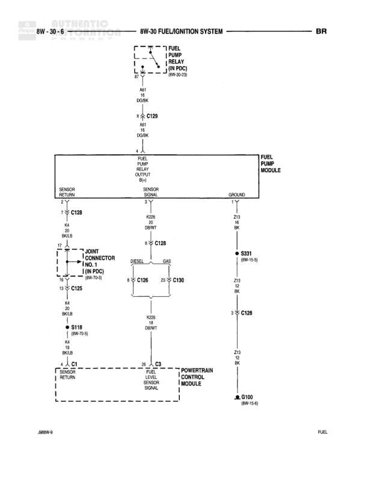

# FUEL/IGNITION SYSTEM

**Notes:** Diagram shows diesel/gas split at C106/C130. DIESEL and GAS indicators shown near connector junction. Reference '369919-5' shown at bottom left. 'BR' indicator at top right. 'FUEL' label at bottom right.

## Components

| Component | Ref | Connectors | Notes |
|-----------|-----|------------|-------|
| Fuel Pump Relay (In PDC) | 8W-30-28 | C129 | Located in Power Distribution Center |
| Fuel Pump Module | None | C128 | Contains sensor return, sensor signal, ground, and fuel pump relay output |
| Joint Connector No. 1 (In PDC) | 8W-70-3 | C125 | Located in Power Distribution Center |
| Powertrain Control Module | None | C1, C2, C3 | Contains O2 sensor return and fuel level sensor signal connections |

## Wires

| From | To | Wire Code | Gauge | Color | Notes |
|------|-----|-----------|-------|-------|-------|
| Fuel Pump Relay/C129 | Fuel Pump Module (Fuel Pump Relay Output) | A61 | 18 | DB/OR | None |
| Fuel Pump Module (Sensor Return) | C128 | None | 24 | BK/LB | None |
| C128 | Joint Connector No. 1/C125 | None | 24 | BK/LB | None |
| Fuel Pump Module (Sensor Signal) | C128 | K25 | 18 | DB/WT | None |
| C128 | C106 (Diesel/Gas split) | K25 | 18 | DB/WT | None |
| C106 | Powertrain Control Module/C3 | K25 | 18 | DB/WT | None |
| C106 | C130 | 23 | None | None | Connection point |
| Fuel Pump Module (Ground) | C128 | Z13 | 16 | BK | None |
| C128 | S331 | Z13 | 16 | BK | 8W-15-8 |
| S331 | C128 | Z13 | 16 | BK | None |
| C128 | G100 | Z13 | 12 | BK | 8W-15-4 |
| Joint Connector No. 1/C125 | S118 | None | 24 | BK/LB | 8W-70-5 |
| S118 | Powertrain Control Module/C1 (O2 Sensor Return) | K4 | 20 | BR/LG | None |
| Powertrain Control Module/C3 (Fuel Level Sensor Signal) | connection point | K25 | 18 | DB/WT | None |

## Splices & Grounds

| ID | Type | Location | Wires Connected | Notes |
|----|------|----------|-----------------|-------|
| S118 | splice | Between Joint Connector No. 1 and Powertrain Control Module | BK/LB (24ga), K4 | 8W-70-5 |
| S331 | splice | Ground circuit between Fuel Pump Module and G100 | Z13 | 8W-15-8 |
| G100 | ground | Main ground point |  | 8W-15-4 |

## Cross-References

- 8W-30-28
- 8W-70-3
- 8W-70-5
- 8W-15-8
- 8W-15-4
