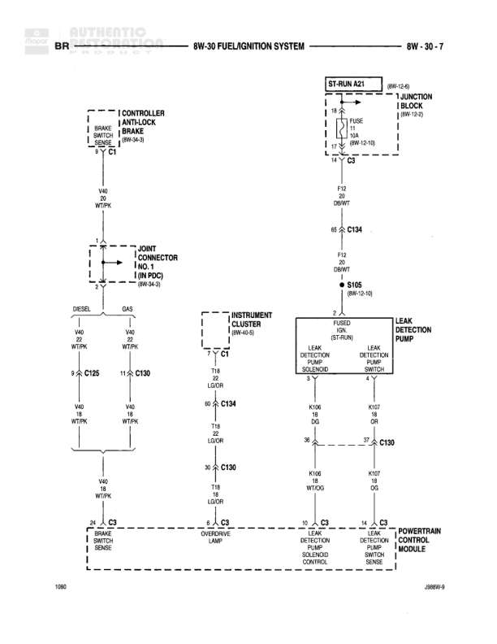

# FUEL/IGNITION SYSTEM

**Notes:** Diagram shows fuel/ignition system with connections between anti-lock brake controller, instrument cluster, fused ignition switch, leak detection system, and powertrain control module. Includes separate paths for DIESEL and GAS configurations.

## Components

| Component | Ref | Connectors | Notes |
|-----------|-----|------------|-------|
| CONTROLLER ANTI-LOCK BRAKE | 8W-30-3 | C1 | Brake Switch Sense |
| ST-RUN A21 | Junction at top right |  | 8W-12-6 |
| JUNCTION BLOCK | 8W-12-2 |  | Contains FUSE 1A and related circuits |
| JOINT CONNECTOR NO. 1 (IN PDC) | 8W-04-3 |  | DIESEL and GAS connections |
| INSTRUMENT CLUSTER | 8W-40-5 | C1 | None |
| FUSED IGNITION SWITCH | None | C1, C2 | LEAK DETECTION SOLENOID and LEAK DETECTION SWITCH connections |
| LEAK DETECTION PUMP | 3-Ter2 |  | None |
| POWERTRAIN CONTROL MODULE | None | C1, C2, C3 | Contains OVERDRIVE OVERRIDE, LEAK DETECTION SOLENOID CONTROL, and LEAK DETECTION SWITCH SENSE |
| BRAKE SWITCH SENSE | None |  | Connected to Controller Anti-Lock Brake |

## Wires

| From | To | Wire Code | Gauge | Color | Notes |
|------|-----|-----------|-------|-------|-------|
| ST-RUN A21 | JUNCTION BLOCK FUSE 1A | None | 18 | PK | 8W-12-6 |
| JUNCTION BLOCK FUSE 1A | C3 | F12 | 18 | OR/WT | 8W-12-10 |
| C3 | C134 | F12 | 18 | OR/WT | None |
| C134 | S105 | F12 | 18 | OR/WT | 8W-52-16 |
| CONTROLLER ANTI-LOCK BRAKE C1 | V40 | V40 | 20 | WT/PK | None |
| V40 | JOINT CONNECTOR NO. 1 | V40 | 20 | WT/PK | None |
| JOINT CONNECTOR NO. 1 DIESEL | C125 | V40 | 20 | WT/PK | None |
| JOINT CONNECTOR NO. 1 GAS | C130 | V40 | 18 | WT/PK | None |
| C125 | C134 | V40 | 18 | WT/PK | None |
| C130 | C134 | V40 | 18 | WT/PK | None |
| C134 | C3 | V40 | 18 | WT/PK | None |
| INSTRUMENT CLUSTER C1 | C134 | T18 | 18 | LG/OR | None |
| C134 | C130 | T18 | 18 | LG/OR | None |
| FUSED IGNITION SWITCH LEAK DETECTION SOLENOID C1 | C130 | K106 | 18 | OR | None |
| FUSED IGNITION SWITCH LEAK DETECTION SWITCH C2 | C130 | K107 | 18 | OR | None |
| C130 | POWERTRAIN CONTROL MODULE C1 OVERDRIVE OVERRIDE | T18 | 18 | LG/OR | None |
| C130 | POWERTRAIN CONTROL MODULE C2 LEAK DETECTION SOLENOID CONTROL | K106 | 18 | WT/DG | None |
| C130 | POWERTRAIN CONTROL MODULE C3 LEAK DETECTION SWITCH SENSE | K107 | 18 | OR | None |

## Splices & Grounds

| ID | Type | Location | Wires Connected | Notes |
|----|------|----------|-----------------|-------|
| S105 | splice | Right side of diagram | F12 | 8W-52-16 |
| C125 | connector | DIESEL path |  | None |
| C130 | connector | GAS path and multiple connections |  | Central connection point for multiple circuits |
| C134 | connector | Central diagram |  | Junction point for V40 and F12 circuits |
| C1 | connector | Multiple components |  | Used by INSTRUMENT CLUSTER and FUSED IGNITION SWITCH |
| C2 | connector | FUSED IGNITION SWITCH and POWERTRAIN CONTROL MODULE |  | None |
| C3 | connector | Upper right and POWERTRAIN CONTROL MODULE |  | None |

## Cross-References

- 8W-30-3
- 8W-12-6
- 8W-12-2
- 8W-12-10
- 8W-04-3
- 8W-40-5
- 8W-52-16
