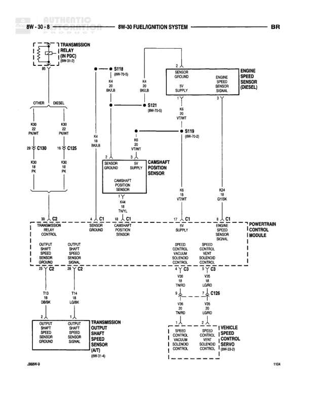

# FUEL/IGNITION SYSTEM

**Notes:** Diagram shows fuel/ignition system connections between transmission relay, sensors, and powertrain control module. Includes separate paths for OTHER and DIESEL variants. Page 1104, diagram 8W-30-8.

## Components

| Component | Ref | Connectors | Notes |
|-----------|-----|------------|-------|
| Transmission Relay | In PDC | 8W-70-5 | Located in Power Distribution Center |
| Sensor Ground | 8W-30-8 |  | Power supply |
| Engine Speed Sensor Signal | 8W-30-8 |  | None |
| Engine Speed Sensor (Diesel) | 8W-30-8 |  | None |
| Camshaft Position Sensor | 8W-30-8 |  | None |
| Transmission Relay Control | 8W-30-8 | C2 | Outputs to sensor ground circuits |
| Powertrain Control Module | 8W-30-8 | C1, C2, C3 | Main controller for powertrain systems |
| Transmission Output Shaft Speed Sensor (A/T) | 8W-31-4 |  | Automatic transmission |
| Vehicle Speed Sensor Servo | 8W-13-2 | C126 | Speed control solenoids |

## Wires

| From | To | Wire Code | Gauge | Color | Notes |
|------|-----|-----------|-------|-------|-------|
| Transmission Relay Pin 87 | S119 | None | 18 | BK/LB | 8W-70-5 |
| S119 | Sensor Ground | K4 | 18 | BK/LB | None |
| S119 | Sensor Ground | K4 | 18 | BK/LB | None |
| Transmission Relay | C130 | K30 | 20 | PK/WT | OTHER |
| Transmission Relay | C125 | K30 | 14 | PK/WT | DIESEL |
| C130 Pin 13 | Transmission Relay Control C2 | K30 | 20 | PK | None |
| C125 Pin 14 | Transmission Relay Control C2 | K30 | 20 | PK | None |
| Sensor Ground | S121 | K4 | 18 | BK/LB | 8W-70-8 |
| S121 | Power Supply | K6 | 18 | VT/WT | None |
| S119 | Camshaft Position Sensor | K4 | 18 | VT/WT | 8W-70-2 |
| Camshaft Position Sensor Pin 3 | Camshaft Position Sensor C1 | K44 | 20 | TN/BK | None |
| Sensor Ground Pin 1 | Camshaft Position Sensor C1 | K4 | 18 | BK/LB | None |
| Power Supply Pin 2 | Camshaft Position Sensor C1 | K6 | 18 | VT/WT | None |
| Camshaft Position Sensor C1 Pin 3 | PCM C1 Pin 17 | K44 | 20 | VT/WT | None |
| Camshaft Position Sensor C1 Pin 1 | PCM C1 Camshaft Position Sensor Ground | K4 | 18 | BK/LB | None |
| Camshaft Position Sensor C1 Pin 2 | PCM C1 Power Supply | K6 | 18 | VT/WT | None |
| Engine Speed Sensor Pin 2 | Engine Speed Sensor (Diesel) C1 | K24 | 18 | GY/BK | None |
| PCM C1 Speed Control Solenoid | C3 Pin 2 | V6 | 20 | TN/RD | None |
| PCM C1 Speed Control Solenoid | C3 Pin 1 | V6 | 20 | LG/RD | None |
| C3 Pin 2 | C126 Pin 3 | V6 | 20 | TN/RD | None |
| C3 Pin 1 | C126 Pin 2 | V6 | 20 | LG/RD | None |
| C126 Pin 3 | Speed Control Solenoid | V6 | 20 | TN/RD | None |
| C126 Pin 2 | Speed Control Solenoid | V6 | 20 | LG/RD | None |
| Transmission Relay Control C2 Output | PCM C2 Pin 22 | T13 | 20 | DB/BK | Output Shaft Speed Sensor Ground |
| Transmission Relay Control C2 Output | PCM C2 Pin 28 | T14 | 20 | LG/BK | Output Shaft Speed Sensor Signal |
| PCM C2 Pin 22 | Output Shaft Speed Sensor Ground | T13 | 20 | DB/BK | None |
| PCM C2 Pin 28 | Output Shaft Speed Sensor Signal | T14 | 20 | LG/BK | None |

## Splices & Grounds

| ID | Type | Location | Wires Connected | Notes |
|----|------|----------|-----------------|-------|
| S119 | splice | Between transmission relay and sensor grounds | K4 | 8W-70-2 |
| S121 | splice | Between sensor ground and power supply | K4, K6 | 8W-70-8 |

## Cross-References

- 8W-70-5
- 8W-70-8
- 8W-70-2
- 8W-31-4
- 8W-13-2
