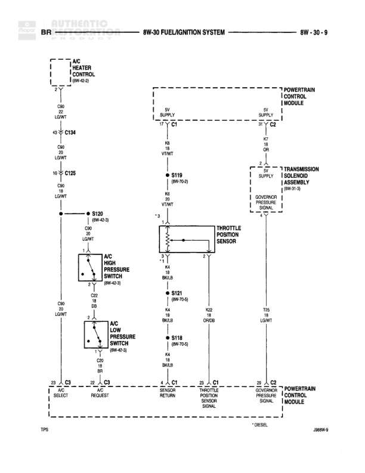

# FUEL/IGNITION SYSTEM

**Notes:** Diagram shows A/C system integration with PCM, throttle position sensor connections, and transmission governor pressure solenoid. Contains DIESEL notation at bottom right (2886W-6).

## Components

| Component | Ref | Connectors | Notes |
|-----------|-----|------------|-------|
| A/C HEATER CONTROL | 8W-42-3 | C60, C134, C125 | None |
| POWERTRAIN CONTROL MODULE | None | C1, C2, C3 | Main engine control module |
| A/C HIGH PRESSURE SWITCH | 8W-42-3 |  | 2-pin switch |
| A/C LOW PRESSURE SWITCH | 8W-42-3 |  | 2-pin switch |
| THROTTLE POSITION SENSOR | None |  | 3-pin sensor |
| TRANSMISSION SOLENOID ASSEMBLY | 8W-31-3 |  | Governor pressure solenoid |

## Wires

| From | To | Wire Code | Gauge | Color | Notes |
|------|-----|-----------|-------|-------|-------|
| A/C HEATER CONTROL C60 | C134 | None | 22 | LG/WT | None |
| C134 | C125 | None | 10 | OR | None |
| C125 | S120 (8W-42-3) | None | 10 | OR | None |
| S120 | A/C HIGH PRESSURE SWITCH pin 1 | None | None | LG/WT | None |
| A/C HIGH PRESSURE SWITCH pin 2 | S121 | None | None | DB | None |
| S121 | A/C LOW PRESSURE SWITCH pin 1 | None | None | BR | None |
| A/C LOW PRESSURE SWITCH pin 2 | PCM C3 pin 23 | None | None | LG/WT | A/C SELECT |
| PCM C3 pin 22 | A/C LOW PRESSURE SWITCH | None | None | DB/YL | A/C REQUEST |
| PCM C1 pin 5 | S119 (8W-10-2) | None | 18 | VT/WT | 5V SUPPLY |
| S119 | THROTTLE POSITION SENSOR pin 1 | None | 18 | VT/WT | None |
| THROTTLE POSITION SENSOR pin 2 | PCM C1 pin 4 | None | None | OR/DB | THROTTLE POSITION SENSOR SIGNAL |
| THROTTLE POSITION SENSOR pin 3 | S118 (8W-10-5) | None | 18 | BK/LB | None |
| S121 (8W-10-5) | S118 | None | 18 | BK/LB | None |
| PCM C2 pin 39 | TRANSMISSION SOLENOID | None | None | LG/WT | GOVERNOR PRESSURE SIGNAL |
| TRANSMISSION SOLENOID | S121 | None | None | BK/YL | None |
| PCM C1 pin 17 | Connector (continuation) | None | None | WT | 5V SUPPLY |
| PCM C2 pin 21 | Connector (continuation) | None | None | VT/WT | 5V SUPPLY |

## Splices & Grounds

| ID | Type | Location | Wires Connected | Notes |
|----|------|----------|-----------------|-------|
| S120 | splice | 8W-42-3 | OR | None |
| S121 | splice | 8W-10-5 | BK/LB, BK/YL, DB | None |
| S119 | splice | 8W-10-2 | VT/WT | None |
| S118 | splice | 8W-10-5 | BK/LB | None |

## Cross-References

- 8W-42-3
- 8W-10-2
- 8W-10-5
- 8W-31-3
