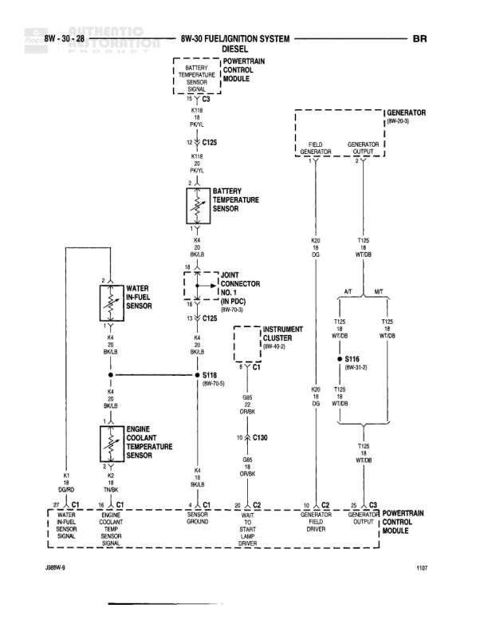

# TRANSMISSION CONTROLS

**Notes:** This is a table of contents/index page for the 8W-31 TRANSMISSION CONTROLS section. The page lists components and their corresponding page references within this section. No actual wiring diagram is shown on this page.

## Components

| Component | Ref | Connectors | Notes |
|-----------|-----|------------|-------|
| Controller Anti-Lock Brake | 8W-31-5 |  | Index/table of contents reference |
| Fuse M (PDC) | 8W-31-2 |  | Index/table of contents reference |
| Fuse Q (PDC) | 8W-31-5 |  | Index/table of contents reference |
| G107 | 8W-31-5 |  | Ground point - Index/table of contents reference |
| G200 | 8W-31-4 |  | Ground point - Index/table of contents reference |
| Generator | 8W-31-2 |  | Index/table of contents reference |
| Instrument Cluster | 8W-31-4, 5 |  | Index/table of contents reference |
| Joint Connector No. 1 | 8W-31-5 |  | Index/table of contents reference |
| Joint Connector No. 2 | 8W-31-5 |  | Index/table of contents reference |
| Overdrive Switch | 8W-31-4 |  | Index/table of contents reference |
| Power Distribution Center | 8W-31-2 |  | Index/table of contents reference |
| Powertrain Control Module | 8W-31-2, 3, 4 |  | Index/table of contents reference |
| Transmission Output Shaft Speed Sensor | 8W-31-4 |  | Index/table of contents reference |
| Transmission Relay | 8W-31-2, 3 |  | Index/table of contents reference |
| Transmission Solenoid Assembly | 8W-31-2, 3 |  | Index/table of contents reference |

## Cross-References

- 8W-31-2
- 8W-31-3
- 8W-31-4
- 8W-31-5
