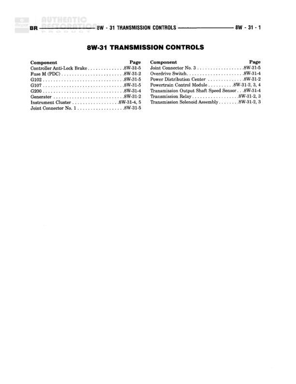

# TRANSMISSION CONTROL SYSTEM

**Notes:** Diagram shows transmission control system with generator field input, battery feed through relay to transmission solenoid assembly. System has separate paths for OTHER and DIESEL configurations. Relay control managed by separate transmission relay control module and powertrain control module.

## Components

| Component | Ref | Connectors | Notes |
|-----------|-----|------------|-------|
| GENERATOR FIELD | 8W-30-1 |  | GENERATOR [8W-30-3] |
| BATT A0 | 8W-10-8 |  | Battery connection point |
| FUSE | 8W-10-20 |  | 10A rating |
| TRANSMISSION RELAY | diagram |  | 30, 87, 86, 85 terminals shown |
| POWER DISTRIBUTION CENTER | 8W-10-8 |  |  |
| TRANSMISSION CONTROL SOLENOID ASSEMBLY | 8W-31-1 | C1 |  |
| TRANSMISSION RELAY CONTROL | diagram | C2 |  |
| POWERTRAIN CONTROL MODULE | 8W-30-4 | C3 | GENERATOR FIELD OUTPUT [8W-30-8] |

## Wires

| From | To | Wire Code | Gauge | Color | Notes |
|------|-----|-----------|-------|-------|-------|
| GENERATOR FIELD | S116 junction | L21 | 18 | DB |  |
| S116 junction | BATT A0 | T182 | 18 | DB |  |
| S116 junction | POWERTRAIN CONTROL MODULE C3 | T125 | 18 | DB |  |
| BATT A0 | C100 | None | 10 | None |  |
| C100 | POWER DISTRIBUTION CENTER | None | 10 | None |  |
| FUSE (10A) | Relay pin 30 | None | 20 | None |  |
| Relay pin 87 | Branch point | None | 20 | None |  |
| Branch OTHER/DIESEL | C130 | T16 | 20 | RD | OTHER path |
| C130 | TRANSMISSION CONTROL SOLENOID ASSEMBLY C1 | T16 | 18 | RD |  |
| Branch OTHER/DIESEL | C125 | T16 | 20 | RD | DIESEL path |
| Branch OTHER/DIESEL | C130 | K30 | 20 | PK/WT | OTHER path |
| Branch OTHER/DIESEL | C125 | K30 | 20 | PK/WT | DIESEL path |
| C130 | Lower branch | K30 | 18 | PK |  |
| C125 | Lower branch | K30 | 18 | PK |  |
| Lower branch | TRANSMISSION RELAY CONTROL C2 | K30 | 18 | PK |  |
| Relay pin 85 | Branch point | None | 20 | None |  |
| Relay pin 86 | TRANSMISSION RELAY CONTROL C2 | None | 20 | None |  |

## Splices & Grounds

| ID | Type | Location | Wires Connected | Notes |
|----|------|----------|-----------------|-------|
| C100 | inline_connector | Between BATT A0 and Power Distribution Center |  |  |
| C130 | inline_connector | OTHER path, upper and lower sections | T16, K30 |  |
| C125 | inline_connector | DIESEL path | T16, K30 |  |
| S116 | splice | Junction between Generator Field, BATT A0, and PCM | L21, T182, T125 |  |

## Cross-References

- 8W-30-1
- 8W-30-3
- 8W-10-8
- 8W-10-20
- 8W-31-1
- 8W-30-4
- 8W-30-8
