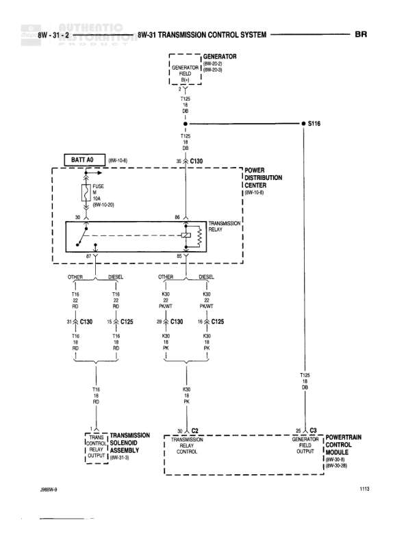

# TRANSMISSION CONTROL SYSTEM

**Notes:** Diagram shows transmission control system connections between PCM and transmission solenoid assembly. Includes sensor grounds for both diesel and other engine types.

## Components

| Component | Ref | Connectors | Notes |
|-----------|-----|------------|-------|
| POWERTRAIN CONTROL MODULE | 8W-30-0 | C1, C2 | SW RATIO FEED connector shown |
| TRANSMISSION RELAY | 8W-31-0 | C130 | SWITCHED B+ FEED |
| TRANSMISSION CONTROL MODULE OUTPUT | None |  | Located between relay and solenoid assembly |
| TRANSMISSION SOLENOID ASSEMBLY | None |  | Includes Governor Pressure Signal, Variable Force Solenoid Control, Overdrive Solenoid Control, Torque Converter Clutch Solenoid Control, and Temp Sensor Signal |

## Wires

| From | To | Wire Code | Gauge | Color | Notes |
|------|-----|-----------|-------|-------|-------|
| POWERTRAIN CONTROL MODULE Pin 31 | C130 | K3 | 18 | DB/OR | None |
| C130 | 5V SUPPLY | K3 | 18 | DB/OR | None |
| TRANSMISSION RELAY (SWITCHED B+ FEED) Pin 1 | C130 | None | 16 | RD | None |
| C130 | TRANSMISSION CONTROL MODULE OUTPUT | None | 16 | RD | None |
| SENSOR GROUND Pin 1 | S132 | K4 | 18 | BK/LB | 8W-70-8 DIESEL |
| S132 | K4 | K4 | 18 | BK/LB | None |
| OTHER Pin 2 | S126 | K4 | 18 | BK/LB | 8W-70-8 OTHER |
| S126 | S121 | K4 | 18 | BK/LB | 8W-70-5 |
| S121 | S118 | K4 | 18 | BK/LB | 8W-70-5 |
| S118 | C1 SENSOR GROUND | K4 | 18 | BK/LB | 8W-70-5 |
| GOVERNOR PRESSURE SIGNAL Pin 39 | C2 GOVERNOR PRESSURE SIGNAL | T75 | 20 | LG/WT | None |
| VARIABLE FORCE SOLENOID CONTROL Pin 8 | C2 VARIABLE FORCE SOLENOID CONTROL | K68 | 20 | VT/WT | None |
| OVERDRIVE SOLENOID CONTROL Pin 60 | C2 OVERDRIVE SOLENOID CONTROL | T60 | 18 | BR | None |
| TORQUE CONVERTER CLUTCH SOLENOID CONTROL Pin 21 | C2 TORQUE CONVERTER CLUTCH SOLENOID CONTROL | K54 | 20 | OR/BK | None |
| TEMP SENSOR SIGNAL Pin 1 | C2 TEMP SENSOR SIGNAL | T54 | 20 | VT | None |

## Splices & Grounds

| ID | Type | Location | Wires Connected | Notes |
|----|------|----------|-----------------|-------|
| S132 | splice | DIESEL circuit | K4 | 8W-70-8 |
| S126 | splice | OTHER circuit | K4 | 8W-70-8 |
| S121 | splice | Between S126 and S118 | K4 | 8W-70-5 |
| S118 | splice | Before C1 SENSOR GROUND | K4 | 8W-70-5 |

## Cross-References

- 8W-30-0
- 8W-31-0
- 8W-70-8
- 8W-70-5
