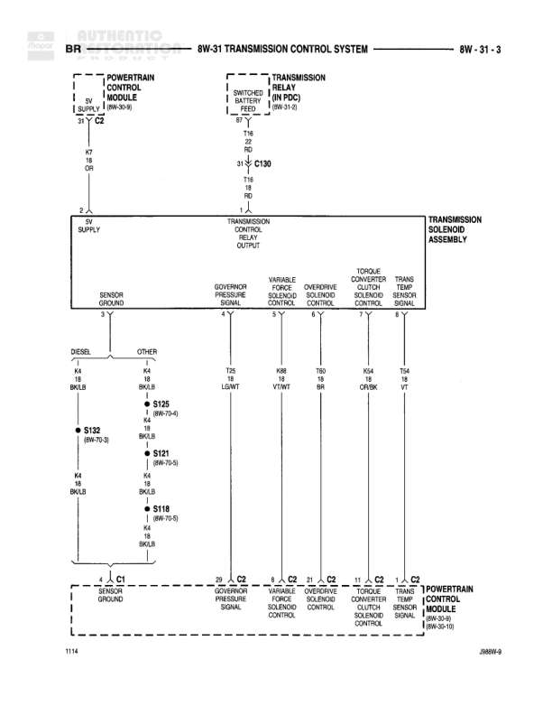

# TRANSMISSION CONTROL SYSTEM

**Notes:** Diagram shows transmission control system with separate paths for DIESEL and GAS configurations. Includes overdrive lamp control, overdrive switch, and transmission output shaft speed sensor. JMBW-9 reference shown at bottom.

## Components

| Component | Ref | Connectors | Notes |
|-----------|-----|------------|-------|
| INSTRUMENT CLUSTER | 8W-40-1 | C1 | Contains OVER DRIVE, LAMP indicators |
| POWERTRAIN CONTROL MODULE | 8W-30-9, 8W-30-10 | C2 | Controls transmission operation, includes transmission overdrive lockup sense |
| OVERDRIVE SWITCH | None |  | Manual override switch for overdrive function |
| TRANSMISSION OUTPUT SHAFT SPEED SENSOR | 8W-30-11 |  | Sensor for monitoring output shaft speed |

## Wires

| From | To | Wire Code | Gauge | Color | Notes |
|------|-----|-----------|-------|-------|-------|
| INSTRUMENT CLUSTER C1 | C136 (65-S) | T18 | 18 | TN/LG | DIESEL |
| INSTRUMENT CLUSTER C1 | C130 (30-S) | T18 | 18 | TN/LG | GAS |
| C136 (3-S) | Junction | T18 | 18 | TN/LG | DIESEL path |
| C130 (3-S) | Junction | T18 | 18 | TN/LG | GAS path |
| Junction | POWERTRAIN CONTROL MODULE C2 (13-Y) | T18 | 18 | TN/LG | OVERDRIVE LAMP DRIVER |
| POWERTRAIN CONTROL MODULE C2 (3-Y) | C190 (34-S) | T6 | 16 | TN/OR | OUTPUT SHAFT SPEED SENSOR GROUND |
| C190 (34-S) | C134 (21-S) | T6 | 16 | TN/OR | None |
| C134 (21-S) | OVERDRIVE SWITCH pin 1 | T6 | 16 | TN/OR | None |
| OVERDRIVE SWITCH pin 2 | G200 | Z2 | 22 | BK/LG | None |
| POWERTRAIN CONTROL MODULE C2 | TRANSMISSION OUTPUT SHAFT SPEED SENSOR | T13 | None | DB/BK | OUTPUT SHAFT SPEED SENSOR SIGNAL |
| POWERTRAIN CONTROL MODULE C2 | TRANSMISSION OUTPUT SHAFT SPEED SENSOR | T14 | None | LG/BK | OUTPUT SHAFT SPEED SENSOR SIGNAL |

## Splices & Grounds

| ID | Type | Location | Wires Connected | Notes |
|----|------|----------|-----------------|-------|
| G200 | ground | 09W-13-9 |  | Ground for overdrive switch |

## Cross-References

- 8W-40-1
- 8W-30-9
- 8W-30-10
- 8W-30-11
- 09W-13-9
