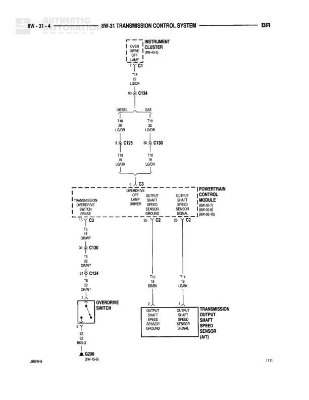

# TRANSMISSION CONTROL SYSTEM

**Notes:** This diagram shows the transmission control system focusing on the 4X4 switch and autolock brake connections. The system uses the G107 circuit for sensing and the Z1 circuit for ground. Joint connectors NO. 1 and NO. 3 provide connection points to other system components.

## Components

| Component | Ref | Connectors | Notes |
|-----------|-----|------------|-------|
| AUTOLOCK BRAKE | 8W-24-2 (8W-30-4) | C1 | Located at top of diagram |
| 4X4 SWITCH | 4X4 |  | Transfer case control switch |
| INSTRUMENT CLUSTER | 8W-42-1 | C3 | Contains indicator lamps |

## Wires

| From | To | Wire Code | Gauge | Color | Notes |
|------|-----|-----------|-------|-------|-------|
| AUTOLOCK BRAKE/C1 pin 4 | C106 | G107 | 22 | BK/GY | SENSE |
| C106 | 4X4 SWITCH pin 3 | G107 | 22 | BK/GY | None |
| C106 | JOINT CONNECTOR NO. 3 | G107 | 22 | BK/GY | Connected via C106 |
| JOINT CONNECTOR NO. 3 | C134 | G107 | 22 | BK/GY | Continues to another section |
| C134 | INSTRUMENT CLUSTER/C3 pin 10 | G107 | 22 | BK/GY | 4WD IND LAMP |
| 4X4 SWITCH pin 18 | C106 | Z1 | 18 | BK | None |
| C106 | JOINT CONNECTOR NO. 1 | Z1 | 18 | BK | 8W-15-2 |
| JOINT CONNECTOR NO. 1 | G102 | Z1 | 18 | BK | 8W-15-2 |

## Splices & Grounds

| ID | Type | Location | Wires Connected | Notes |
|----|------|----------|-----------------|-------|
| C106 | splice | Between Autolock Brake and 4X4 Switch | G107, G107, G107 | Connector joining multiple paths |
| C134 | splice | Between Joint Connector No. 3 and Instrument Cluster | G107, G107 | Connector to instrument cluster |
| G102 | ground | End of Z1 circuit path |  | 8W-15-2 |

## Cross-References

- 8W-24-2
- 8W-30-4
- 8W-42-1
- 8W-15-2
