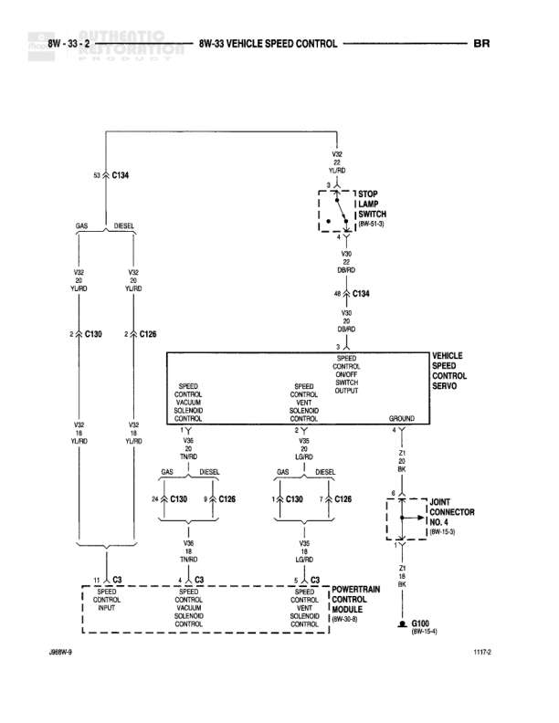

# 8W-33 VEHICLE SPEED CONTROL

**Notes:** Diagram shows vehicle speed control system with separate paths for GAS and DIESEL engines. Components include vacuum solenoid controls connected to powertrain control module and vehicle speed control servo.

## Components

| Component | Ref | Connectors | Notes |
|-----------|-----|------------|-------|
| Stop Lamp Switch | 8W-51-3 |  |  |
| Speed Control Vacuum Solenoid Control |  | C130 | GAS |
| Speed Control Vacuum Solenoid Control |  | C128 | DIESEL |
| Speed Control Solenoid Control |  | C130 | GAS |
| Speed Control Solenoid Control |  | C128 | DIESEL |
| Vehicle Speed Control Servo |  |  |  |
| Speed Control On/Off Switch |  |  | Part of control module |
| Powertrain Control Module | 8W-32-8 | C3 |  |
| Joint Connector (NC) | 8W-16-8 |  |  |

## Wires

| From | To | Wire Code | Gauge | Color | Notes |
|------|-----|-----------|-------|-------|-------|
| Stop Lamp Switch (8W-51-3) | C134 connector | V22 | 20 | YL/RD |  |
| C134 | C130 GAS | V22 | 20 | YL/RD |  |
| C134 | C128 DIESEL | V22 | 20 | YL/RD |  |
| C134 | Speed Control On/Off Switch | V20 | 20 | DB/RD |  |
| Speed Control On/Off Switch | C134 | V20 | 20 | DB/RD |  |
| C134 | C130 GAS | V20 | 20 | DB/RD |  |
| C134 | C128 DIESEL | V20 | 20 | DB/RD |  |
| Speed Control Vacuum Solenoid Control GAS C130 | Speed Control Solenoid Control GAS C130 | V28 | None | TN/RD |  |
| Speed Control Vacuum Solenoid Control DIESEL C128 | Speed Control Solenoid Control DIESEL C128 | V28 | None | TN/RD |  |
| Speed Control Solenoid Control GAS C130 | C3 | V28 | None | TN/RD |  |
| Speed Control Solenoid Control DIESEL C128 | C3 | V28 | None | TN/RD |  |
| Speed Control Vacuum Solenoid Control GAS C130 | C3 Speed Control | V25 | None | LG/RD |  |
| Speed Control Vacuum Solenoid Control DIESEL C128 | C3 Speed Control | V25 | None | LG/RD |  |
| Speed Control Solenoid Control GAS C130 | C3 Powertrain Control Module | V25 | None | LG/RD |  |
| Speed Control Solenoid Control DIESEL C128 | C3 Powertrain Control Module | V25 | None | LG/RD |  |
| Vehicle Speed Control Servo | Joint Connector (NC) 8W-16-8 | Z1 | 20 | BK |  |
| Joint Connector (NC) | G100 | Z1 | 20 | BK |  |

## Splices & Grounds

| ID | Type | Location | Wires Connected | Notes |
|----|------|----------|-----------------|-------|
| G100 | ground | 8W-15-1 |  |  |

## Cross-References

- 8W-51-3
- 8W-32-8
- 8W-16-8
- 8W-15-1
