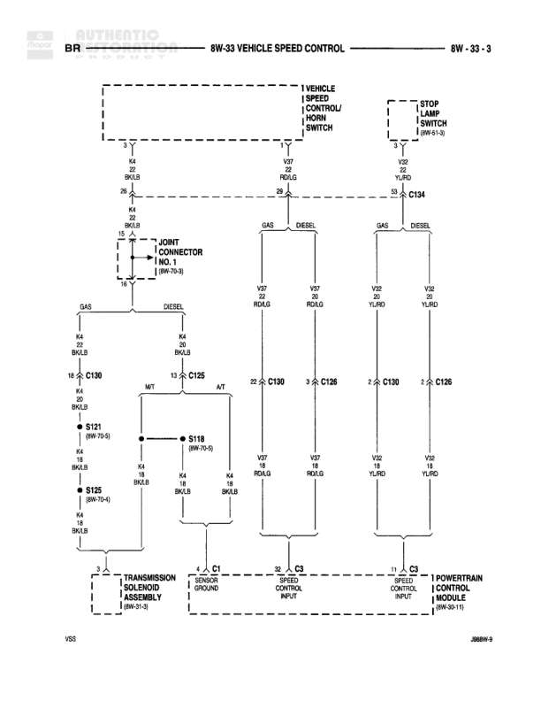

# VEHICLE SPEED CONTROL

**Notes:** Diagram shows vehicle speed control system with separate paths for GAS and DIESEL variants. Includes connections to stop lamp switch, transmission solenoid assembly, and powertrain control module. Joint connector No. 1 reference shown for GAS/DIESEL split.

## Components

| Component | Ref | Connectors | Notes |
|-----------|-----|------------|-------|
| VEHICLE SPEED CONTROL/HORN SWITCH | 8W-33-3 |  | Main control switch for speed control and horn |
| STOP LAMP SWITCH | 8W-61-3 |  | Stop lamp switch input |
| TRANSMISSION SOLENOID ASSEMBLY | 8W-9-3 |  | Transmission control assembly |
| POWERTRAIN CONTROL MODULE | 8W-30-11 |  | Main engine control module |

## Wires

| From | To | Wire Code | Gauge | Color | Notes |
|------|-----|-----------|-------|-------|-------|
| VEHICLE SPEED CONTROL/HORN SWITCH | K4 BKYLB | K4 | None | BK/LB | None |
| VEHICLE SPEED CONTROL/HORN SWITCH | V37 RDLG | V37 | None | RD/LG | None |
| STOP LAMP SWITCH | V22 YLRD | V22 | None | YL/RD | None |
| K4 BKYLB | S121 (8W-70-8) | K4 | None | BK/LB | None |
| V37 RDLG | C130 | V37 | None | RD/LG | None |
| V22 YLRD | C134 | V22 | None | YL/RD | None |
| GAS | DIESEL | None | None | None | Split for gas/diesel variants |
| K4 BKYLB | C139 | K4 | None | BK/LB | GAS variant |
| K4 BKYLB | C125 | K4 | None | BK/LB | DIESEL variant |
| C139 | S121 (8W-70-8) | K4 | None | BK/LB | None |
| C125 | S118 (8W-70-8) | K4 | None | BK/LB | None |
| S118 | K4 BKYLB | K4 | None | BK/LB | None |
| S121 | K4 BKYLB | K4 | None | BK/LB | None |
| K4 BKYLB | S125 (8W-70-4) | K4 | None | BK/LB | None |
| S125 | K4 BKYLB | K4 | None | BK/LB | None |
| V37 RDLG | C130 | V37 | None | RD/LG | None |
| C130 | V37 RDLG | V37 | None | RD/LG | None |
| V37 RDLG | SPEED CONTROL INPUT | V37 | None | RD/LG | To Powertrain Control Module |
| V22 YLRD | C134 | V22 | None | YL/RD | None |
| C134 | V22 YLRD | V22 | None | YL/RD | None |
| V22 YLRD | C130 | V22 | None | YL/RD | None |
| C130 | V22 YLRD | V22 | None | YL/RD | None |
| V22 YLRD | C136 | V22 | None | YL/RD | None |
| C136 | V22 YLRD | V22 | None | YL/RD | None |
| V22 YLRD | SPEED CONTROL INPUT | V22 | None | YL/RD | To Powertrain Control Module |
| K4 BKYLB | SENSOR GROUND | K4 | None | BK/LB | To Powertrain Control Module |
| Z1 | TRANSMISSION SOLENOID ASSEMBLY | Z1 | None | None | Ground connection |

## Splices & Grounds

| ID | Type | Location | Wires Connected | Notes |
|----|------|----------|-----------------|-------|
| S121 | splice | 8W-70-8 | K4 | GAS variant splice |
| S118 | splice | 8W-70-8 | K4 | DIESEL variant splice |
| S125 | splice | 8W-70-4 | K4 | None |
| Z1 | ground | Transmission Solenoid Assembly area |  | Ground point for transmission assembly |

## Cross-References

- 8W-70-8
- 8W-70-4
- 8W-61-3
- 8W-9-3
- 8W-30-11
