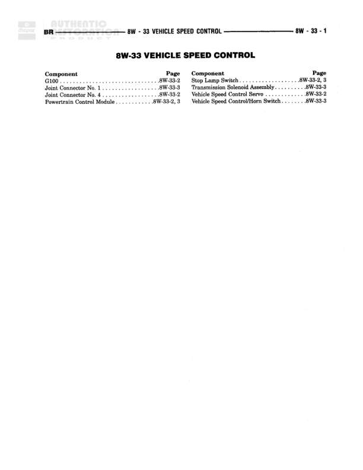

# VEHICLE SPEED CONTROL

**Notes:** This is an index/table of contents page for the Vehicle Speed Control section. Actual wiring diagrams are on pages 8W-33-2 and 8W-33-3.

## Components

| Component | Ref | Connectors | Notes |
|-----------|-----|------------|-------|
| G100 | 8W-33-2 |  | Ground |
| Joint Connector No. 1 | 8W-33-3 |  | None |
| Joint Connector No. 4 | 8W-33-2 |  | None |
| Powertrain Control Module | 8W-33-2, 3 |  | None |
| Stop Lamp Switch | 8W-33-2, 3 |  | None |
| Transmission Solenoid Assembly | 8W-33-3 |  | None |
| Vehicle Speed Control Servo | 8W-33-2 |  | None |
| Vehicle Speed Control/Horn Switch | 8W-33-3 |  | None |

## Cross-References

- 8W-33-2
- 8W-33-3
