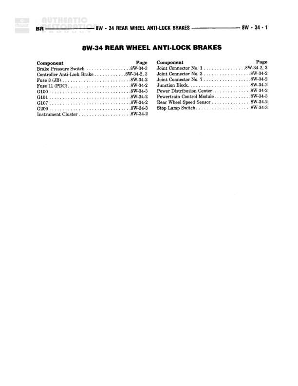

# REAR WHEEL ANTI-LOCK BRAKES

**Notes:** This is an index page for the Rear Wheel Anti-Lock Brakes wiring diagram section. It lists all components and their corresponding diagram page references. The actual wiring connections are shown on pages 8W-34-2 and 8W-34-3.

## Components

| Component | Ref | Connectors | Notes |
|-----------|-----|------------|-------|
| Brake Pressure Switch | 8W-34-3 |  | Component index page reference |
| Controller Anti-Lock Brake | 8W-34-3 |  | Component index page reference |
| Diagnosis Connector | 8W-34-2 |  | Component index page reference |
| Fuse 11 (PDC) | 8W-34-2 |  | Power Distribution Center fuse |
| G100 | 8W-34-3 |  | Ground point |
| G101 | 8W-34-2 |  | Ground point |
| G107 | 8W-34-2 |  | Ground point |
| G200 | 8W-34-3 |  | Ground point |
| Instrument Cluster | 8W-34-2 |  | Component index page reference |
| Joint Connector No. 1 | 8W-34-3 |  | Component index page reference |
| Joint Connector No. 3 | 8W-34-2 |  | Component index page reference |
| Joint Connector No. 7 | 8W-34-2 |  | Component index page reference |
| Junction Block | 8W-34-2 |  | Component index page reference |
| Power Distribution Center | 8W-34-2 |  | Component index page reference |
| Powertrain Control Module | 8W-34-3 |  | Component index page reference |
| Rear Wheel Speed Sensor | 8W-34-2 |  | Component index page reference |
| Stop Lamp Switch | 8W-34-3 |  | Component index page reference |

## Cross-References

- 8W-34-2
- 8W-34-3
