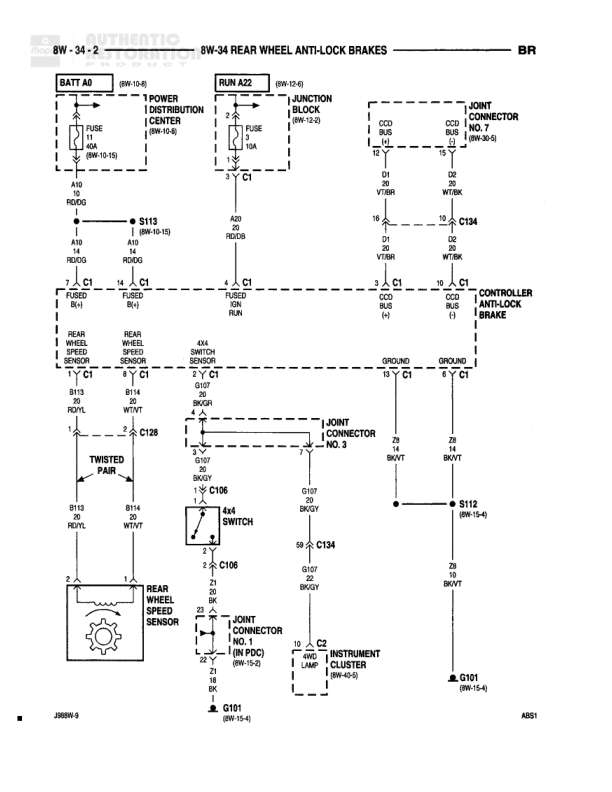

# REAR WHEEL ANTI-LOCK BRAKES

**Notes:** This diagram shows the Rear Wheel Anti-Lock Brake system with dual rear wheel speed sensors connected to a controller anti-lock brake module. The system includes 4x4 switch integration and instrument cluster indicator lamp. Power is supplied from both battery and ignition run circuits. Ground distribution is through multiple points including G101. The rear wheel speed sensors use twisted pair wiring for noise reduction.

## Components

| Component | Ref | Connectors | Notes |
|-----------|-----|------------|-------|
| BATT 40 | 8W-10-1 |  | Battery feed with fuse |
| POWER DISTRIBUTION CENTER | 8W-10-18 |  | Contains fuses and power distribution |
| RUN A22 | 8W-12-4 |  | Run/ignition feed with junction block and fuse |
| JUNCTION BLOCK | 8W-21-3 | C1 | Contains fuses 10A |
| JOINT CONNECTOR | 8W-26-8 | CCO | Located at right side |
| REAR WHEEL SPEED SENSOR |  | C1 | Left sensor |
| REAR WHEEL SPEED SENSOR |  | C1 | Right sensor |
| CONTROLLER ANTI-LOCK BRAKE |  | CCO, C1 | Main ABS control module |
| FUSED B+ |  | C1 | Left side connection |
| FUSED B+ |  | C1 | Right side connection |
| 4X4 SWITCH IGNITION |  | C1 | 4-wheel drive switch |
| REAR WHEEL SPEED SENSOR |  |  | Sensor assembly with twisted pair wiring |
| 4X4 SWITCH |  | C106 | Lower 4x4 switch |
| INSTRUMENT CLUSTER | 8W-40-5 | C2 | Contains IND LAMP |

## Wires

| From | To | Wire Code | Gauge | Color | Notes |
|------|-----|-----------|-------|-------|-------|
| BATT 40 | POWER DISTRIBUTION CENTER (FUSE) | A10 | 10 | RD/DG |  |
| POWER DISTRIBUTION CENTER | S113 | A10 | 10 | RD/DG | 8W-10-15 |
| S113 | FUSED B+ (Left) C1 | A10 | 10 | RD/DG |  |
| S113 | FUSED B+ (Right) C1 | A10 | 10 | RD/DG |  |
| RUN A22 (FUSE 10A) | 4X4 SWITCH IGNITION C1 | A20 | 20 | RD/GN |  |
| 4X4 SWITCH IGNITION C1 | JOINT CONNECTOR C1 | A20 | 20 | RD/GN |  |
| JUNCTION BLOCK C1 | JOINT CONNECTOR CCO | D1 | 20 | VT/BR |  |
| JOINT CONNECTOR CCO | C134 | D6 | 20 | VT/BR |  |
| C134 | CONTROLLER ANTI-LOCK BRAKE CCO | D1 | 20 | VT/BR |  |
| CONTROLLER ANTI-LOCK BRAKE CCO | CONTROLLER ANTI-LOCK BRAKE C1 | D1 | 20 | VT/BR |  |
| REAR WHEEL SPEED SENSOR (Left) C1 | CONTROLLER ANTI-LOCK BRAKE C1 | B19 | 20 | RD/YL |  |
| REAR WHEEL SPEED SENSOR (Right) C1 | CONTROLLER ANTI-LOCK BRAKE C1 | B14 | 20 | WT/YT |  |
| CONTROLLER ANTI-LOCK BRAKE C1 | C128 | G107 | 20 | BK/WT |  |
| C128 | 4X4 SWITCH C106 | G107 | 20 | BK/WT |  |
| C128 | JOINT CONNECTOR C1 | G107 | 20 | BK/WT |  |
| FUSED B+ (Left) C1 | TWISTED PAIR B19 | D107 | 20 | BK/OR |  |
| FUSED B+ (Right) C1 | TWISTED PAIR B14 | D107 | 20 | BK/OR |  |
| 4X4 SWITCH C106 | 4X4 SWITCH | G107 | 20 | BK/WT |  |
| 4X4 SWITCH | C106 | Z1 | 20 | BK |  |
| C106 | REAR WHEEL SPEED SENSOR JOINT CONNECTOR | Z1 | 20 | BK |  |
| REAR WHEEL SPEED SENSOR JOINT CONNECTOR | G101 | Z1 | 18 | BK | 8W-15-4 |
| 4X4 SWITCH C106 | C134 | S9 | 20 | None |  |
| C134 | JOINT CONNECTOR C2 IND LAMP (8W PDC) (8W-15-2) | C3 | 20 | DB |  |
| JOINT CONNECTOR | INSTRUMENT CLUSTER C2 IND LAMP | C3 | 20 | DB |  |
| CONTROLLER ANTI-LOCK BRAKE C1 | S112 | Z8 | 20 | BK/WT | 8W-15-8 |
| CONTROLLER ANTI-LOCK BRAKE C1 | G101 | Z8 | 20 | BK/WT | 8W-15-4 |

## Splices & Grounds

| ID | Type | Location | Wires Connected | Notes |
|----|------|----------|-----------------|-------|
| S113 | splice | Between PDC and fused B+ connections | A10 | 8W-10-15 |
| G101 | ground | Ground point for sensors and controller |  | 8W-15-4 |
| S112 | splice | Controller ground connection | Z8 | 8W-15-8 |
| C128 | connector | Junction point for grounds | G107 | Connects to 4x4 switch and joint connector |
| C134 | connector | Junction point for diagnostics and power | D1, D6, S9 | Connects junction block to controller and indicator |
| C106 | connector | 4x4 switch and sensor junction | G107, Z1 | Multiple connection point |

## Cross-References

- 8W-10-1
- 8W-10-18
- 8W-10-15
- 8W-12-4
- 8W-21-3
- 8W-26-8
- 8W-40-5
- 8W-15-4
- 8W-15-8
- 8W-15-2
