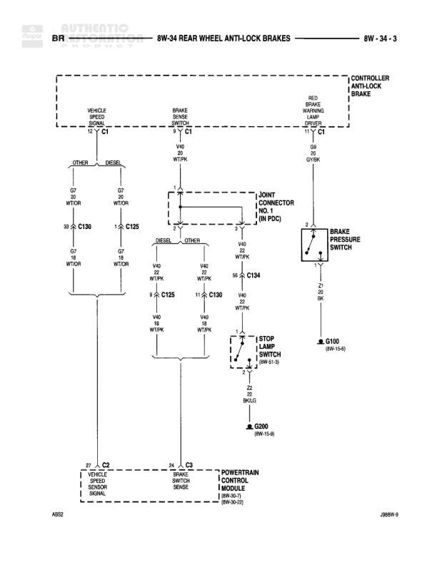

# REAR WHEEL ANTI-LOCK BRAKES

**Notes:** This diagram shows the rear wheel anti-lock brake system wiring. The system includes vehicle speed sensing, brake pressure monitoring, and stop lamp integration. The JOINT CONNECTOR NO. 1 (IN PDC) serves as a distribution point for the brake sense signal to both DIESEL and OTHER (non-diesel) vehicle configurations. Reference A032 and J08BW-5 noted at bottom of diagram.

## Components

| Component | Ref | Connectors | Notes |
|-----------|-----|------------|-------|
| CONTROLLER ANTILOCK BRAKE | top right | C1 | Main control module for rear wheel anti-lock brakes |
| VEHICLE SPEED SIGNAL | top left, connects to C1 | C1 | Input signal from vehicle speed sensor |
| BRAKE SENSE SIGNAL | top center, connects to C1 | C1 | Input signal from brake sense |
| RED BRAKE WARNING SIGNAL | top right, connects to C1 | C1 | Brake warning indicator signal |
| BRAKE PRESSURE SWITCH | right side |  | Connected to pin 56 of C134 |
| JOINT CONNECTOR NO. 1 (IN PDC) | center, connects multiple circuits |  | Junction point in Power Distribution Center |
| STOP LAMP SWITCH | center right, 8W-51-3 |  | Controls stop lamp circuit |
| VEHICLE SPEED SENSOR | bottom left, connects to C2 | C2 | Located in/on Powertrain Control Module |
| BRAKE SWITCH SENSE | bottom center, connects to C3 | C3 | Located in/on Powertrain Control Module |
| POWERTRAIN CONTROL MODULE | 8W-30-D | C2, C3 | Main engine/transmission control module |

## Wires

| From | To | Wire Code | Gauge | Color | Notes |
|------|-----|-----------|-------|-------|-------|
| VEHICLE SPEED SIGNAL (C1, pin 6) | C130 (pin 38) - W/TOR | G7 | None | WT/OR | OTHER branch |
| VEHICLE SPEED SIGNAL (C1, pin 6) | C125 (pin 1) - W/TOR | G7 | None | WT/OR | DIESEL branch |
| BRAKE SENSE SIGNAL (C1, pin 11) | JOINT CONNECTOR via V40/WT/PK | V40 | 18 | WT/PK | None |
| RED BRAKE WARNING SIGNAL (C1, pin 18) | C134 (pin 56) - BRAKE PRESSURE SWITCH | B9 | None | GY/BK | None |
| JOINT CONNECTOR (DIESEL path) | C125 (pin 1) | V40 | 18 | WT/PK | DIESEL branch |
| JOINT CONNECTOR (OTHER path) | C130 (pin 11) | V40 | 18 | WT/PK | OTHER branch |
| C125 (pin 1) | C130 (pin 11) | V40 | 18 | WT/PK | Connection between DIESEL and OTHER paths |
| C130 (pin 11) | STOP LAMP SWITCH (pin 1) | V40 | 18 | WT/PK | None |
| STOP LAMP SWITCH (pin 22) | G200 (8W-15-6) | Z2 | None | BK/LG | Ground connection |
| C134 (pin 56) | G100 (8W-15-4) | Z1 | 20 | BK | Ground connection |
| C130 (pin 38) - W/TOR | VEHICLE SPEED SENSOR C2 (pin 27) | G7 | None | WT/OR | None |
| C125 (pin 1) - W/TOR | VEHICLE SPEED SENSOR C2 (pin 27) | G7 | None | WT/OR | None |
| C130 (pin 11) | BRAKE SWITCH SENSE C3 (pin 24) | V40 | 18 | WT/PK | None |

## Splices & Grounds

| ID | Type | Location | Wires Connected | Notes |
|----|------|----------|-----------------|-------|
| G100 | ground | 8W-15-4 |  | Ground for brake pressure switch circuit |
| G200 | ground | 8W-15-6 |  | Ground for stop lamp switch circuit |

## Cross-References

- 8W-30-D
- 8W-51-3
- 8W-15-4
- 8W-15-6
