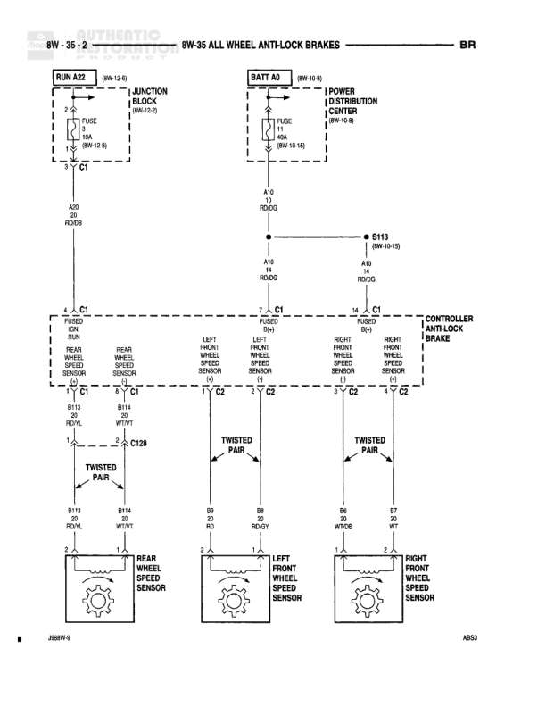

# ALL WHEEL ANTI-LOCK BRAKES

**Notes:** All Wheel Anti-Lock Brake System diagram showing power distribution from battery and run circuits through controller to four wheel speed sensors. Sensors use twisted pair wiring for noise immunity. Controller has two main connectors (C1 and C2) managing sensor inputs and power feeds.

## Components

| Component | Ref | Connectors | Notes |
|-----------|-----|------------|-------|
| RUN A22 | 8W-12-8 |  | Run circuit from Junction Block |
| JUNCTION BLOCK | 8W-12-2 |  | Power distribution point |
| BATT A0 | 8W-10-6 |  | Battery feed circuit |
| POWER DISTRIBUTION CENTER | 8W-10-5 |  | Main power distribution |
| CONTROLLER ANTI-LOCK BRAKE | 8W-35-2 | C1, C2 | Main ABS control module with multiple sensor inputs |
| REAR WHEEL SPEED SENSOR | 8W-35-2 |  | Monitors rear wheel speed |
| LEFT FRONT WHEEL SPEED SENSOR | 8W-35-2 |  | Monitors left front wheel speed |
| RIGHT FRONT WHEEL SPEED SENSOR | 8W-35-2 |  | Monitors right front wheel speed |

## Wires

| From | To | Wire Code | Gauge | Color | Notes |
|------|-----|-----------|-------|-------|-------|
| RUN A22/FUSE 11 9A | JUNCTION BLOCK (8W-12-2) | A22 | None | BK | From RUN A22 circuit |
| JUNCTION BLOCK | Ground C1 | A22 | None | BK | None |
| BATT A0/FUSE 11 | POWER DISTRIBUTION CENTER | A10 | 12 | RD/DG | 30A fuse |
| POWER DISTRIBUTION CENTER | Splice S113 | A10 | 12 | RD/DG | Continues to 8W-10-12 |
| Splice S113 | CONTROLLER C1 (FUSED IGN RUN) | A10 | 18 | RD/DG | None |
| Splice S113 | CONTROLLER C1 (FUSED B(+)) | A10 | 18 | RD/DG | None |
| CONTROLLER C1 (FUSED IGN RUN) | Ground C1 | None | None | None | LEFT FRONT WHEEL SPEED SENSOR (+) |
| CONTROLLER C1 (REAR WHEEL SPEED SENSOR) | Ground C1 | None | None | None | REAR WHEEL SPEED SENSOR (-) |
| CONTROLLER C1 (FUSED B(+)) | Ground C2 | None | None | None | LEFT FRONT WHEEL SPEED SENSOR (-) |
| CONTROLLER C1 (RIGHT FRONT WHEEL SPEED SENSOR (+)) | Ground C2 | None | None | None | RIGHT FRONT WHEEL SPEED SENSOR (+) |
| CONTROLLER C2 (RIGHT FRONT WHEEL SPEED SENSOR (-)) | Ground C2 | None | None | None | RIGHT FRONT WHEEL SPEED SENSOR (-) |
| CONTROLLER C1 | Ground C1 | B/13 | 20 | RD/YL | To rear wheel speed sensor |
| CONTROLLER C1 | Ground C1 | B/14 | 20 | WT/YT | To rear wheel speed sensor |
| CONTROLLER C1 | C128 connector |  | 20 | RD/YL | Twisted pair to rear sensor |
| CONTROLLER C1 | C128 connector | B/14 | 20 | WT/VT | Twisted pair to rear sensor |
| C128 connector | REAR WHEEL SPEED SENSOR | B/13 | 20 | RD/YL | Twisted pair |
| C128 connector | REAR WHEEL SPEED SENSOR | B/14 | 20 | WT/VT | Twisted pair |
| CONTROLLER C2 | LEFT FRONT WHEEL SPEED SENSOR | B9 | 20 | RD | Twisted pair |
| CONTROLLER C2 | LEFT FRONT WHEEL SPEED SENSOR | B8 | 20 | RD/WT | Twisted pair |
| CONTROLLER C2 | RIGHT FRONT WHEEL SPEED SENSOR | B6 | 20 | WT/DG | Twisted pair |
| CONTROLLER C2 | RIGHT FRONT WHEEL SPEED SENSOR | B7 | 20 | WT | Twisted pair |

## Splices & Grounds

| ID | Type | Location | Wires Connected | Notes |
|----|------|----------|-----------------|-------|
| C1 | ground | Controller connector 1 |  | Multiple ground connections at controller C1 |
| C2 | ground | Controller connector 2 |  | Multiple ground connections at controller C2 |
| S113 | splice | Between power distribution and controller | A10 | Continues to 8W-10-12, splits power to controller |
| C128 | splice | In-line connector to rear wheel speed sensor | B/13, B/14 | Twisted pair connection |

## Cross-References

- 8W-12-8
- 8W-12-2
- 8W-10-6
- 8W-10-5
- 8W-10-12
