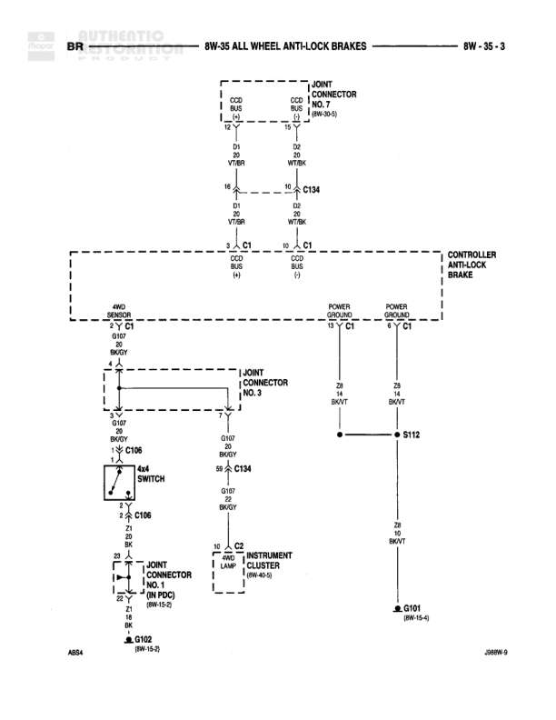

# ALL WHEEL ANTI-LOCK BRAKES

**Notes:** Diagram shows ABS controller connections including CCD bus communication, power/ground circuits, 4x4 switch interface, and ABS warning lamp circuit

## Components

| Component | Ref | Connectors | Notes |
|-----------|-----|------------|-------|
| Controller Anti-Lock Brakes | 8W-35-3 | C1 | Main ABS controller module |
| 4x4 Switch | 8W-35-3 | C106 | Four wheel drive selector switch |
| ABS Lamp | Instrument Cluster (8W-40-5) | C2 | Anti-lock brake system warning lamp in instrument cluster |
| Joint Connector No. 7 | 8W-30-9 |  | Junction connector |
| Joint Connector No. 3 | 8W-35-3 |  | Junction connector |
| Joint Connector (in PDC) | 8W-15-0 |  | Junction connector in Power Distribution Center |

## Wires

| From | To | Wire Code | Gauge | Color | Notes |
|------|-----|-----------|-------|-------|-------|
| CCO Bus C1 pin 13 | Joint Connector No. 7 | D1 | 18 | VT/BR | None |
| CCO Bus C134 pin 10 | Joint Connector No. 7 | D4 | 18 | WT/BK | None |
| CCO Bus C1 pin 13 | Controller Anti-Lock Brakes C1 | D1 | 18 | VT/BR | None |
| CCO Bus C1 pin 10 | Controller Anti-Lock Brakes C1 | D4 | 18 | WT/BK | None |
| Controller Anti-Lock Brakes Power Ground pin C1 | Joint Connector No. 3 | Z1 | 4 | BK/WT | None |
| Controller Anti-Lock Brakes Power C1 | S112 | Z1 | 4 | BK/WT | None |
| Joint Connector No. 3 | 4x4 Switch C106 pin 3 | G107 | 18 | BK/WT | None |
| 4x4 Switch C106 pin 1 | C134 pin 99 | G107 | 18 | BK/WT | None |
| 4x4 Switch C106 pin 2 | Joint Connector (in PDC) (8W-15-0) | Z1 | 18 | BK | None |
| Controller Anti-Lock Brakes C1 | ABS Lamp C2 (Instrument Cluster 8W-40-5) | M8 | 18 | BK/WT | None |
| S112 | Power Ground | Z1 | 4 | BK/WT | None |

## Splices & Grounds

| ID | Type | Location | Wires Connected | Notes |
|----|------|----------|-----------------|-------|
| S112 | splice | Between controller and power ground | Z1 | Power ground splice |
| G101 | ground | 8W-15-4 |  | Ground connection |
| G102 | ground | 8W-15-2 |  | Ground connection |

## Cross-References

- 8W-30-9
- 8W-40-5
- 8W-15-0
- 8W-15-4
- 8W-15-2
