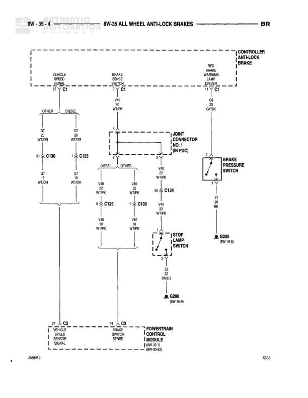

# 8W-35 ALL WHEEL ANTI-LOCK BRAKES

**Notes:** Diagram shows ABS controller wiring with separate paths for diesel and other (gasoline) vehicles. Contains vehicle speed sensor circuits, brake sense switch, brake pressure switch, and stop lamp switch connections. References junction connector No. 1 in PDC (Power Distribution Center).

## Components

| Component | Ref | Connectors | Notes |
|-----------|-----|------------|-------|
| CONTROLLER ANTI-LOCK BRAKE | 8W-35-4 | C1 | Main ABS controller module |
| VEHICLE SPEED SENSOR | 8W-35-4 | C1 | OTHER |
| BRAKE SENSE SWITCH | 8W-35-4 | C1 | None |
| VEHICLE SPEED SENSOR | 8W-35-4 | C1 | DIESEL |
| BRAKE PRESSURE SWITCH | 8W-35-4 |  | Connected to Y40 |
| STOP LAMP SWITCH | 8W-35-4 |  | Connected to V40 |
| POWERTRAIN CONTROL MODULE | 8W-30-2 | C3 | None |
| DIESEL VEHICLE SENSOR SIGNAL | 8W-35-4 | C3 | None |
| OTHER VEHICLE SENSOR SIGNAL | 8W-35-4 | C3 | None |

## Wires

| From | To | Wire Code | Gauge | Color | Notes |
|------|-----|-----------|-------|-------|-------|
| CONTROLLER ANTI-LOCK BRAKE C1 | VEHICLE SPEED SENSOR (OTHER) C1 | D7 | 18 | WT/OR | OTHER |
| CONTROLLER ANTI-LOCK BRAKE C1 | VEHICLE SPEED SENSOR (DIESEL) C1 | D7 | 18 | WT/OR | DIESEL |
| VEHICLE SPEED SENSOR (OTHER) C1 | C100 | D7 | 18 | WT/OR | None |
| VEHICLE SPEED SENSOR (DIESEL) C1 | C125 | D7 | 18 | WT/OR | None |
| BRAKE SENSE SWITCH C1 | JOINT CONNECTOR NO. 1 (IN PDC) | V40 | 18 | WT/PK | None |
| CONTROLLER ANTI-LOCK BRAKE C1 | BRAKE PRESSURE SWITCH | D8 | None | GY/OR | RED RESET WARNING LAMPS |
| JOINT CONNECTOR NO. 1 (IN PDC) | C125 | V40 | 18 | WT/PK | DIESEL |
| JOINT CONNECTOR NO. 1 (IN PDC) | C100 | V40 | 18 | WT/PK | OTHER |
| C125 | C130 | V40 | 11 | WT/PK | None |
| C100 | C130 | V40 | 18 | WT/PK | None |
| BRAKE PRESSURE SWITCH | C134 | Y40 | 18 | WT/PK | None |
| C130 | STOP LAMP SWITCH | V40 | 18 | WT/PK | None |
| STOP LAMP SWITCH | G200 | Z2 | 20 | BK/LG | None |
| C134 | G300 | Z1 | 20 | BK | None |
| POWERTRAIN CONTROL MODULE C3 | DIESEL VEHICLE SENSOR SIGNAL C3 | T2 | None | None | DIESEL |
| POWERTRAIN CONTROL MODULE C3 | OTHER VEHICLE SENSOR SIGNAL C3 | T2 | None | None | OTHER |

## Splices & Grounds

| ID | Type | Location | Wires Connected | Notes |
|----|------|----------|-----------------|-------|
| G200 | ground | 8W-15-8 |  | Ground for stop lamp switch |
| G300 | ground | 8W-15-8 |  | Ground for brake pressure switch circuit |

## Cross-References

- 8W-30-2
- 8W-15-8
