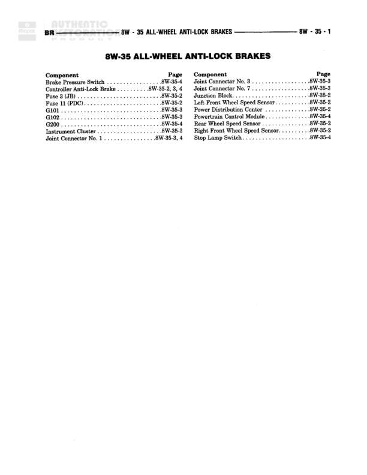

# ALL-WHEEL ANTI-LOCK BRAKES

**Notes:** This is an index/contents page for the All-Wheel Anti-Lock Brakes system. It lists components and their locations across diagrams 8W-35-2, 8W-35-3, and 8W-35-4. No actual wiring diagram is shown on this page.

## Components

| Component | Ref | Connectors | Notes |
|-----------|-----|------------|-------|
| Brake Pressure Switch | 8W-35-4 |  | Component index page |
| Controller Anti-Lock Brake | 8W-35-2, 3, 4 |  | Component index page |
| Fuse 8 (JB) | 8W-35-2 |  | Junction Block fuse |
| Fuse 11 (PDC) | 8W-35-2 |  | Power Distribution Center fuse |
| G101 | 8W-35-3 |  | Ground point |
| G200 | 8W-35-4 |  | Ground point |
| Instrument Cluster | 8W-35-3 |  | Component index page |
| Joint Connector No. 1 | 8W-35-3, 4 |  | Component index page |
| Joint Connector No. 3 | 8W-35-3 |  | Component index page |
| Joint Connector No. 7 | 8W-35-3 |  | Component index page |
| Junction Block | 8W-35-2 |  | Component index page |
| Left Front Wheel Speed Sensor | 8W-35-2 |  | Component index page |
| Power Distribution Center | 8W-35-2 |  | Component index page |
| Right Front Wheel Speed Sensor | 8W-35-2 |  | Component index page |
| Rear Wheel Speed Sensor | 8W-35-2 |  | Component index page |
| Stop Lamp Switch | 8W-35-4 |  | Component index page |

## Splices & Grounds

| ID | Type | Location | Wires Connected | Notes |
|----|------|----------|-----------------|-------|
| G101 | ground | Referenced on 8W-35-3 |  | Ground point for ABS system |
| G200 | ground | Referenced on 8W-35-4 |  | Ground point for ABS system |

## Cross-References

- 8W-35-2
- 8W-35-3
- 8W-35-4
