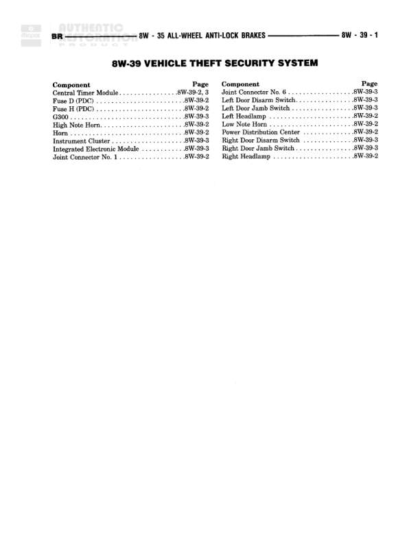

# VEHICLE THEFT SECURITY SYSTEM

**Notes:** This is an index/table of contents page for the Vehicle Theft Security System wiring diagrams. The actual wiring connections are shown on pages 8W-39-2 and 8W-39-3.

## Components

| Component | Ref | Connectors | Notes |
|-----------|-----|------------|-------|
| Central Timer Module | 8W-39-2, 3 |  | None |
| Fuse D (PDC) | 8W-39-2 |  | None |
| Fuse H (PDC) | 8W-39-2 |  | None |
| G300 | 8W-39-3 |  | Ground point |
| High Note Horn | 8W-39-2 |  | None |
| Hood Switch | 8W-39-2 |  | None |
| Instrument Cluster | 8W-39-3 |  | None |
| Integrated Electronic Module | 8W-39-3 |  | None |
| Joint Connector No. 1 | 8W-39-2 |  | None |
| Joint Connector No. 6 | 8W-39-3 |  | None |
| Left Door Disarm Switch | 8W-39-3 |  | None |
| Left Door Jamb Switch | 8W-39-3 |  | None |
| Left Headlamp | 8W-39-2 |  | None |
| Low Note Horn | 8W-39-2 |  | None |
| Park Lamp Ign Center | 8W-39-2 |  | None |
| Right Door Disarm Switch | 8W-39-3 |  | None |
| Right Door Jamb Switch | 8W-39-3 |  | None |
| Right Headlamp | 8W-39-2 |  | None |

## Cross-References

- 8W-39-2
- 8W-39-3
